# What is a computer?

## Schedule

| Time | Topic | Activity | Teacher | 
| ---- | ----- | -------- | ------- |
| 9:00 | Intro to computers | lecture | PO |
| 10:15 | Break | Break | Break | 
| 10:30 | Files and filesystems | lecture + exercises | BB |
| 12:00 | End of lectures | . | . |

!!! note 

    "A computer is a machine that can be programmed to automatically carry out sequences of arithmetic or logical operations (computation)." 
    (Wikipedia) 

In this session we are going to do a short walk-through of what a computer is, both the hardware parts and the system software. 

Everyone has an idea of what a computer is; usually we are thinking of a screen, a keyboard, and internal components like CPU, GPU, HDD/SDD, and RAM/memory. 

Computers are special types of machines. Most machines only do one thing (cars, ovens, sewing machines, coffee machines), but computers are what is called "universal machines". They run programs that means they can do many different tasks. 

## Hardware parts

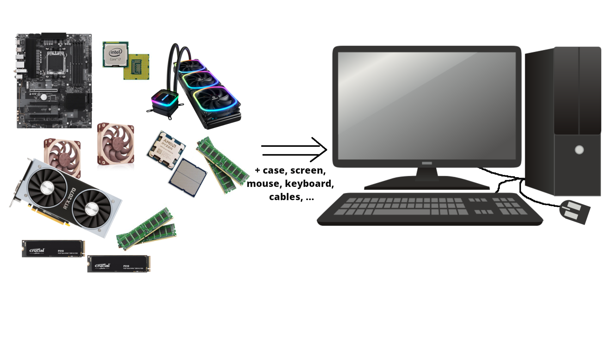{: style="width: 600px;"}

Let us take a look inside a typical desktop computer. This shows a simplified sketch of the inside of the case: 

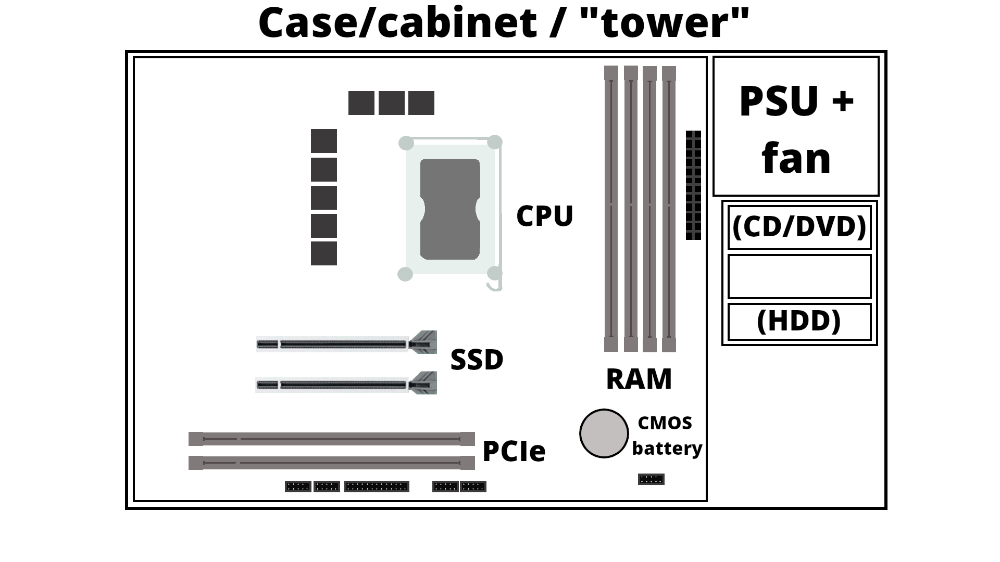{: style="width: 600px;"}

- PSU is the power supply unit. 
- CD/DVD are getting increasingly rare
- If you have spinning disk/HDD installed, it sits in a rack along the side and is connected to the motherboard (power cable and data cable). Used for long term storage. Do not confuse with memory!
- A motherboard is mounted in the case, and has a socket for a CPU as well as slots for RAM/memory, SSDs/M.2 disk, PCIe etc. 
- How much RAM usually depends on the motherboard, and they should be of the same size (8GB, 16GB, 32GB, etc.) DRAM (Dynamic Random-Access Memory). Memory is a physical device that can be used to store information temporarily; when the computer is shut down the data disappears from the memory. Do NOT confuse with storage space!
- SSD storage are placed in the suitable slots. Size again depends on the motherboard. New SSDs are typically NVMe/M.2, which has better speed usually. Used for long term storage. Do not confuse with memory!  
- PCIe are expansion slots, often used for graphics cards/GPUs. These can be large and the case size is important when seeing if there is space for many of the modern types of GPUs.
- The GPU generally has its own cooling, but the CPU needs cooling. Either fans for air cooling or water cooling 
- Storage is related to "disks" on the computer. A disk is a storage device that stores and retrieves data using magnetic or optical technology. An SSD or a HDD is an example.


### A motherboard

<figure>
  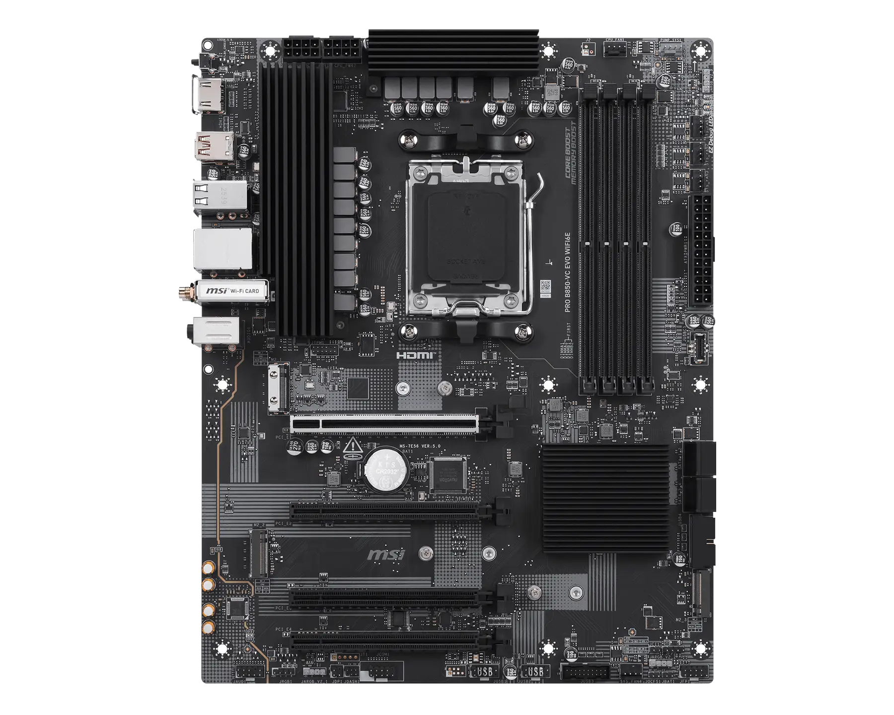
  <figcaption> Example of a motherboard MSI PRO B850-VC EVO WIFI6E. Credits: https://www.msi.com/Motherboard/PRO-B850-VC-EVO-WIFI6E</figcaption>
</figure>

### SSD storage 

<figure>
  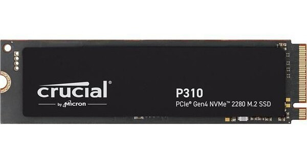
  <figcaption> SSD storage. Credits: https://ssd-tester.com/crucial_p310_2tb.html</figcaption>
</figure>

### GPU

<figure class="inline end" markdown>
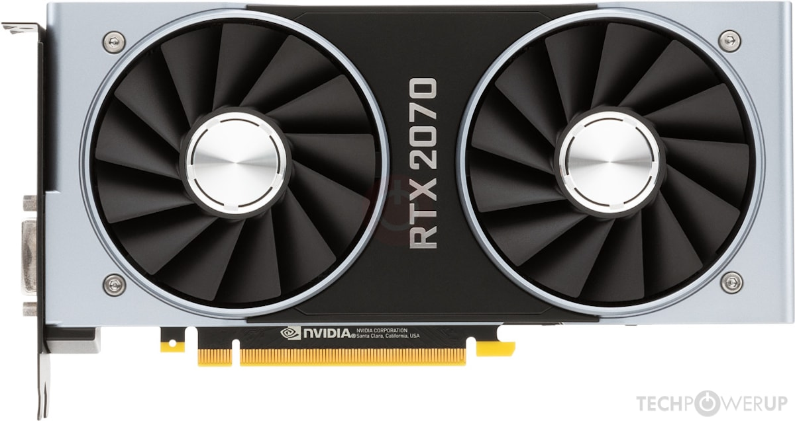{: style="width: 300px;"}
<figcaption>GPU (Nvidia)</figcaption>
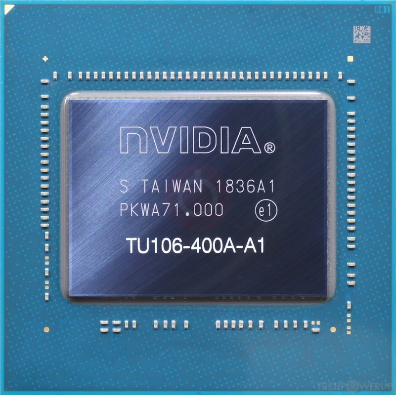{: style="width: 200px;"}
<figcaption>GPU chip. Credits: https://www.techpowerup.com/gpu-specs/geforce-rtx-2070.c3252</figcaption>
</figure>

??? note "What type of GPU is available?"

    ```text
    $ nvidia-smi 

    Fri Aug 21 09:57:14 2026       
    +-----------------------------------------------------------------------------------------+
    | NVIDIA-SMI 580.173.02             Driver Version: 580.173.02     CUDA Version: 13.0     |
    +-----------------------------------------+------------------------+----------------------+
    | GPU  Name                 Persistence-M | Bus-Id          Disp.A | Volatile Uncorr. ECC |
    | Fan  Temp   Perf          Pwr:Usage/Cap |           Memory-Usage | GPU-Util  Compute M. |
    |                                         |                        |               MIG M. |
    |=========================================+========================+======================|
    |   0  NVIDIA A100 80GB PCIe          On  |   00000000:25:00.0 Off |                    0 |
    | N/A   44C    P0             88W /  300W |   33644MiB /  81920MiB |     43%      Default |
    |                                         |                        |             Disabled |
    +-----------------------------------------+------------------------+----------------------+

    +-----------------------------------------------------------------------------------------+
    | Processes:                                                                              |
    |  GPU   GI   CI              PID   Type   Process name                        GPU Memory |
    |        ID   ID                                                               Usage      |
    |=========================================================================================|
    |    0   N/A  N/A          205769    C+G   MorphoGraphX                          22904MiB |
    |    0   N/A  N/A          544754    C+G   MorphoDynamX                          10670MiB |
    +-----------------------------------------------------------------------------------------+
    ``` 

### Cooling 

<figure class="inline end" markdown>
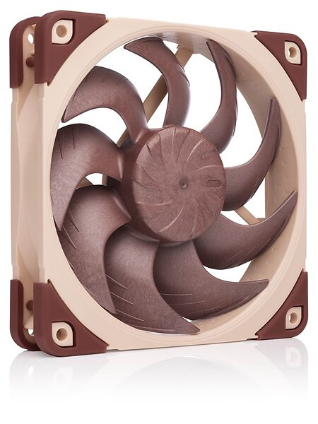{: style="width: 100px;"}
<figcaption>A fan</figcaption>
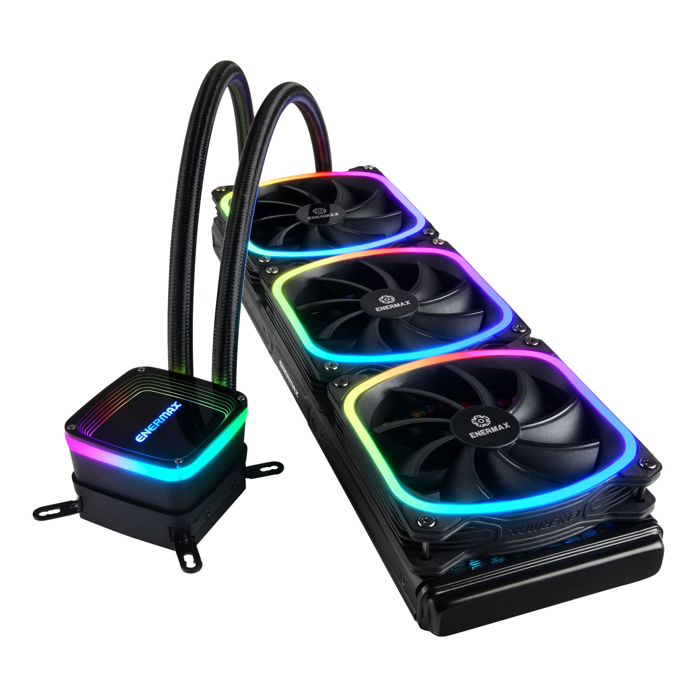{: style="width: 300px;"}
<figcaption>Watercooling including heat sink (the heat sink will be attached on top of a CPU with cooling paste in between). Credits:  https://www.noctua.at/en/products/nf-a12x25-pwm and https://www.enermax.com/en/search/label/360mm%20Radiaotr</figcaption>
</figure>


## System software 

System software is what is required for the computer to run and to let us interact with it. 

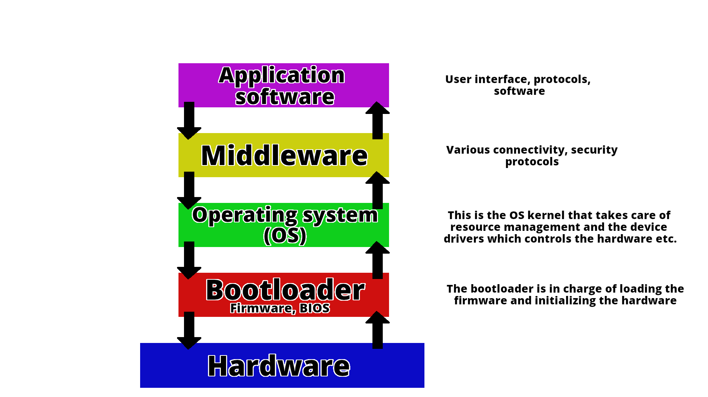{: style="width: 700px;"}

This picture shows how the different components talk together. 

A computer is a machine that can be programmed to automatically carry out sequences of 
arithmetic or logical operations (computation). (Wikipedia) 

??? note "What is my Operating System (OS)?"

    ```text
    $ cat /etc/os-release
    PRETTY_NAME="Ubuntu 22.04.5 LTS"
    NAME="Ubuntu"
    VERSION_ID="22.04"
    ...
    ```

# Basic Functions of a Computer

Computers are built around four fundamental operations:

1. **Input** Acquiring data from the outside world (e.g., keyboard, mouse, sensors)
2. **Processing** Transforming that data through calculations and logical operations
3. **Storage** Retaining data and instructions for immediate or future use
4. **Output** Delivering results to the user or to other systems (e.g., monitor, printer)


## The Von Neumann Architecture

John von Neumann proposed a model for a computer architecture **Von Neumann architecture** (see 
*Von Neumann Report* in the references) where the program and data were loaded to the machine
without the need of modifying the hardware. In this case, the same machine could be used to execute any
program compatible with the instructions of the machine.

The Von Neumann model organizes a computer into four main components, all communicating over a shared **bus**:

- **Central Processing Unit (CPU):** the active core of the machine; fetches instructions from memory, decodes 
them, and carries out their execution. Internally, it contains the ALU, the Control Unit, and a set of registers 
(each described in detail below).
- **Memory Unit:** a single, unified address space holding both the program instructions and the data those instructions operate on.
- **Input/Output (I/O):**  the mechanisms through which the computer exchanges information with the outside world, receiving input and delivering output.
- **Bus:** the shared communication pathway interconnecting all components, carrying addresses, data, and control signals.

<figure>
  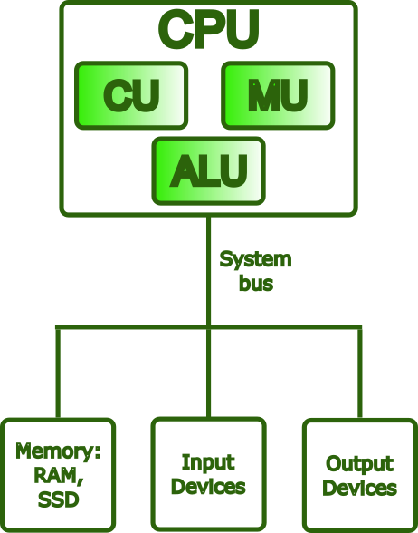
  <figcaption> CPU components.</figcaption>
</figure>

### The Von Neumann Bottleneck
 
In the Von Neumann architecture, the transfer of instructions between the CPU and memory and the transfer 
of data occur through the same bus, and these operations take place one at a time. This creates the so-called 
Von Neumann bottleneck. Early computers masked this bottleneck because CPU and memory speeds were similar. 
However, in modern computers, CPU speeds greatly outperform memory transfer rates, making the bottleneck 
significant, especially in high-performance computing clusters where massive computations are performed.

Modern hardware addresses this problem through several complementary strategies:

- **Cache hierarchies (L1/L2/L3):** multiple levels of small, fast memory placed close to the CPU 
reduce how often the processor needs to reach out to main memory over the bus.
- **Harvard-style L1 caches:** the first cache level is split into separate instruction and data caches, allowing
both to be accessed simultaneously and eliminating a key source of contention.
- **Wide memory buses, DDR channels, and HBM (High Bandwidth Memory):** these increase the raw throughput of data
transfers between memory and the CPU, attacking the bottleneck at its source.
- **Hardware prefetching:** dedicated units predict which data the CPU will need next and load it into cache ahead 
of time, hiding memory latency before it stalls execution.

Despite these improvements, the memory wall remains a major challenge in modern computer architecture, especially 
in HPC systems, where data movement often dominates execution time.

### Neuromorphic computing

Neuromorphic computing is a computing paradigm inspired by the organization and behavior of biological neural networks, 
such as the human brain. 
Unlike the Von Neumann architecture, where processing and memory are separated and data must constantly move between 
them, neuromorphic systems integrate computation and memory within large networks of artificial neurons and synapses. 
This design reduces the Von Neumann bottleneck and enables highly energy-efficient, event-driven operation: artificial 
neurons activate only when relevant signals arrive instead of continuously executing instructions on a fixed clock cycle.

Examples of neuromorphic hardware include Intel Loihi and IBM TrueNorth. Traditional von Neumann systems remain superior 
for general-purpose and sequential computing, supported by mature software ecosystems. However, neuromorphic architectures 
are especially promising for low-power tasks such as sensory processing, pattern recognition, and real-time edge inference, 
where conventional clock-driven computing is often inefficient.

### Quantum Computers

Quantum computers are computing systems that exploit the principles of Quantum Mechanics in their hardware and and use
Quantum Algorithms to perform computations.
In a traditional **Von Neumann architecture**, computation relies on bits stored in memory and processed 
by a central processing unit (CPU). Classical bits can only take the values **0** or **1**. In contrast, quantum computers use 
**qubits**, which can exist in superpositions of states, enabling them to encode a combination of both states until they are 
measured. 
Quantum computation also relies on **entanglement** and **quantum interference**, allowing qubits to share correlations and 
enhance correct computational outcomes.

Although quantum computers share some similarities with classical systems (such as storing information, executing operations, 
and producing outputs) they do not follow the conventional separation between memory and processor found in Von Neumann machines. 
Instead, computations are performed through quantum gates acting directly on qubit states. Quantum computers are especially 
powerful because some problems that are extremely difficult for classical computers can be solved more efficiently with quantum 
algorithms. For example, **Shor’s algorithm** accelerates integer factorization, while **Grover’s algorithm** speeds up search problems. 
Quantum computing is also highly promising for simulating molecules, materials, and complex optimization problems. While scalable 
fault-tolerant quantum computers are still under development, their potential impact on science, chemistry, finance, cryptography, 
and artificial intelligence makes them one of the most important emerging technologies today.


# What Is a CPU?

The Central Processing Unit (CPU) is the component of a computer that executes programs. Instructions are fetched
from memory, interpreted in machine language, and then executed. These operations occur rapidly, many millions of
times per second.

## Main Components of a CPU

### Control Unit (CU)

The Control Unit, as its name suggests, manages the operation of the entire processor. It fetches each instruction from 
memory in sequence, interprets the required operation, and issues the control signals needed to coordinate the ALU, 
registers, and other components accordingly.

### Arithmetic Logic Unit (ALU)

The ALU is the part of the CPU that performs computational tasks. This includes arithmetic operations (addition, subtraction, 
multiplication, and division) and logical operations (comparisons such as equality or greater than, and bitwise operations 
such as AND, OR, and NOT). 

### Registers

Registers are the closest storage locations in the memory hierarchy to the processor. They are small, extremely fast, and can 
be accessed in less than one CPU cycle, far faster than external memory. Their role is to hold the values the CPU is actively 
using: operands for operations, intermediate results, and critical information about the state of execution.

Common register types include:

- **General-purpose registers**, hold operands and results for arithmetic and logical operations (e.g., `rax`, `rbx` on x86-64)
- **Program Counter (PC)**, holds the memory address of the next instruction to be fetched; it advances automatically after each fetch
- **Stack Pointer (SP)**, tracks the current top of the call stack, used to manage function calls, local variables, and return addresses
- **Flags / Status register**, records condition codes produced by the last operation (such as zero, carry, sign, and 
overflow), which are then used by conditional branch instructions to control program flow

## What Is an Instruction?

An **instruction** is the most basic unit of work a CPU can perform. At the lowest level, a program is nothing more than a 
sequence of such instructions encoded in **machine code**, binary patterns that the hardware can fetch, decode, and act on directly.

Each instruction contains two essential pieces of information:

- An **opcode** is a numeric code specifying which operation to perform (e.g., ADD, LOAD, or BRANCH)
- **Operands** are the inputs to that operation: the registers, memory addresses, or immediate values it should act on

### The Instruction Set Architecture (ISA)

The ISA defines the complete set of instructions a CPU can execute and serves as the interface between software and hardware. It 
specifies operations, operand encoding, memory addressing, and processor state management. Any program compiled for a given ISA can 
run on any CPU that implements it, regardless of its internal design. This distinction between the ISA and the processor’s 
microarchitecture is a fundamental principle of computer architecture.

### The Instruction Pipeline

Modern CPUs do not execute instructions one at a time from start to finish. Instead, they use an instruction pipeline, 
where execution is divided into stages such as fetch, decode, execute, and write-back. Multiple instructions can then be 
processed simultaneously at different stages, increasing throughput without making individual stages faster.

### Common ISAs

**x86-64** (also called AMD64 or Intel 64) is the dominant ISA for desktops, laptops, and servers. It 
evolved from Intel’s 8086 through 32-bit x86 before AMD introduced the 64-bit extension in 2003. 
As a CISC architecture, it uses complex instructions that modern CPUs internally translate into 
simpler micro-operations for efficient pipelined execution.

**AArch64 (ARM64)** is the 64-bit ARM ISA introduced with ARMv8 in 2011. ARM follows a RISC design, 
using a smaller and more uniform instruction set that improves pipelining and power efficiency. This 
made it dominant in mobile and embedded systems, and it is now expanding into laptops, cloud servers, and 
HPC systems such as the Fugaku supercomputer.

**RISC-V** is an open, royalty-free ISA introduced at University of California, Berkeley in 2010. 
Based on RISC principles, it uses a small base ISA that can be extended with standardized modules for 
features such as floating-point and vector operations. Its openness and flexibility have made it increasingly 
popular in research, embedded systems, AI processors, and HPC accelerators.

**Other notable ISAs** include **POWER** (IBM's architecture, used in high-end servers and HPC systems 
like Summit), **SPARC** (historically significant in scientific workstations, now largely retired), and 
**IA-64/Itanium** (Intel's discontinued VLIW architecture). GPU ISAs form a separate category: NVIDIA uses 
PTX/SASS for CUDA workloads, while AMD uses RDNA/CDNA for its GPU lines.


<figure>
  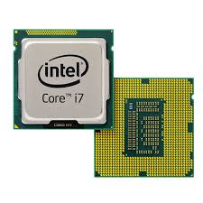
  <figcaption> Intel CPU (Image taken from Intel CPU in References).</figcaption>
</figure>

<figure>
  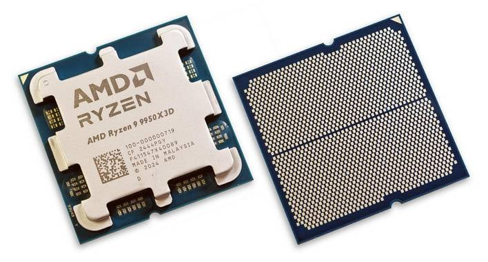
  <figcaption> AMD CPU (Image taken from AMD CPU in References).</figcaption>
</figure>

## What Are CPU Cores?

A **core** is a complete, independent processing unit within the CPU. Each core contains its own ALU, 
Control Unit, registers, and private L1/L2 cache, and is capable of executing an instruction stream 
without sharing execution resources with other cores.

Today, processors range from a few cores in consumer CPUs to dozens or even hundreds of cores in server 
and HPC processors. The two main categories are:

- A **single-core** CPU executes one instruction stream at a time, processing operations sequentially 
through a single execution unit.
- A **multi-core** CPU (dual-core, quad-core, many-core, etc.) can execute multiple instruction streams 
simultaneously, with each core operating independently.

Additional cores can greatly improve throughput, but only if the workload is parallelized. A purely sequential 
program will use just one core while the others remain idle. To benefit from multi-core systems, tasks must 
be divided into parallel workloads using programming models such as OpenMP for shared-memory systems or 
MPI for distributed computing. In HPC, performance depends not only on hardware, but also on software designed 
to use parallelism effectively.

## What Is Cache Memory?

**CPU cache** is a small, high-speed memory located on or near the processor. It stores frequently 
used data and instructions so the CPU can access them much faster than from main memory (RAM), 
reducing delays caused by memory access.

Caches are organized in levels, each with a trading size for speed:

| Level | Location | Size (typical) | Bandwidth (typical) |
|-------|----------|----------------|---------------------|
| **L1** | Inside each core | 32 – 128 KB | ~1,000 – 3,000 GB/s |
| **L2** | Inside each core (or nearby) | 256 KB – 4 MB | ~400 – 1,000 GB/s |
| **L3** | Shared across all cores | 8 – 64 MB | ~100 – 400 GB/s |
| **RAM** | On the motherboard | 8 – 512 GB | ~50 – 100 GB/s (DDR5) / up to ~3,000 GB/s (HBM) |

When the CPU requests data, it searches the cache hierarchy in sequence: first L1, then L2, then L3. 
Only if the data is missing from all cache levels does it access RAM, which is known as a **cache miss**. 
This design is effective because programs often reuse the same data and instructions and frequently access 
nearby memory locations, a behavior called locality of reference.

Cache performance strongly affects overall execution speed. Algorithms that access memory in regular, 
sequential patterns make efficient use of the cache and can run much faster than those that frequently 
cause cache misses and force the CPU to wait for data from RAM.

# What Is RAM?

**Random Access Memory (RAM)** is the computer’s main working memory, where the operating system, 
applications, and active data are stored while programs run. Unlike CPU cache, which keeps only 
immediately needed data close to the processor, RAM contains the larger working set of a program, 
including its code and data structures.

RAM is much faster than disk storage but slower than cache, and it is volatile, meaning its contents 
are lost when power is turned off. Cache hierarchies help reduce the performance gap between the CPU 
and RAM.

<figure class="inline end" markdown>
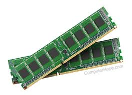{: style="width: 200px;"}
<figcaption>A couple memory sticks / RAM (Image taken from RAM in References).</figcaption>
</figure>

## Why RAM Matters

- More RAM allows the operating system to keep a larger number of programs and active data in memory 
at the same time.
- When RAM is insufficient, the operating system relies on **swap space** (disk-based virtual memory), 
which is much slower and can significantly reduce system responsiveness.
- RAM performance also depends on memory speed (measured in MT/s or MHz) and latency (the delay between 
requesting data and receiving it), both of which affect how quickly the CPU can access data that is not already in cache.

## Non-Uniform Memory Access (NUMA)

Modern servers and workstations often contain multiple CPU **sockets**, each with its own cores and a 
local bank of RAM. This architecture is called **NUMA (Non-Uniform Memory Access)**.

<figure>
  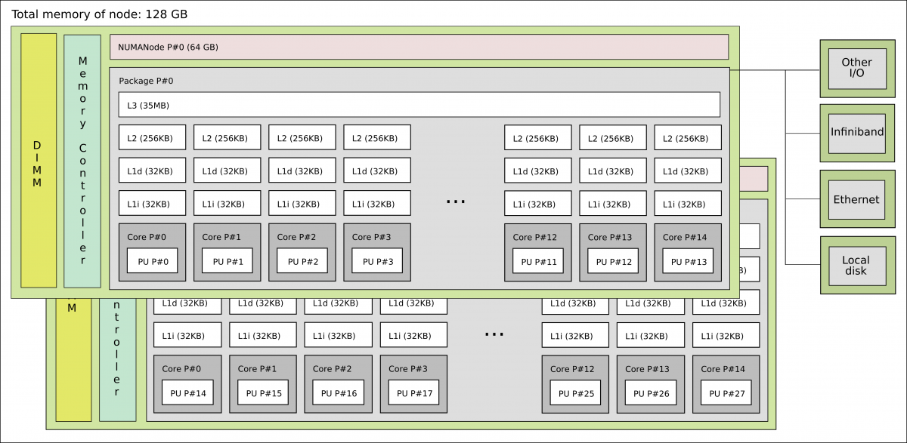
  <figcaption> CPU cache hierarchy: L1, L2, and L3 levels relative to cores and main memory in a single node.</figcaption>
</figure>

- A core can access its **local** RAM quickly (low latency).
- Accessing **remote** RAM (on the other socket) is possible but slower, typically 1.5x to 3x more latency.

In HPC and high-performance workloads, NUMA awareness is critical. Placing data in the same NUMA 
node as the cores that process it avoids expensive cross-socket traffic. Tools like `numactl`, 
`hwloc`, and SLURM's `--mem-bind` option help manage NUMA placement on Linux clusters.

## How Everything Works Together

1. **Programs and data** are first loaded from persistent storage into RAM, making them accessible to the CPU.
2. The **CPU** fetches instructions from RAM or cache, decodes them, and executes them using the ALU and registers.
3. The **cache hierarchy** keeps recently used data close to the processor cores, minimizing delays caused by slower 
RAM accesses.
4. In multi-socket systems, the **NUMA topology** affects memory access time: transfer data between sockets is less efficient
than local transfers.
5. **Results** are then stored back in RAM, written to persistent storage, or sent to output devices.

This fetch-decode-execute-write-back cycle runs continuously and billions of times per second while a program is executing.

??? note "How to get information about the CPU?"

    ```text
    $ lscpu 

    Architecture:                x86_64
      CPU op-mode(s):            32-bit, 64-bit
      Address sizes:             48 bits physical, 48 bits virtual
      Byte Order:                Little Endian
    CPU(s):                      32
      On-line CPU(s) list:       0-31
    Vendor ID:                   AuthenticAMD
      Model name:                AMD EPYC 7313 16-Core Processor
        CPU family:              25
        Model:                   1
        Thread(s) per core:      1
        Core(s) per socket:      16
        Socket(s):               2
        Stepping:                1
        Frequency boost:         enabled
        CPU max MHz:             3730.7351
        CPU min MHz:             1500.0000
        BogoMIPS:                5988.83
        Flags:                   fpu vme de pse tsc msr pae mce cx8 apic sep mtrr pge mca cmov pat pse36 clflush mmx fxsr s
                                se sse2 ht syscall nx mmxext fxsr_opt pdpe1gb rdtscp lm constant_tsc rep_good nopl nonstop
                                _tsc cpuid extd_apicid aperfmperf rapl pni pclmulqdq monitor ssse3 fma cx16 pcid sse4_1 ss
                                e4_2 x2apic movbe popcnt aes xsave avx f16c rdrand lahf_lm cmp_legacy svm extapic cr8_lega
                                cy abm sse4a misalignsse 3dnowprefetch osvw ibs skinit wdt tce topoext perfctr_core perfct
                                r_nb bpext perfctr_llc mwaitx cpb cat_l3 cdp_l3 invpcid_single hw_pstate ssbd mba ibrs ibp
                                b stibp vmmcall fsgsbase bmi1 avx2 smep bmi2 invpcid cqm rdt_a rdseed adx smap clflushopt 
                                clwb sha_ni xsaveopt xsavec xgetbv1 xsaves cqm_llc cqm_occup_llc cqm_mbm_total cqm_mbm_loc
                                al clzero irperf xsaveerptr rdpru wbnoinvd amd_ppin arat npt lbrv svm_lock nrip_save tsc_s
                                cale vmcb_clean flushbyasid decodeassists pausefilter pfthreshold v_vmsave_vmload vgif v_s
                                pec_ctrl umip pku ospke vaes vpclmulqdq rdpid overflow_recov succor smca ibpb_exit_to_user
    Virtualization features:     
      Virtualization:            AMD-V
    Caches (sum of all):         
      L1d:                       1 MiB (32 instances)
      L1i:                       1 MiB (32 instances)
      L2:                        16 MiB (32 instances)
      L3:                        256 MiB (8 instances)
    NUMA:                        
      NUMA node(s):              2
      NUMA node0 CPU(s):         0-15
      NUMA node1 CPU(s):         16-31
    Vulnerabilities:             
      Gather data sampling:      Not affected
      Indirect target selection: Not affected
      Itlb multihit:             Not affected
      L1tf:                      Not affected
      Mds:                       Not affected
      Meltdown:                  Not affected
      Mmio stale data:           Not affected
      Reg file data sampling:    Not affected
      Retbleed:                  Not affected
      Spec rstack overflow:      Mitigation; safe RET
      Spec store bypass:         Mitigation; Speculative Store Bypass disabled via prctl and seccomp
      Spectre v1:                Mitigation; usercopy/swapgs barriers and __user pointer sanitization
      Spectre v2:                Mitigation; Retpolines; IBPB conditional; IBRS_FW; STIBP disabled; RSB filling; PBRSB-eIBR
                                S Not affected; BHI Not affected
      Srbds:                     Not affected
      Tsa:                       Mitigation; Clear CPU buffers
      Tsx async abort:           Not affected
      Vmscape:                   Mitigation; IBPB before exit to userspace
    ``` 
??? note "How to get information about the NUMA node topology?"

    ```text
    $ numactl --hardware 

    available: 2 nodes (0-1)
    node 0 cpus: 0 1 2 3 4 5 6 7 8 9 10 11 12 13 14 15
    node 0 size: 128374 MB
    node 0 free: 121829 MB
    node 1 cpus: 16 17 18 19 20 21 22 23 24 25 26 27 28 29 30 31
    node 1 size: 128969 MB
    node 1 free: 122201 MB
    node distances:
    node   0   1 
      0:  10  32 
      1:  32  10
    ```

# Summary

| Component              | Role                                                                                  |
| ---------------------- | ------------------------------------------------------------------------------------- |
| **CPU**                | Executes program instructions and controls the overall operation of the computer      |
| **Cores**              | Individual processing units inside a CPU that allow multiple tasks to run in parallel |
| **Registers**          | Very small, extremely fast memory locations within each core used for active data     |
| **Instructions / ISA** | The set of operations the CPU can understand and execute                              |
| **Cache (L1/L2/L3)**   | High-speed memory near the CPU that reduces access to slower RAM                      |
| **RAM**                | Main volatile memory that stores running programs and active data                     |
| **NUMA**               | Multi-socket memory architecture where access speed depends on memory locality        |


!!! tip "References"

    - <a href="https://news.softpedia.com/news/Latest-Core-i7-Extreme-Ivy-Bridge-E-Intel-CPU-Delayed-335790.shtml" target="_blank">Intel CPU</a>
    - <a href="https://hothardware.com/reviews/amd-ryzen-9-9950x3d-cpu-review" target="_blank">AMD CPU</a>
    - <a href="https://medium.com/@sunnybabacom10/ram-a-deep-dive-into-its-importance-types-and-functionality-c042a095ef95" target="_blank">RAM</a>
    - <a href="https://johny4u.com/igcse_theory_2023/07)%20Computer%20Architecture.php" target="_blank">Computer Architecture</a>
    - <a href="https://en.wikipedia.org/wiki/First_Draft_of_a_Report_on_the_EDVAC" target="_blank">Von Neumann Report</a>
    - <a href="https://www.geeksforgeeks.org/computer-organization-architecture/computer-organization-von-neumann-architecture/" target="_blank">Computer organization</a>
    - <a href="https://www.geeksforgeeks.org/computer-organization-architecture/introduction-of-control-unit-and-its-design/" target="_blank">Instruction control units</a>
    - <a href="https://www.geeksforgeeks.org/computer-organization-architecture/essential-registers-for-instruction-execution/" target="_blank">Registers for instruction</a>
    - <a href="https://daemons.net/hardware/processors/x86.html" target="_blank">x86 instruction set</a>
    - <a href="https://en.wikipedia.org/wiki/X86-64" target="_blank">x86-64 instruction set</a>
    - <a href="https://en.wikipedia.org/wiki/AArch64" target="_blank">AArch64</a>
    - <a href="https://jasonblog.github.io/note/arm/introduction_to_armv8_64-bit_architecture.html" target="_blank">ARM64</a>
    - <a href="https://dl.acm.org/doi/10.1145/3757348.3757367" target="_blank">RISC-V instruction set</a>
    - <a href="https://www.geeksforgeeks.org/computer-science-fundamentals/central-processing-unit-cpu/" target="_blank">Central Processing Unit</a>
    - <a href="https://en.wikipedia.org/wiki/CPU_cache" target="_blank">Central Processing Unit cache</a>
    - <a href="https://www.geeksforgeeks.org/computer-science-fundamentals/cache-memory/" target="_blank">Cache memory</a>
    - <a href="https://www.geeksforgeeks.org/computer-organization-architecture/cache-memory-performance/" target="_blank">Cache memory performance</a>
    - <a href="https://www.geeksforgeeks.org/computer-science-fundamentals/random-access-memory-ram/" target="_blank">Random Access Memory</a>
    - <a href="https://www.geeksforgeeks.org/computer-organization-architecture/difference-between-uniform-memory-access-uma-and-non-uniform-memory-access-numa/" target="_blank">Non Uniform Access Memory</a>
    - <a href="https://en.wikipedia.org/wiki/Non-uniform_memory_access" target="_blank">NUMA</a>

