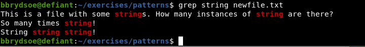
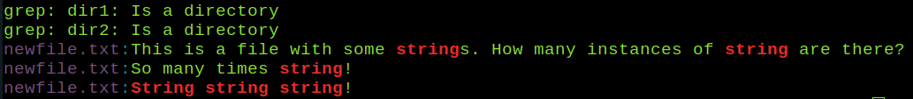

# Model solutions for "Extra exercises" 

Useful files for these examples are found in `exercises/06.linux-intro/patterns` from the tarball, except for the two last sections which mainly uses `exercises/06.linux-intro/awk-qol` and `exercises/06.linux-intro/script`.

Note that many of the exercises have several correct answers. 
 
## The Linux File System - Wildcards

1. Using wildcards, match all file names that begin with `thisfile`, followed by one or more numbers, and end with `.txt` 
    - Answer: 
    ```bash
    thisfile?*.txt
    ```
    - NOTE: You can test with `ls thisfile?*.txt`
    ```bash
    $ ls thisfile?*.txt
    thisfile0.txt   thisfile1.txt  thisfile3.txt  thisfile5.txt  thisfile7.txt  thisfile9.txt
    thisfile10.txt  thisfile2.txt  thisfile4.txt  thisfile6.txt  thisfile8.txt
    ```
2. Using wildcards, match all file names with a number in them. 
    - Answer:
    ```bash
    *[0-9]*
    ```
    - NOTE: You can test with `ls *[0-9]*`
    ```bash
    $ ls *[0-9]* 
    1file.c      myfile1.txt  thisfile0.txt   thisfile2.txt  thisfile5.txt  thisfile8.txt
    file.c1      myfile2.txt  thisfile10.txt  thisfile3.txt  thisfile6.txt  thisfile9.txt
    myfile0.txt  myfile3.txt  thisfile1.txt   thisfile4.txt  thisfile7.txt

    dir1:
    dir3  fil3.txt  fil4.txt

    dir2:
    ```
3. Using wildcards, match all file names that has a `0` in them. 
    - Answer:
    ```bash
    *0*
    ```
    - NOTE: You can test with `ls *0*`
    ```bash
    $ ls *0* 
    myfile0.txt  thisfile0.txt  thisfile10.txt
    ```

More about wildcards here: <a href="https://hpc2n.github.io/bioinformatics-hpc/06.linux-intro/filesystem/#wild__cards" target="_blank">https://hpc2n.github.io/bioinformatics-hpc/06.linux-intro/filesystem/#wild__cards</a>

## Modifying the file tree - cp, mv, rm 
 
1. Create a directory named `bio`. Change to the directory. Create two subdirectories. Enter one of them. Create three files (using either `touch` or an editor).
    - Answer: 
    ```bash
    $ mkdir bio
    $ cd bio
    $ mkdir subdir1
    $ mkdir subdir2
    $ cd subdir1
    $ touch file1.txt
    $ touch file2.c
    $ touch file3.dat
    ``` 
2. Create another directory, at the same level as the directory named `bio`. Copy the files and directories form `bio` into your new directory. 
    - Answer: 
    ```bash
    $ cd ..
    $ cd ..
    $ mkdir bio2
    $ cp -r bio/* bio2/
    ```
3. Enter your new directory. Create four files. Create a subdirectory. Move the files to the new subdirectory.
    - Answer:
    ```bash
    $ cd bio2
    $ touch fil1.txt
    $ touch fil2.txt
    $ touch fil3.c
    $ touch fil4.dat
    $ mkdir subdir3
    $ mv fil1.txt fil2.txt fil3.c fil4.dat subdir3/
    ```
4. Enter the directory `bio`. Rename one of the subdirectories. Create another subdirectory. Remove a file. Remove one of the subdirectories. Try removing one with files in it and one without. What extra option do you need to remove a directory, a directory with files in, and a regular file? 
    - Answer: 
    ```bash 
    $ cd ../bio
    $ mv subdir1 subdir4 
    $ mkdir subdir5
    $ rm subdir4/file1.txt 
    $ rm -r subdir2
    $ rm -rf subdir4
    ```
    - Note: A regular file can be removed with `rm FILE`, and to remove a directory you need the option `-r` to `rm`. Depending on the settings on your system, you may need options `-rf` to `rm` in order to remove a directory with files in it. 

## Modifying the file tree - symbolic links 

1. Create a symbolic link in your home directory to the `patterns` subdirectory inside the extracted tarball. 
    - Answer:
    ```bash
    ln -s /path/to/your/exercises/06.linux-intro/patterns/ $HOME/patterns 
    ```

## Data handling - archiving and compressing 

1. Create a tarball containing the `exercises/06.linux-intro` files and directories, but not the exercises from the other sections. 
    - Answer:
    ```bash 
    tar zcvf linux-intro.tar.gz /path/to/your/exercises/06.linux-intro/
    ```
2. Use `rsync` to transfer files between two of your directories. 
    - Answer:
                                                                                    ```bash
    rsync -a dir1/ dir2
    ```

## Pipes and filters 

1. Using `cat` and redirect, create a new file named `myfancyfile.txt` with several lines of text (at least 10 lines). Save it as in the exercise on https://hpc2n.github.io/bioinformatics-hpc/06.linux-intro/pipesfilters/#exercises 
    - Answer: 
    ```bash
    $ cat > myfancyfile.txt
    Here I am writing a number of lines
    There should be at least 10 lines.
    Let us hope I am inspired.
    To write a long text file with many lines, you just write and write :)
    It is going forward.
    I am writing the sixth line of text.
    Once upon a time, there was a blue cat with small red boots.
    This cat liked to walk in snow and rain, which is why it had the boots.
    Where did it get the boots you may wonder?
    It had asked a fairy for them, when out on a hunt for mice. The mice had been eating 
    the fairys favourite berries so when the cat caught and ate the mice the fairy gave 
    the cat the choice of a gift and the cat asked for the boots. 
    And now there are more than 10 lines!
    Success! 
    ```
    - Note: I closed and saved the file with CTRL-d (press CTRL and hold while pressing d on the keyboard)
2. Use `head` and `tail` to see the first and last few lines of text. 
    - Answer:
    ```bash
    $ head -3 myfancyfile.txt 
    Here I am writing a number of lines
    There should be at least 10 lines.
    Let us hope I am inspired.
    ```
    ```bash
    $ tail -3 myfancyfile.txt 
    the cat the choice of a gift and the cat asked for the boots. 
    And now there are more than 10 lines!
    Success! 
    ```
3. Use `wc` to count the number of lines, the number of characters, and the number of words in your file. 
    - Answer:
    ```bash
    $ wc myfancyfile.txt 
     14 144 685 myfancyfile.txt
    ```
    - Note: To get just the line, use the option `-l`. To get just the words, use the option `-w`. To get just the number of characters, use the option `-c`
4. Use `sort` to sort the lines. 
    - Answer:
    ```bash
    $ sort myfancyfile.txt 
    And now there are more than 10 lines!
    Here I am writing a number of lines
    I am writing the sixth line of text.
    It had asked a fairy for them, when out on a hunt for mice. The mice had been eating 
    It is going forward.
    Let us hope I am inspired.
    Once upon a time, there was a blue cat with small red boots.
    Success! 
    the cat the choice of a gift and the cat asked for the boots. 
    the fairys favourite berries so when the cat caught and ate the mice the fairy gave 
    There should be at least 10 lines.
    This cat liked to walk in snow and rain, which is why it had the boots.
    To write a long text file with many lines, you just write and write :)
    Where did it get the boots you may wonder?
    ```
    - Note: It would make no difference to add the option `-n` for numerically instead of alphanumerically, since this is not numbers. 

## Finding patterns 

1. Use pipes to first do `wc` on a file and then `sort` the output. 
    - Answer: 
    ```bash
    $ wc myfancyfile.txt | sort
     14 144 685 myfancyfile.txt
    ```
2. In the directory `exercises/06.linux-intro/patterns`, use `grep` to search for the word `string` and the word `text`. Do the same while adding `-i` to ignore case. 
    - Answer: 
    ```bash
    $ grep string *
    ```
    
    ```bash
    $ grep text *
    ```
    
    ```bash
    $ grep -i string *
    ```
    
    ```bash
    $ grep -i text *
    ```
    
3. Standing in the top level directory of exercise directories for the "Introduction to Linux" section (`exercises/06.linux-intro`), use find to find all files with the suffix `.txt`. 
    - Answer: 
    ```bash
    $ find . -type f -name "*.txt"
    ./mytestdir/myotherfile.txt
    ./mytestdir/testdir1/file1.txt
    ./mytestdir/testdir2/file2.txt
    ./mytestdir/testdir2/file1.txt
    ./mytestdir/myfile.txt
    ./awk-qol/myfile.txt
    ./script/file.txt
    ./patterns/thisfile8.txt
    ./patterns/thisfile2.txt
    ./patterns/fil.txt
    ./patterns/thisfile9.txt
    ./patterns/thisfile3.txt
    ./patterns/thisfile6.txt
    ./patterns/myfile3.txt
    ./patterns/dir1/dir3/fil2.txt
    ./patterns/dir1/fil3.txt
    ./patterns/dir1/fil4.txt
    ./patterns/thisfile4.txt
    ./patterns/thisfile7.txt
    ./patterns/newfile.txt
    ./patterns/myfile1.txt
    ./patterns/thisfile.txt
    ./patterns/thisfile1.txt
    ./patterns/thisfile5.txt
    ./patterns/myfile2.txt
    ./patterns/numbers.txt
    ./patterns/myfiles.txt
    ./patterns/thisfile0.txt
    ./patterns/myfile0.txt
    ./patterns/thisfile10.txt
    ```
4. Use regular expressions to find all lines in the file `myfile3.txt` in the `exercises/06.linux-intro/patterns` directory that has a word starting with `A` at the beginning of the line. 
    - Answer: 
    ```bash
    $ grep A* myfile3.txt 
    ```
     

## Linux tools: awk 

The directory `exercises/06.linux-intro/awk-qol` has two files `file.dat` and `myfile.txt` which are useful for these exercises. 

1. Search for the pattern `omnivore` in the file `file.dat` and print out the line. 
    - Answer: 
    ```bash
    $ awk '/omnivore/ {print$1}' file.dat 
    dog
    magpie
    ```
2. Search for the pattern `is` in the file `myfile.txt` and print out the second column of lines with that pattern. 
    - Answer: 
    ```bash
    $ awk '/is/ {print $2}' myfile.txt
    it
    is
    file
    file
    ```
    - Note: Look at the file <a href="https://raw.githubusercontent.com/hpc2n/bioinformatics-hpc/refs/heads/main/exercises/06.linux-intro/awk-qol/myfile.txt" target="_blank">`myfile.txt`</a>; you can see that the *'pattern* `is` exists in the last few lines, namely in the word `this`. 
3. Print column 1 and 4 from file `file.dat`, but only those rows that contain the letter ‘v’. 
    - Answer
    ```bash
    $ awk '/v/ {print $1 "\t" $4}' file.dat
    cat	3
    dog	2
    wolf	4
    rabbit	1
    magpie	3
    gecko	4
    cow	3
    python	5
    ```
4. Print all lines of `file.dat` that has more than 20 characters 
    - Answer: 
    ```bash
    $ awk 'length($0) > 20' file.dat
    ```

## Scripting 

1. Create a script that greets you when run. 
    - With any editor, open the new file `hello.sh`. 
    - Enter the following into the editor: 
      ```bash
      #!/bin/bash
      # Let us first declare a variable
      GREETING="Hello, Linux Learner!"

      # Print the content of the variable.

      echo $GREETING
      ```
      
    - Save 
    - Set the executable permissions: ``chmod +x hello.sh``
    - Run the script.
      ```bash
      $ ./hello.sh 
      Hello, Linux Learner!
      ```   
2. Create a script that asks for input and does something with it: 
    - With any editor, open the new file `addinput.sh`.
    - Enter the following into the editor:
      ```bash 
      #!/bin/bash
      echo "This program adds integers."
      echo "What is the first integer? "

      read FIRST_INTEGER
     
      echo "What is the second integer? "

      read SECOND_INTEGER

      SUM=$(expr "$FIRST_INTEGER" + "$SECOND_INTEGER")

      echo "The sum is: $SUM" 
      ```
      
    - Save and set correct permissions, then run it. 
      ```bash
      $ chmod +x addinput.sh 
      $ ./addinput.sh 
      This program adds integers.
      What is the first integer? 
      23
      What is the second integer? 
      32
      The sum is: 55
      ```
3. Combine the two programs to create a program that asks for your name and then says ``Hello, <your-name>!``. 
    - Answer: 
      
4. Create a script that uses IF-ELSE to say if a number is less or greater that 2026. 
    - With any editor, open the new file `ifelse.sh`
      ```bash
      #!/bin/bash
      echo "Enter a number:"
      read NUM

      if [ $NUM -gt 2026 ]; then

        echo "This is greater than 2026!"

      else

        echo "This number is not greater than 2026."

      fi
      ```
    - Save. Set executable permissions. Run the script. 
    - Answer: 
      
      ```bash
      $ ./ifelse.sh 
      Enter a number:
      4
      This number is not greater than 2026.
      ```
      ```bash
      $ ./ifelse.sh 
      Enter a number:
      14567
      This is greater than 2026!
      ```
