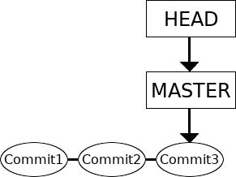
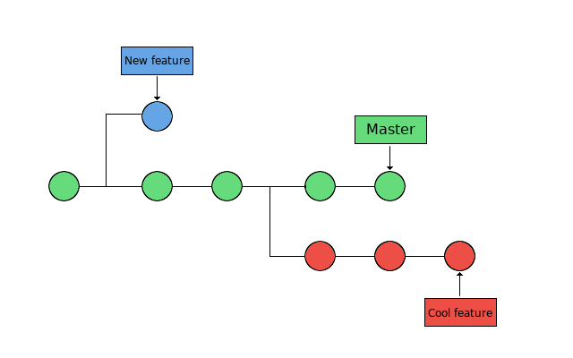
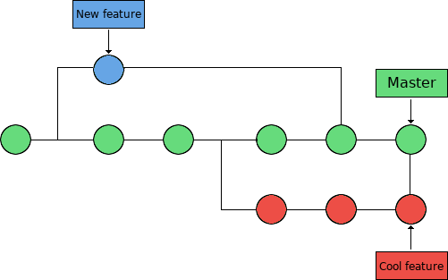

# Branches, merges, and conflicts 

!!! note "Objectives"

    - Get some more hands-on working with branches
        - creation
        - switching
        - merging
        - deletion
        - handling uncommitted changes
            - stashing
            - discarding
            - checkout with merge
        - merging and merge conflicts
        - rebasing: combining a sequence of commits to a new base commit.
        - cherry-picking

Branches allow developers to work independently on features, fixes, or experiments.

## Why use branches 

There are many uses for branches:

- Test different directions for a project
- Several projects members would like to work on their own copy of the code
- Bug fixes that are not yet tested, but will later be merged into the main version

## What is a Git branch?

A branch represents a separate development path.
Repositories typically begin with a default branch called `main` or `master`.

Until now, we have worked with a repository that only have one branch, with the commits done one at a time: 



In the above picture, the master (or main) branch points to a commit. The current position is HEAD. (Time goes rightwards)

### What is a Git branch - basic concepts

Now we want to look at repositories with several branches: 



Branches are used to create another line of development.  They are "individual projects" within a git repository.

* The branch is the commit and all its parent commits, not just the one we are currently pointing at. 
* The main line of development is usually called the "master" branch.
* Different branches within a repository can have
  * completely different files and folders
  * almost everything the same except for a few lines of code in a file

Usually, a branch is created to work on a new feature. Once the feature is completed, it is merged back with the master branch.




## Basic Branch Commands

```bash
# List branches and see which branch you are on 
git branch

# Create a branch
git branch cool-feature

# Switch to another branch named cool-feature
git switch cool-feature

# Create a branch and switch to it immediately
git switch -c cool-feature

# Another way to switch branch
git checkout cool-feature

# Another way to create a branch and switch to it immediately
git checkout -b fancy-idea
```

## Typical Branch Workflow

```bash
# Create and enter a branch
git switch -c my-feature

# Make edits
echo "Feature content" > feature.txt

git add feature.txt
git commit -m "Add feature"

# Return to main
git switch main
# or 
git checkout cool-feature

# Merge the branch
git merge my-feature

# Delete merged branch
git branch -d my-feature
```

## Branches: merging, deletion

- When you have decided you are happy with the changes you made to the new branch, merge it back to the master branch (or another branch)
- Note: The branch is always merged to the current HEAD.
- First switch to the branch you are merging it to:

```shell
git checkout master
```

- Then merge them:
```shell
git merge cool-feature
```
- You can now delete the reference to the extra branch, the commits stay:
```shell
$ git branch -d cool-feature
```

!!! example "Exercise/example - Type along!"

    * Create a directory. Initialize a repository
    * Create a file, stage it, and commit it

    ```shell
    $ mkdir my-project; cd my-project/
    $ git init
    Initialized empty Git repository in /home/bbrydsoe/my-project/.git/
    $ touch file.txt
    $ git add file.txt 
    $ git commit -m "Committing the first file"
    [master (root-commit) 1006b51] Committing the first file
     1 file changed, 0 insertions(+), 0 deletions(-)
     create mode 100644 file.txt
    ```

    * Create a new branch, then switch to that branch
    * Make some changes - add files and text ( > overwrites or are suitable for new file)
    * Stage the file and commit it

    ```shell
    $ git branch cool-feature
    $ git checkout cool-feature 
    Switched to branch 'cool-feature'
    $ echo "This is a text" > file.txt 
    $ git add file.txt 
    $ git commit -m "Added text to the first file" 
    [cool-feature 5bad966] Added text to the first file
     1 file changed, 1 insertion(+)
    ```

    - Switch back to the master branch, make some changes 

    ```shell
    $ git checkout master
    Switched to branch 'master'
    $ echo "Text to the second file" > second-file.txt 
    $ git add second-file.txt 
    $ git commit -m "Added a second file"
    [master bdec2cf] Added a second file
     1 file changed, 1 insertion(+)
     create mode 100644 second-file.txt
    ```

    - We should check the effect of the changes. I will use this command: 
 
    ```shell
    $ git log --graph --oneline --decorate --all
    ``` 

    - It can be useful to make this into an alias so we can just say ``git graph``:
   
    ```shell
    $ git config --global alias.graph "log --all --graph --decorate --oneline"
    ```

    This is on the master branch 

    ```shell
    $ git graph
    * bdec2cf (HEAD -> master) Added a second file
    | * 5bad966 (cool-feature) Added text to the first file
    |/  
    * 1006b51 Committing the first file
    ```

    We now merge the branches and check again 

    ```shell
    $ git merge cool-feature 
    Merge made by the 'recursive' strategy.
     file.txt | 1 +
     1 file changed, 1 insertion(+)
    ```

    - Note that in recent git versions (>=2.33) the default "recursive" strategy is replaced by the "ort" strategy.

    ```shell
    $ git graph
    *   cf3e6b7 (HEAD -> master) Merge branch 'cool-feature'
    |\  
    | * 5bad966 (cool-feature) Added text to the first file
    * | bdec2cf Added a second file
    |/ 
    * 1006b51 Committing the first file
    ```

    Now we can delete the reference to the new branch we had created, since all the content is now in the master branch. 

    ```shell
    $ git branch -d cool-feature 
    Deleted branch cool-feature (was 5bad966).
    ```

    In a somewhat nicer format, it looks like this: 

    We commit stuff to both branches

    ```mermaid
    graph LR

      master["master"]
      style master fill:#ffffff,stroke:#ffffff
      cool-feature["cool-feature"]
      style cool-feature fill:#ffffff,stroke:#ffffff

      commitX(["commitX"])
      commit1(["commit1"])
      commit2(["commit2"])
      commitY(["commitY"])
      commit3(["commit3"])

      master -.-> commit3
      commit3 --> commit2
      commit2 --> commit1
      cool-feature -.-> commitY 
      commitY --> commitX
      commitX --> commit1

    ```

    (Time goes leftwards)

!!! warning "Optional/self study"

    Merge 'cool-feature' to 'master' (3-way merge)"

    3-way merges use a dedicated commit for connecting the two merge histories. The name comes from the fact that Git uses three commits to generate the merge commit: the two branch tips and their common ancestor.

    ```mermaid
    graph LR

      commit4Y(["New merge commit"])
      master["master"]
      style master fill:#ffffff,stroke:#ffffff
      cool-feature["cool-feature"]
      style cool-feature fill:#ffffff,stroke:#ffffff

      commitX(["commitX"])
      commit1(["commit1"])
      commit2(["commit2"])
      commitY(["commitY"])
      commit3(["commit3"])
      commit4(["commit4"])

      master -.-> commit4Y
      commit4 --> commit3
      commit4Y --> commit4
      cool-feature -.-> commitY
      commit3 --> commit2
      commit2 --> commit1
      commitY --> commitX
      commit4Y --> commitY
      commitX --> commit1
    ```

    Delete 'cool-feature'

    ```mermaid
    graph LR

      commit4Y(["New merge commit"])
      master["master"]
      style master fill:#ffffff,stroke:#ffffff

      commitX(["commitX"])
      commit1(["commit1"])
      commit2(["commit2"])
      commitY(["commitY"])
      commit3(["commit3"])
      commit4(["commit4"])

      master -.-> commit4Y
      commit4 --> commit3
      commit4Y --> commit4
      commit3 --> commit2
      commit2 --> commit1
      commitY --> commitX
      commit4Y --> commitY
      commitX --> commit1
    ```

    (Time goes leftwards)

If the branches have not diverged, i.e. if there is a linear path from the current branch tip and to the target branch, then it is possible to do a fast-forward merge. Git is not really merging the branches, just integrating the histories, i.e. it moves “fast forward” the current branch tip up to the target branch tip.

!!! warning "Optional example, fast-forward merging" 

    When doing a fast-forward merge, the commit histories are combined and all commit histories can be reached from the current tip. An example would be to do a fast-forward merge of a feature into master/main.

    A fast-forward merge is not possible if the branches have diverged, like in the previous example. This means that there is no linear path to the target branch and Git has to combine them via a 3-way merge.

    This shows an example where a fast-forward merge would work.

    Before FF merge: 

    ```mermaid
    graph LR

      master["master"]
      style master fill:#ffffff,stroke:#ffffff
      nice-feature["nice-feature"]
      style nice-feature fill:#ffffff,stroke:#ffffff

      commit1(["commit1"])
      commit2(["commit2"])
      commit3(["commit3"])
      commitX(["commitX"])
      commitY(["commitY"])

      master -.-> commit3
      nice-feature -.-> commitY
      commit1 --> commit2
      commit2 --> commit3
      commit3 --> commitX
      commitX --> commitY
    ```

    After FF merge:

    ```mermaid
    graph LR

      master["master"]
      style master fill:#ffffff,stroke:#ffffff
      nice-feature["nice-feature"]
      style nice-feature fill:#ffffff,stroke:#ffffff

      commit1(["commit1"])
      commit2(["commit2"])
      commit3(["commit3"])
      commitX(["commitX"])
      commitY(["commitY"])

      master -.-> commitY
      nice-feature -.-> commitY
      commit1 --> commit2
      commit2 --> commit3
      commit3 --> commitX
      commitX --> commitY
    ```

## Switching with uncommitted changes

As mentioned above, you switch between branches with: 

```shell
$ git checkout <branch>
```

What happens if you have uncommitted changes (and/or new files added) when you try to switch?

- The uncommitted changes will be carried to the new branch that you switch to, if possible. 
 
- Changes that you commit will be committed to the newly switched branch.

What if there is a **conflict**? Conflicts can happen when two branches modify the same part of a file.

- You will **not** be allowed to switch to the other branch.
- You must commit or stash any conflicting changes before switching branches.

!!! example "Example - new file"

    Here we create a new branch, switch to it, then add a new file. Then we switch back to the master branch without committing the changes: 

    ```shell
    $ git checkout -b cool-feature 
    Switched to a new branch 'cool-feature'
    $ touch newfile.txt
    $ git add newfile.txt 
    $ git checkout master
    A   newfile.txt
    Switched to branch 'master'
    ```

    Git warns that there is a file added (`A`) in one branch but not the other, but the switch is allowed. 

!!! example "Example - modified file"

    **We continue in the same repository!**

    First commit the `newfile.txt` in the cool-feature branch to clean the environment.
    If we make changes to the file in one of the branches (go back to `cool-feature`) but not on the other and do not commit it, then git will again warn: 

    ```shell
    $ git switch cool-feature
    $ git commit -m "newfile.txt"
    $ echo "Adding some text" >> second-file.txt
    $ git add second-file.txt 
    $ git checkout master
    M	second-file.txt
    Switched to branch 'master'
    ```

    Git warns that there is a file that is modified (`M`) in one branch but not the other, but the switch is allowed. 

!!! example "Example - uncommitted, conflicting change"

    **We continue in the same repository!**

    Assume two branches, "cool-feature" and "morefeatures"

    Create the branch "morefeatures" without switching to it
    Switch to branch "cool-feature", add some text to a file, stage the file and commit it: 

    ```shell
    $ git branch morefeatures
    $ git checkout cool-feature 
    Switched to branch 'cool-feature'
    $ git commit -m "second-file.txt"
    $ echo "add text" >> morefiles.txt 
    $ git add morefiles.txt 
    $ git commit -m "Some text"
    [cool-feature 469542b] Some text
     1 file changed, 1 insertion(+)
     create mode 100644 morefiles.txt
    ```

    Switch to branch "morefeatures". Modify the same file, stage the file and commit it. Then try and switch back to the "cool-features" branch: 

    ```shell
    $ git checkout morefeatures 
    Switched to branch 'morefeatures'
    $ echo "Adding yet some more text" >> morefiles.txt
    $ git add morefiles.txt 
    $ git checkout cool-feature 
    error: Your local changes to the following files would be overwritten by checkout:
    	morefiles.txt
    Please commit your changes or stash them before you switch branches.
    Aborting
    ```

    Now Git complains and do not allow the switch. 


## Handling uncommitted changes (that are causing conflicts)

So, what can we do if there is a conflict?

* Commit the changes before switching branch
* Stash the uncommitted changes
* Discard the uncommitted changes
* Checkout with Merge


## Stashing

The command "stash" can be described as a **drawer** where you store uncommitted changes temporarily. 

After stashing your uncommitted changes you can continue **working on other things**.

The uncommitted changes that are stored in the stash **can be taken out and applied to any branch, including the original branch.**

!!! warning "Stashing example - try on your own in the afternoon"

    First do a `git status` in the branch where you may have uncommitted changes: 

    ```shell
    $ git status
    On branch morefeatures
    Changes to be committed:
      (use "git reset HEAD <file>..." to unstage)

    	modified:   file.txt
	new file:   morefiles.txt
    ```

    You can see the dirty status. 

    To fix it, let us use `git stash`:

    ```shell
    $ git stash
    Saved working directory and index state WIP on morefeatures: 4922606 Some text
    ```

    Checking again with `git status`: 

    ```shell
    $ git status
    On branch morefeatures
    nothing to commit, working tree clean
    ```

    You can now switch branches and work on something else. 

    To later restore the file, check the stashes you have saved with ``git stash list`` and restore the the latest stash with ``git stash apply``. 

## Discarding uncommitted changes 

If you do not want to stash your changes, but just **get rid** of them, you can use `git clean`.

WARNING: This command will remove all non-tracked files in your current directory!

You can safely test which files will be removed by running: 

```shell
$ git clean --dry-run
```

## Handling uncommitted changes - merging

- There is a checkout with merge option. Add the flag `--merge` (or `-m`): 
```shell
$ git checkout --merge <branch>
```
- This will perform a **three-way merge between your working tree and the new branch, with the current branch as the base.**

- After the merge, you will be on the new  branch and the merged result will be in your working tree. 
 
- NOTE: As with any merge, **conflicts may result** and you will then have to resolve those. 


## Merging and merge conflicts

Conflicts happen when two branches modify the same part(s) of a file/files.

- Merge conflicts will happen now and then when you are working with more than one branch and try to merge them. 
- In many cases, Git is actually able to do a merge without problems. However, merge conflicts can happen.
- If Git cannot safely merge something automatically, you will get a message like this:
```shell
error: Entry '<fileName>' would be overwritten by merge. 
Cannot merge. (Changes in staging area)
```

!!! warning "NOTE"

    Always check that you are on the right branch before merging! You check the branch with `git branch`.


Git can automatically try to merge when you give the command: 

```shell
$ git merge <branch-to-merge-into-present-branch>
```

while standing on the branch you want to merge to. 

!!! info "Conflict markers"

    If there is a conflict, Git inserts markers like this:

    ```text
    <<<<<<< HEAD
    Current branch content
    =======
    Incoming branch content
    >>>>>>> feature_1
    ```

### OPTIONAL/SELF study - Merge strategies

The most commonly used 

* Fast Forward Merge 
    * the commit history is one straight line. 
    * You create a branch, you make some commits there, but no changes to the 'master'. You then just merge onto the 'master'. This just moves the pointer for the 'master' branch forward in a straight line. 
* Recursive Merge (until 2.32)
    * make a branch and make some commits there, but also make new commits that are made on another branch, like the ‘master‘. 
    * Then, when you want to merge, git will recurse over the branch and create a new merge commit. The merge commit will continue to have two parents. 
* ORT (from git-2.33)
    * acronym for "Ostensibly Recursive’s Twin"
    * replacement for the previous default algorithm, recursive.
    * This is the default merge strategy when pulling or merging one branch. 
    * Results in fewer merge conflicts without causing mismerges 


!!! example "Exercise/example: A merge conflict" 

    TYPE ALONG! 

    Let's create a merge conflict:

    ```shell
    $ mkdir merge-test
    $ cd merge-test/
    $ git init
    $ echo "Initial content" > myfile.txt
    $ git add myfile.txt
    $ git commit -m "first commit"

    $ git checkout -b feature_1
    $ echo "Feature 1 is a good implementation" >> myfile.txt
    $ git commit -a -m "start work on feature 1"

    $ git checkout master
    $ echo "Working on a really cool feature" >> myfile.txt
    $ git commit -a -m "start work on a cool feature" 
    ```

    We now have two branches, **master** and **feature_1**:

    ```shell
    $ git log --all --graph --decorate --oneline
    * d8e6809 (HEAD -> master) start work on a cool feature
    | * 87934eb (feature_1) start work on feature 1
    |/  
    * ce7e46c first commit
    ```

    What are the contents of **myfile.txt** in the two branches?

    ```shell
    $ git diff master feature_1 -- myfile.txt
    diff --git a/myfile.txt b/myfile.txt
    index b14ae98..5390ea7 100644
    --- a/myfile.txt
    +++ b/myfile.txt
    @@ -1,2 +1,2 @@
     Initial content
    -Working on a really cool feature
    +Feature 1 is a good implementation
    ```

    Or use the **git show <ref>:<path>** command:

    ```
    $ git show master:myfile.txt
    Initial content
    Working on a really cool feature
    $ git show feature_1:myfile.txt
    Initial content
    Feature 1 is a good implementation
    ```

    Let's try to merge the **feature_1** branch on to the **master** branch:
    
    ```shell
    $ git merge feature_1
    Auto-merging myfile.txt
    CONFLICT (content): Merge conflict in myfile.txt
    Automatic merge failed; fix conflicts and then commit the result.
    ```

    The merge failed due to a conflict. In this case, the conflict arises because there are changes in the same line on both branches.

    We can get some more information with the **git status** command: 

    ```shell
    $ git status
    On branch master
    You have unmerged paths.
      (fix conflicts and run "git commit")
      (use "git merge --abort" to abort the merge)

    Unmerged paths:
      (use "git add <file>..." to mark resolution)
    	both modified:   myfile.txt

    no changes added to commit (use "git add" and/or "git commit -a")
    ```

    Let's check the file that lead to the conflict, note the "conflict dividers":
    ```shell
    $ cat myfile.txt 
    Initial content
    <<<<<<< HEAD
    Working on a really cool feature
    =======
    Feature 1 is a good implementation
    >>>>>>> feature_1

    ```
    One can abort the merge with **git merge --abort**.
    Or one may try to solve the conflict..

## Resolving merge conflicts 

!!! info "Resolving merge conflicts" 

    1. The most direct way to resolve the conflict is to edit the file yourself.
    2. Remember to also remove the conflict markers.
    3. Stage the corrected file
    ```bash
    git add FILE
    ```
    4. When this has been done, you can attempt the merge again with:
    ```shell
    $ git merge --continue
    ```

!!! tip "Helpful commands"

    - identify conflicting files: `git status`
    - list the conflicting commits among the branches: `git log --merge`
    - find differences between the commits involved in the merge: `git diff` 
    - reset conflicted files to a known good state: `git reset` 


If you made a mistake when you resolved a conflict and have completed the merge before realizing, you can roll back to the commit before the merge was done with the command `git reset --hard`. 

## Exercises

Each of the exercises has a README.md file with explanations and descriptions of what to do. You can find all of them in the subdirectory 5.branches. The contents of the README.md files are also listed here. You should do them in the below order: 
 
In order to do these exercises, you need to download the exercises.zip file if you did not already do so. 

1. ``wget https://github.com/hpc2n/bioinformatics-hpc/raw/refs/heads/main/exercises/07.Git/git_materials.zip`` 
2. ``unzip git_materials.zip``
3. ``cd git_materials``
4. ``cd 5.branches``

You are now in a directory with 5 subdirectories, one for each exercise. You will only be doing the first three exercises, as the two last are for more advanced/optional material (You can find the material towards the end of the branches, merges, and conflicts section found under "Advanced/self-study" in the left-hand menu). 

### 1. Merging two local branches

!!! note 

    The purpose of this exercise is to test the command `git merge` and see that the merge goes well in this case. 

    **Situation:** The ingredient list in branch "master" has an error in the ingredients which is fixed in the branch "fixed-recipe".

Start by making sure you are in the directory `git_materials/5.branches/1.merge-ok/recipes`. 

1. First do `git status` to look at the status. You can also run `git log` so you can compare before and after merging. 
2. Now try to merge the two branches. You will see that it merges with a "fast-forward" merge. <br>
   NOTE: Remember to check that you are on the right branch! Use `git branch` to check. <br>
   Merging the branch "fixed-recipe" to the "master" branch: 
   ```
   git merge fixed-recipe
   ```
   <br>
3. See that the merge goes well, and that git reports using "fast-forward" merge. <br>
4. Do `git log` and `git status` after the merge and compare what you got before.<br>
5. Think about why git could merge the two braches automatically and why it used "fast-forward" merge. 

### 2. Merging two local branches, recursive 

!!! note 

    In this exercise you will again try the command `git merge` and it should again go well. However, this time git will do a recursive merge, or in newer version an "ort" merge.

    **Situation:** The ingredient list in branch "master" has an error in the ingredients which is fixed in the branch "fixed-recipes". After that fix, a small change was made to the recipe in the "master" branch. 

Start by making sure you are in the directory `git_materials/5.branches/2.merge-ok-recursive/recipes`. 

1. First do `git status` to look at the status. Also run `git log` and see the commits that  have been made and to which branches. <br>
2. Now try to merge the two branches. You will see that the merge happens with "recursive" merge. <br>
   NOTE: Remember to check you are on the right branch before you try to merge!    <br>
   Merge the branch "fixed-recipe" to the "master" branch using the `git merge`command. 
   <br>
3. Notice that the merge goes well and that git reports using "recursive" merge. <br>
4. Do `git log`and `git status` after the merge and compare with what you got before.<br> 
5. Why did git use "recursive" merge? 

### 3. Merging two local branches resulting in a merge conflict 

!!! note 

    This exercise will again feature the command `git merge`, but this time the merge will fail and git will give a merge conflict. 

    **Situation:** In the branch "metric" we change the recipe to use the metric system for measurements. Then we change back to the "master" branch and **add some coffee** to that version of the recipe.

Start by making sure you are in the directory `git_materials/5.branches/3.merge-bad/recipes`. 

1. Do a `git status`first and note the result. Run `git log`. You could also look at the output from the longer command: 
   <br>   
   ```
   $ git log --oneline --abbrev-commit --all --graph
   ```
   or with the alias command `git graph`
   <br>
   NOTE: Remember to change to the subdirectory "recipes" first!
   <br>
2. Now try to merge the two branches with the `git merge` command and see that a conflict happens. 
   <br>
   NOTE: Check with `git branch` to find out if you are on the right branch before trying to merge.
   <br>
   You will get an error similar to this: 
   <br>
   ```
   $ git merge metric
   Auto-merging cakerecipe.txt
   CONFLICT (content): Merge conflict in cakerecipe.txt
   Automatic merge failed; fix conflicts and then commit the result.
   ```
   <br>
3. Use `git log` (including with the above mentioned flags) and `git status` to see where the problems are and see if you can fix the conflict and then reattempt the merge.

