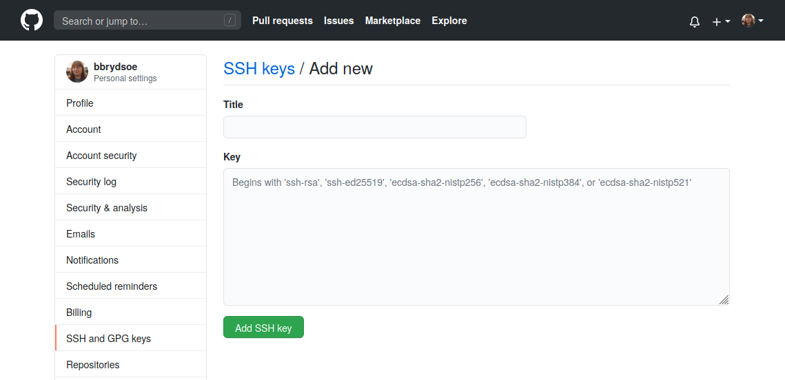

# Introduction to Git and setup

The purpose of this session is to learn the fundamentals of version control — manage file history, collaborate efficiently, and protect your work from accidental loss. 

## Understanding Git

Git is a **version control tool** designed to keep track of modifications made to files over time. It allows developers to revisit earlier versions of a project, compare changes, and work together without overwriting each other’s progress.

### Why Git and version control matters

In an ideal world, things develop linearly: 

- Every new version is an improvement upon the previous version. 
    - No need to backtrack. 
- Everyone knows what everyone else is doing 
- In the end, things are simply finished. 


In the real world, things develop non-linearly: 

- A new version can be anything between 
    - a complete catastrophe and 
    - a major breakthrough.
- People do not know what others are doing 
- Sometimes we are simply fixing earlier mistakes... 


!!! note "Going back to an earlier version"

    Sometimes, it is easier to simply backtrack to an *earlier version*...

    ```mermaid
    graph LR
      Mon@{ shape: stadium, label: "Monday's improvements"}
      Tue@{ shape: stadium, label: "Tuesday's mistakes"}
      Wed@{ shape: stadium, label: "Wednesday's improvements"}
      Mon --> Tue
      Mon --> Wed
    ```

    But without using a version control system (VCS), where is this *earlier version*?

    - CTRL + Z 
    - my_file.txt, my_file.txt.old, ... 
    - My project/ 
         - 2020-08-12/
         - 2020-08-13/
         - ...
    - Daily home directory backup 

    Also, this is: 

    - Prone to mistakes 
         - CTRL + Z has limits, overwritten/deleted files, human/hardware error 
    - How much to save? 
         - Individual files? Everything? How much space is required? 
    - How to organize versions? 
         - What is the difference between different versions? 

    *Overall, difficult to manage!* 

!!! note "What about the granularity?"

    This compounds the problem. 

    ```mermaid
    graph LR

      subgraph cluster1 [Monday's changes]
        t1a@{ shape: stadium, label: "Component A improvement"}
        t1b@{ shape: stadium, label: "Component B mistake"}
        t1c@{ shape: stadium, label: "Component C improvement"}
      end

      subgraph cluster2 [Tuesday's changes]
        t2a@{ shape: stadium, label: "Component A improvement"}
        t2b@{ shape: stadium, label: "Component B correction"}
        t2c@{ shape: stadium, label: "Component C mistake"}
      end

      subgraph cluster3 [Wednesday's changes]
        t3a@{ shape: stadium, label: "Component A mistake"}
        t3b@{ shape: stadium, label: "Component B improvement"}
        t3c@{ shape: stadium, label: "Component C correction"}
      end
  
      t1a --> t2a
      t1b --> t2b
      t1c --> t2c

      t2a --> t3a
      t2b --> t3b
      t2c --> t3c
    ```

!!! note "How does Git solve this?"

    - Stores the history using snapshots (commits) 
        - Each snapshot represents the project at a given point in time 
    - Manages snapshots and associated metadata 
        - Naming (tags), comments, dates, authors, etc 
    - Easy to move between different snapshots 
    - Can handle different degrees of granularity 
    - Can handle multiple development paths (branches) 

!!! note "Comparing and joining"

    - Git makes it easy to compare different snapshots 
        - Named revisions, comments, time information, author information 
        - Diff tools 
        - Search tools 
        - Bisection search 
    - Git also allows the joining (merging) of different snapshots  
        - Easy to experiment with ideas 

!!! note "Collaboration"

    - One of the primary functions of Git is to allow collaboration 
    - Usual setup: server (remote) + multiple clients 
        - People work locally and send (push) the changes to the server 
        - Git keeps track of what has been done and by whom 
    - Safer since mistakes can be easily remedied 
    - The contributions of several people can be merged 

!!! note "Backup"

    - Git functions as a backup 
    - Locally, the system maintains a copy of each file 
        - Usually only the changes or the files that have changed are stored 
    - Globally, lost files can be recovered from the server 

In addition, Git have been integrated with several services, like HackMD, Overleaf, ...

!!! note "Summing up"

    Git 

    - keeps track of your files and other output
    - tracks what is created and modified
    - tracks who made the modifications
    - tracks why the modifications were made (if you make good commit comments!)
    - Is important to reproducible research, helping you to explain what was changed, when, and why (for instance, why you filtered out specific data)

#### Practical use cases

- Managing source code 
    - Manage deployment (production, development, testing, etc) 
    - Manage published versions (v0.1 etc) 
    - Manage (experimental) features 
    - Bug hunting 
    - But also for: writers, artists, composers... 
- Track which version of a Latex manuscript has been 
    - submitted, 
    - revised and/or 
    - accepted
- Collaboration between several authors 
- batch files and data
    - Track different versions of your batch scripts 
    - Easy to check the used configuration afterwards
- Track input and output files 
    - Limited to smallish files
- etc etc 

## Setup - installing and setting up Git

We will use Git from the command line in this course. This is normally how you will use it on Kebnekaise and other HPC centers, and this way it will also be easier to understand what is going on while you are learning to use Git. On Windows, this means you will be using Git Bash. 

Graphical tools exists for Git, see below list for a few. All entries on the list are free and unless otherwise mentioned, available for Windows, macOS, and Linux: 

* git-scm (https://git-scm.com) comes with a basic GUI 
* Git Kraken (https://www.gitkraken.com/)
* Github Desktop (https://desktop.github.com/) Windows and macOS only
* Sourcetree (https://www.sourcetreeapp.com/) Windows and macOS only
* TortoiseGit (https://tortoisegit.org/) Windows only

!!! hint "NOTE!"

    If you have a problem getting this to work on your own computer, then you can use Kebnekaise instead.

    We have some documentation for you for using Git from Kebnekaise: [Using Kebnekaise for Git](../kebnekaise)

These are the steps we will go through - if you have already installed Git and set it up, you should not do this again. 

* Install Git, if you have not already
* Create a repository with `git init`
* Set your name and email with `git config` (local, global, system). More info in a moment. 
* Test by creating a file
* Then adding the file with `git add`
* Then commiting the file with `git commit`
* Check with `git log` that all looks well. 

When this is done, you will clone the course materials for the Git session.

### Git install 

=== "Windows"

    * Go to the Git-scm website (<a href="https://git-scm.com/downloads" target="_blank">https://git-scm.com/downloads</a>) and click "Windows" to download the Windows version. It should automatically start download of the .exe file.
    * The downloaded file can be installed by double-clicking and choosing "Run". 
    * Click "Yes" to let it be installed and then "Next" to accept the GNU GPL. 
    * The default options you are presented with should work, and we recommend using those. 
    * You will be using Git Bash for this course 
    * NOTE: when it comes to choosing the default editor, we recommend using either notepad or vim, unless you have a preferred editor. See the section on "Configure git" as well as the section on editors at the end of this document for some help. 

=== "macOS"

    If you have installed XCode (or its Command Line Tools), Git may already be installed. To find out, open a terminal and enter `git --version`.

    If Git is not installed, you have several installation options. Apple maintains their own fork of Git, but it is usually a few versions behind, so we do not recommend installing that. 

    * SourceForge: <a href="https://sourceforge.net/projects/git-osx-installer/files/" target="_blank">https://sourceforge.net/projects/git-osx-installer/files/</a>
    * Git-scm.com: <a href="https://git-scm.com/downloads" target="_blank">https://git-scm.com/downloads</a>
    * If you have Homebrew: `brew install git`

=== "Linux"

    Git is usually already installed on Linux, but if not, this is how you install it. 

    Installing Git on Linux depends on which distro you are running. 

    * `sudo apt-get install git` (Ubuntu, Debian)
    * `sudo dnf install git` (RHEL, CentOS)
    * <a href="https://git-scm.com/download/linux" target="_blank">https://git-scm.com/download/linux</a> (other)

!!! warning "Primary branch"

    * The primary branch will probably be named "master" when installing Git. 
    * You can choose if you want to instead name it "main" (which is what GitHub uses as default).
    * Regardless of which you pick, stick to one to avoid problems when pushing a repo
    * You can change the naming of the primary branch in GitHub for a repo
        * Go to repo
        * Pick "Settings" -> "General"
        * Change the name in "Default branch"
    * Instructions how to rename the primary branch in a repo from "master" to "main" on the command line: <a href="https://gist.github.com/danieldogeanu/739f88ea5312aaa23180e162e3ae89ab" target="_blank">https://gist.github.com/danieldogeanu/739f88ea5312aaa23180e162e3ae89ab</a>

### Configure git (all OS)

First check that you have git installed (in a terminal or in Git Bash):

```bash
$ git --version
```

Now configure git with

* `git config (local, global, system)`

You should at least set your global name and email (just once):

```bash
$ git config --global user.name "Your Name"
$ git config --global user.email "yourname@example.com" 
```

Setting the editor (once) is also a good idea: 

```bash
$ git config --global core.editor <editor>
```

Choices for editor could be (on Linux, though can be installed together with Git for other OS): 
* nano
* vim
* emacs

You should be able to use notepad on Windows by setting: 
`git config --global core.editor "<path-to>/notepad++.exe"`

Another option could be to install VS Code and do this config instead: 
`git config --global core.editor "code --wait"` 

GitHub has some documentation on choosing and setting editors for various OS: 
<a href="https://docs.github.com/en/get-started/getting-started-with-git/associating-text-editors-with-git" target="_blank">https://docs.github.com/en/get-started/getting-started-with-git/associating-text-editors-with-git</a>

See more about configuring and using editors with Git at the end of this document. 

### Test your Git installation

Create an example folder and change to that, then create a file test.txt. On Linux you would do this: 

```bash
$ mkdir <mydir> 
$ cd <mydir>
$ touch test.txt
```

Now initialize a repository and *stage* the new file:

```bash
$ git init
Initialized empty Git repository in /home/bbrydsoe/test-git/.git/
$ git add test.txt
```

Now *commit* the change. The editor which you configured earlier should open. Add an example *commit message*:

```bash
$ git commit test.txt 
[master (root-commit) ff8b6f6] Test of git
 1 file changed, 0 insertions(+), 0 deletions(-)
 create mode 100644 test.txt
```

Now let us look at the log:

```bash
$ git log
commit ff8b6f699d98c72d5cffc64d65a1c618b976b45a (HEAD -> master)
Author: Birgitte Brydsö <bbrydsoe@cs.umu.se>
Date:   Thu Sep 17 13:53:59 2020 +0200

    Test of git
```

When you do `git log`, you should see something like the above, but with name, email, date, and commit message different. If that is the case, your Git should be configured correctly. 

## Download the materials for the Git part 

For the individual hands-on part we have created some materials which you will download from the course GitHub repo: <a href="https://github.com/hpc2n/bioinformatics-hpc/" target="_blank">https://github.com/hpc2n/bioinformatics-hpc/</a>. 

* Please go to the terminal window where you have downloaded and set up Git.
* Change the directory to wherever you wish to have the material.
* Download the zipfile directly with `wget https://github.com/hpc2n/bioinformatics-hpc/raw/refs/heads/main/exercises/6.Git/git_materials.zip) and unzip. If you previously fetched the course tarball, then it is in the directory exercises/6.Git/. 

## Web based Git repositories

There are several web based Git repositories. Some of the more popular ones are: 

* GitHub (<a href="https://github.com/" target="_blank">https://github.com/</a>)
* GitLab (<a href="https://www.gitlab.com" target="_blank">https://www.gitlab.com</a>)
* Bitbucket (<a href="https://bitbucket.org" target="_blank">https://bitbucket.org</a>)
* SourceForge (<a href="https://sourceforge.net/" target="_blank">https://sourceforge.net/</a>)

### GitHub 

We are going to use GitHub for the part of the hands-on where you will be working together in groups. 

Please go to 

* <a href="https://github.com/" target="_blank">https://github.com/</a>

and sign up for an account, if you do not already have one. You will need to setup 2FA also. 

### Create a new SSH key for GitHub 

=== "Linux and macOS"

    1. Open a terminal. In the command below, "GitHub" is a label added to the key for clarity. You can add any you want: 
       a. Do this
       ```
       $ ssh-keygen -t ed25519 -C "GitHub"
       ```
       b. If you have an older system, this may work better
       ```
       $ ssh-keygen -t rsa -b 4096 -C "GitHub"
       ```    
    2. You will be asked for a file to save the key. Unless you have an existing SSH key, accept the default.
    3. Enter a passphrase and repeat it.
    4. Add the key to the ssh-agent. Here we assume the default name for the new systems - change to what your key was called (`.ssh/id_rsa` for the legacy system): 
    ```
    $ eval "$(ssh-agent -s)"

    $ ssh-add ~/.ssh/id_ed25519
    ```
    5. Switch to the `.ssh` folder, open the file `id_ed25519.pub` with some editor and copy it (`id_rsa` for legacy systems). Do NOT add any newlines or whitespace! 

=== "Windows"

    1. Open Git Bash. In the command below, "GitHub" is a label added to the key for clarity. You can add any you want: 
        a. Do this
        ```
        $ ssh-keygen -t ed25519 -C "GitHub"
        ```
        b. If you have an older system, this may work better
        ```
        $ ssh-keygen -t rsa -b 4096 -C "GitHub"
        ```    
    2. You will be asked for a file to save the key. Unless you have an existing SSH key, accept the default.
    3. Enter a passphrase and repeat it.
    4. Add the key to the ssh-agent. Here we assume the default name for the new systems - change to what your key was called (`.ssh/id_rsa` for the legacy system): 
    ```
    $ eval "$(ssh-agent -s)"

    $ ssh-add ~/.ssh/id_ed25519
    ```
    5. Switch to the `.ssh` folder, with some editor, open the file `id_ed25519.pub` (or `id_rsa.pub` for the legacy systems) and copy it. Do NOT add any newlines or whitespace! 

### Adding the SSH key to GitHub

1. On GitHub, click your avatar in the top right corner and pick "Settings".
2. Choose "SSH and GPG keys"
3. Click the green button labeled "New SSH key"
4. Add a descriptive label for the key in the "Title" field. In the key field you paste the content of the key (~/.ssh/id_rsa.pub)

5. Click "Add SSH key"
6. Confirm your GitHub password if you are prompted for it. 

1. Open a terminal / the Git bash 
2. `$ ssh -T git@github.com`
3. It will look similar to this: 
```
$ ssh -T git@github.com
The authenticity of host 'github.com (140.82.121.3)' can't be established.
ECDSA key fingerprint is SHA256:p2QAMXNIC1TJYWeIOttrVc98/R1BUFWu3/LiyKgUfQM.
ECDSA key fingerprint is MD5:7b:99:81:1e:4c:91:a5:0d:5a:2e:2e:80:13:3f:24:ca.
Are you sure you want to continue connecting (yes/no)? yes
Warning: Permanently added 'github.com,140.82.121.3' (ECDSA) to the list of known hosts.
Hi bbrydsoe! You've successfully authenticated, but GitHub does not provide shell access.
```
4. Verify that the resulting message contains your username.

!!! info "Extra/optional"

    The following is only if you need to do something extra to get an editor to work or want a specific one.  

## More on editors for Git 

### Linux

**Vim**

* You may need to install it first, on your own computer. (`sudo apt-get install vim`). Not on Kebnekaise - it is already installed! 
* Start with `vim <filename>` to open a file for editing. The file will be created if it does not exist before. 
* Type `i` to enter 'insert' mode to be able to write in the editor. 
* Use `ESC` to go to 'command' mode and then `:wq` to save and exit the editor.
* If you decide you do not want to save your changes, instead type `:q!` while in 'command mode'. 
* When you are in 'command' mode, typing `dd` will delete the whole line your cursor is on. 

**Nano**

* You may need to install it first, on your own computer. (`sudo apt-get install nano`). Not on Kebnekaise - it is already installed! 
* Start with `nano <filename>` to open a file for editing. The file will be created if it does not exist before.
* Ctrl-x will exit the editor, asking first if you want to save the file. If you started with just `nano` and did not give a filename, it will ask you for a name. 

### Windows

* Using notepad: if you are using a newer version of Git, then you should be able to choose to install/use notepad during the Git install. 
    * `git config --global core.editor notepad`
* Otherwise, you need to give the full path to notepad on your system
    * `git config --global core.editor "<path-to>\notepad++.exe"`
    * Example: 
        * `git config --global core-editor "C:\Program Files (x86)\Notepad++\notepad++.exe"`
* Using vim: this is easy as it can be installed during the Git install and then setting it with `git config --global core.editor vim`

### Various OS 

GitHub has a page for setting some editors for various OS'es: 

- <a href="https://docs.github.com/en/get-started/getting-started-with-git/associating-text-editors-with-git" target="_blank">https://docs.github.com/en/get-started/getting-started-with-git/associating-text-editors-with-git</a>. 

### GitHub CLI

GitHub also has a command line interface that you can use if you want to. 

It is available for Windows, macOS, and Linux. 

You can use it if you prefer to do your workflow through a terminal, and you can call the GitHub API to script various actions as well as set a custom alias for any command.

More information and download here:

- <a href="https://cli.github.com/" target="_blank">https://cli.github.com/</a>
- <a href="https://github.blog/2020-09-17-github-cli-1-0-is-now-available/" target="_blank">https://github.blog/2020-09-17-github-cli-1-0-is-now-available/</a>

