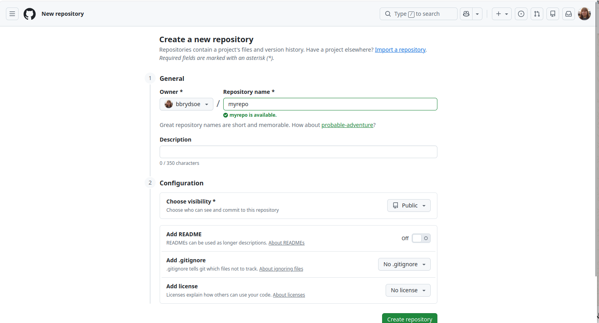
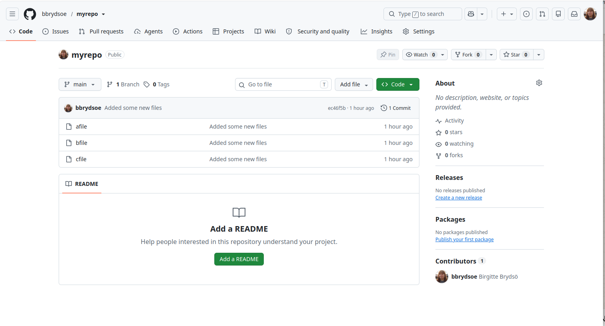
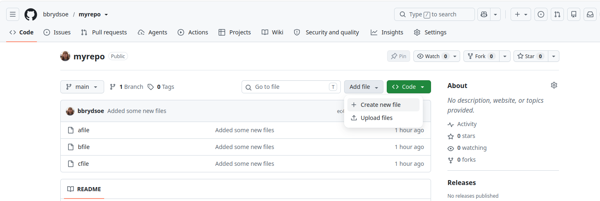
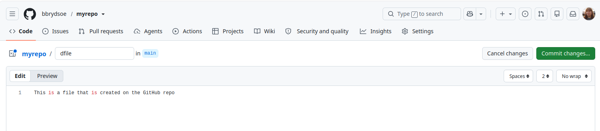
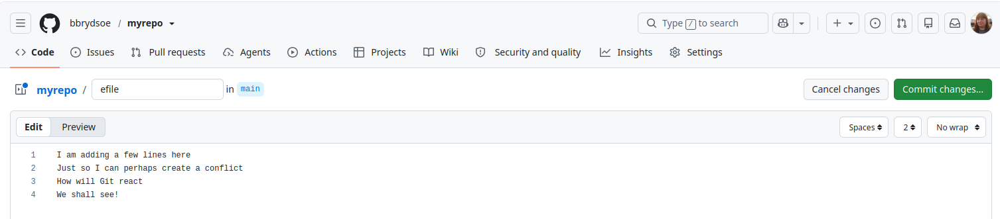
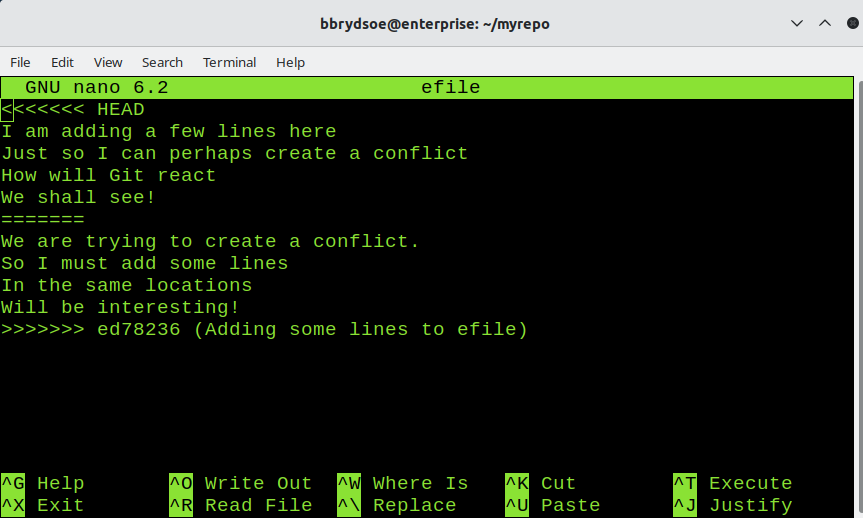

# Extra exercises 

These exercises are meant as extra (optional) training and can be done either during classes if there is time, or later.

## On your own 

These exercises can be done on your own. 

1. Create a repository from the command line: 
    - Initialize a repository from the command line. 
    - Create a file or two. 
    - Add the file(s) and commit them. 
    - Use `git log` and `git status` to see what has happened. 
    - Answer: 
      ```bash
      git init myrepo
      hint: Using 'master' as the name for the initial branch. This default branch name
      hint: is subject to change. To configure the initial branch name to use in all
      hint: of your new repositories, which will suppress this warning, call:
      hint: 
      hint: 	git config --global init.defaultBranch <name>
      hint: 
      hint: Names commonly chosen instead of 'master' are 'main', 'trunk' and
      hint: 'development'. The just-created branch can be renamed via this command:
      hint: 
      hint: 	git branch -m <name>
      Initialized empty Git repository in /home/bbrydsoe/myrepo/.git/
      ```
      Since GitHub uses `main` instead of `master` you have to either rename the repo here or in GitHub. Let us do it here: 
      ```bash
      $ cd myrepo/
      $ git branch -m main
      ```
      Create files. Add the files, commit them. Check with `git log` and `git status`: 
      ```bash
      $ touch afile
      $ touch bfile
      $ touch cfile
      $ git add afile bfile cfile
      $ git commit -m "Added some new files"
      [main (root-commit) ec46f5b] Added some new files
       3 files changed, 0 insertions(+), 0 deletions(-)
       create mode 100644 afile
       create mode 100644 bfile
       create mode 100644 cfile
      $ git log
      commit ec46f5b152cbf5059a73bf7554db235b50290c09 (HEAD -> main)
      Author: Birgitte Brydsö <bbrydsoe@hpc2n.umu.se>
      Date:   Sun Sep 27 16:03:16 2026 +0200

          Added some new files
      $ git status
      On branch main
      nothing to commit, working tree clean
      ```
2. Create a new, empty repository on GitHub with the same name (do not add README or .gitignore). Instead, on the new page of creation, connect to the local repo (... or push an existing repository from the command lines). Just copy the commands from there to your command line. 
**NOTE** You need to have setup SSH keys on GitHub first. If not, do so as described here: https://hpc2n.github.io/bioinformatics-hpc/07.Git/teamwork/#2__creating__and__using__ssh-keys 
    - Answer: 
       
      Click "Create repository" (green button at bottom) 
      Now pick the option "…or push an existing repository from the command line".
      For my example, I would do (line 2 is already done): 
      ```bash
      git remote add origin git@github.com:bbrydsoe/myrepo.git
      git branch -M main
      git push -u origin main
      ```
3. See on GitHub that your repository now contains what you had in your local repository. Do `git status` on the command line and compare what it says now. 
    - Answer: 
      
      ```bash
      $ git status
      On branch main
      Your branch is up to date with 'origin/main'.

      nothing to commit, working tree clean
      ```
4. Create a minor conflict and resolve it with `git pull --rebase`
    - Create a new file on GitHub. Save/commit. 
    - On the command line, create a new file. Stage, commit, and push. Git complains! 
    - Solve the problem with `git pull --rebase` and `git push`
    - Answer: 
      
      Click the "Create new file" imder "Add file"
      
      Click "Commit changes ..." 
      Go to command line: 
      ```bash
      $ touch efile
      bbrydsoe@enterprise:~/myrepo$ git add efile 
      bbrydsoe@enterprise:~/myrepo$ git commit -m "Creating one more file"
      [main 0b8008e] Creating one more file
       1 file changed, 0 insertions(+), 0 deletions(-)
       create mode 100644 efile
      bbrydsoe@enterprise:~/myrepo$ git push
      To github.com:bbrydsoe/myrepo.git
       ! [rejected]        main -> main (fetch first)
      error: failed to push some refs to 'github.com:bbrydsoe/myrepo.git'
      hint: Updates were rejected because the remote contains work that you do
      hint: not have locally. This is usually caused by another repository pushing
      hint: to the same ref. You may want to first integrate the remote changes
      hint: (e.g., 'git pull ...') before pushing again.
                                hint: See the 'Note about fast-forwards' in 'git push --help' for details.
      $ git pull --rebase
      remote: Enumerating objects: 4, done.
      remote: Counting objects: 100% (4/4), done.
      remote: Compressing objects: 100% (3/3), done.
      remote: Total 3 (delta 1), reused 0 (delta 0), pack-reused 0 (from 0)
      Unpacking objects: 100% (3/3), 979 bytes | 979.00 KiB/s, done.
      From github.com:bbrydsoe/myrepo
         ec46f5b..1b84667  main       -> origin/main
      Successfully rebased and updated refs/heads/main.
      bbrydsoe@enterprise:~/myrepo$ git push
      Enumerating objects: 3, done.
      Counting objects: 100% (3/3), done.
      Delta compression using up to 4 threads
      Compressing objects: 100% (2/2), done.
      Writing objects: 100% (2/2), 279 bytes | 279.00 KiB/s, done.
      Total 2 (delta 1), reused 0 (delta 0), pack-reused 0
      remote: Resolving deltas: 100% (1/1), completed with 1 local object.
      To github.com:bbrydsoe/myrepo.git
         1b84667..f1861ee  main -> main
    ```
5. Create a conflict and try to resolve it: 
    - Either make changes to the same file in the same place on both GitHub and your repo on the command line or clone the repo somewhere else and make the changes in both local copies of the repo (this imitates the situation where you work on the files from home/your laptop and from your office desktop/laptop. Do not pull the new changes in either place before making new changes (bad idea!) 
    - Now try and push in both places. Git will complain when you try to push in the second location. Git will say there are diverging branches. 
    - Can it be resolved with `git pull --rebase`? Probably not. Try it anyway. There is now a conflict. Find the conflict markers in the file you changed in both locations, decide how it should look and edit to suit. Remove conflict markers. Save. Add, commit, push. 
    - Did Git allow you to push? Did it say you are not currently on a branch? (Detached head). You must then do `git push origin HEAD:main` 
    - Answer: 
        - Here making changes to the same file in the same place on command line and on gitHub: 
        - First edit the file (here `efile`) on GitHub: Click the file. Chose the pen to edit. Commit changes ... (green button) afterwards. I added four lines. 
          
        - Now edit the same file on the command line, without pulling first. 
          
          ```bash 
          $ git add efile
          $ git commit -m "Adding some lines to efile"
          [main ed78236] Adding some lines to efile
           1 file changed, 4 insertions(+)
          $ git push
          To github.com:bbrydsoe/myrepo.git
           ! [rejected]        main -> main (fetch first)
          error: failed to push some refs to 'github.com:bbrydsoe/myrepo.git'
          hint: Updates were rejected because the remote contains work that you do
          hint: not have locally. This is usually caused by another repository pushing
          hint: to the same ref. You may want to first integrate the remote changes
          hint: (e.g., 'git pull ...') before pushing again.
          hint: See the 'Note about fast-forwards' in 'git push --help' for details.
          ``` 
          This means we now have to try and resolve the conflict. Let us first pull: 
          ```bash
          $ git pull
          remote: Enumerating objects: 5, done.
          remote: Counting objects: 100% (5/5), done.
          remote: Compressing objects: 100% (3/3), done.
          remote: Total 3 (delta 1), reused 0 (delta 0), pack-reused 0 (from 0)
          Unpacking objects: 100% (3/3), 1013 bytes | 1013.00 KiB/s, done.
          From github.com:bbrydsoe/myrepo
             f1861ee..bb236f3  main       -> origin/main
          hint: You have divergent branches and need to specify how to reconcile them.
          hint: You can do so by running one of the following commands sometime before
          hint: your next pull:
          hint: 
          hint:   git config pull.rebase false  # merge (the default strategy)
          hint:   git config pull.rebase true   # rebase
          hint:   git config pull.ff only       # fast-forward only
          hint: 
          hint: You can replace "git config" with "git config --global" to set a default
          hint: preference for all repositories. You can also pass --rebase, --no-rebase,
          hint: or --ff-only on the command line to override the configured default per
          hint: invocation.
          fatal: Need to specify how to reconcile divergent branches.
          ```
          Let us try the rebase then:
          ```bash
          $ git pull --rebase
          Auto-merging efile
          CONFLICT (content): Merge conflict in efile
          error: could not apply ed78236... Adding some lines to efile
          hint: Resolve all conflicts manually, mark them as resolved with
          hint: "git add/rm <conflicted_files>", then run "git rebase --continue".
          hint: You can instead skip this commit: run "git rebase --skip".
          hint: To abort and get back to the state before "git rebase", run "git rebase --abort".
          Could not apply ed78236... Adding some lines to efile
          ```
          Let us look at the file: 
          ```bash
          $ cat efile
          <<<<<<< HEAD
          I am adding a few lines here
          Just so I can perhaps create a conflict
          How will Git react
          We shall see!
          =======
          We are trying to create a conflict.
          So I must add some lines
          In the same locations
          Will be interesting!
          >>>>>>> ed78236 (Adding some lines to efile)
          ```
          Now we need to edit the file. I am doing so with `nano`: 
          
          We edit the file to have the content we want (I decide I want to keep the content and just remove the conflict markers). It looks like this: 
            
          We now add, commit, and push 
          ```bash
          $ git add efile 
          bbrydsoe@enterprise:~/myrepo$ git commit -m "Fixing the conflict"
          [detached HEAD 6adbfea] Fixing the conflict
           1 file changed, 8 insertions(+), 4 deletions(-)
          bbrydsoe@enterprise:~/myrepo$ git push
          fatal: You are not currently on a branch.
          To push the history leading to the current (detached HEAD)
          state now, use

              git push origin HEAD:<name-of-remote-branch>
          ```
          Did you notice the comment about "detached head"? We must fix that: 
          ```bash
          $ git push origin HEAD:main
          Enumerating objects: 5, done.
          Counting objects: 100% (5/5), done.
          Delta compression using up to 4 threads
          Compressing objects: 100% (3/3), done.
          Writing objects: 100% (3/3), 406 bytes | 406.00 KiB/s, done.
          Total 3 (delta 1), reused 0 (delta 0), pack-reused 0
          remote: Resolving deltas: 100% (1/1), completed with 1 local object.
          To github.com:bbrydsoe/myrepo.git
             bb236f3..6adbfea  HEAD -> main
          ```

## Teamwork 

Together in a team. 

1. Setup: 
    - One of you create a repository. Either as in the section "On your own" or directly on GitHub. 
    - That person also adds some files. 
    - In "Settings" along the top in the repository on GitHub, the owner of the repository goes to "Collaborators" and there add the team members as maintainers or developers. What is the difference? Do they need the right to create branches? 
    - The members accept the invite. 
2. Each of the other team members now clone this repository. (Green code button -> under SSH, copy the url, do `git clone repo-url`) 
3. All members (including the owner) now make some changes. To begin with, make sure to do `git pull --rebase` first to get any changes the orhers have made. Regularly see the changes that happens locally and in the GitHub remote repository. Check with `git status` and `git log`.
4. Some/all create their own branch. Make some directories and files. Add some content to the files. Stage/commit/push. Check how it looks. 
5. Fetch each others branches.
6. Try and merge some branches to main. Try and merge after having created a file and not having added/committed it. What happens? How do you resolve it? 
7. Create more branches. Make sure you have some files that are named the same and in the same location in the branches. Two should then make changes to the same file in the same location in it. Try and merge the branches. Will Git complain?
8. If you got a conflict, try and resolve it and then continue the merge. 

