# What is a computer?

!!! note 

    "A computer is a machine that can be programmed to automatically carry out sequences of arithmetic or logical operations (computation)." 
    (Wikipedia) 

In this session we are going to do a short walk-through of what a computer is, both the hardware parts and the system software. 

Everyone has an idea of what a computer is; usually we are thinking of a screen, a keyboard, and internal components like CPU, GPU, HDD/SSH, and RAM/memory. 

Computers are special types of machines. Most machines only do one thing (cars, ovens, sewing machines, coffee machines), but computers are what is called "universal machines". They run programs that means they can do many different tasks. 

## Hardware parts

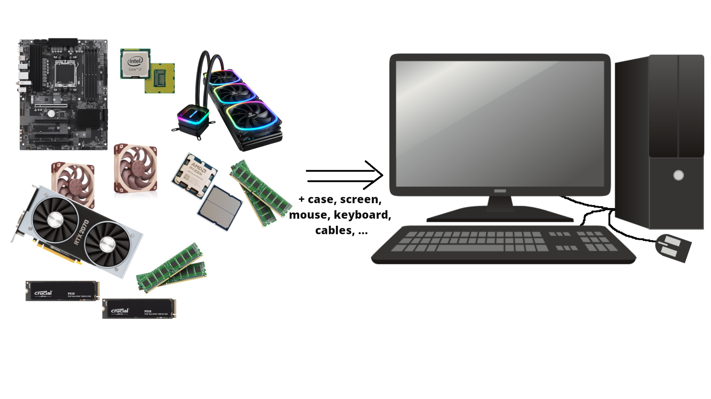{: style="width: 600px;"}

Let us take a look inside a typical desktop computer. This shows a simplified sketch of the inside of the case: 

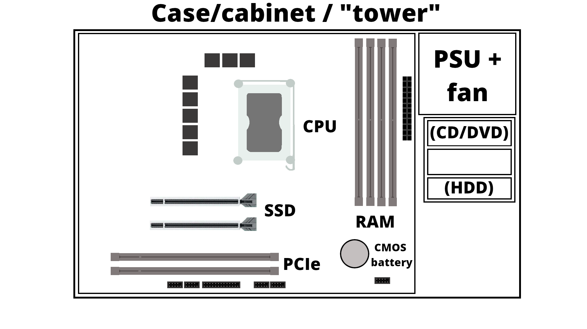{: style="width: 600px;"}

- PSU is the power supply unit. 
- CD/DVD are getting increasingly rare
- If you have spinning disk/HDD installed, it sits in a rack along the side and is connected to the motherboard (power cable and data cable). Used for long term storage. Do not confuse with memory!
- A motherboard is mounted in the case, and has a socket for a CPU as well as slots for RAM/memory, SSDs/M.2 disk, PCIe etc. 
- How much RAM usually depends on the motherboard, and they should be of the same size (8GB, 16GB, 32GB, etc.) DRAM (Dynamic Random-Access Memory). Memory is a physical device that can be used to store information temporarily - when the computer is shut down the data disappears from the memory. Do NOT confuse with storage space!
- SSD storage are placed in the suitable slots. Size again depends on the motherboard. New SSDs are typically NVMe/M.2, which has better speed usually. Used for long term storage. Do not confuse with memory!  
- PCIe are expansion slots, often used for graphics cards/GPUs. These can be large and the case size is important when seeing if there is space for many of the modern types of GPUs.
- The GPU generally has its own cooling, but the CPU needs cooling. Either fans for air cooling or water cooling 
- Storage is related to "disks" on the computer. A disk is a storage device that stores and retrieves data using magnetic or optical technology. An SSD or a HDD is an example.

### A motherboard

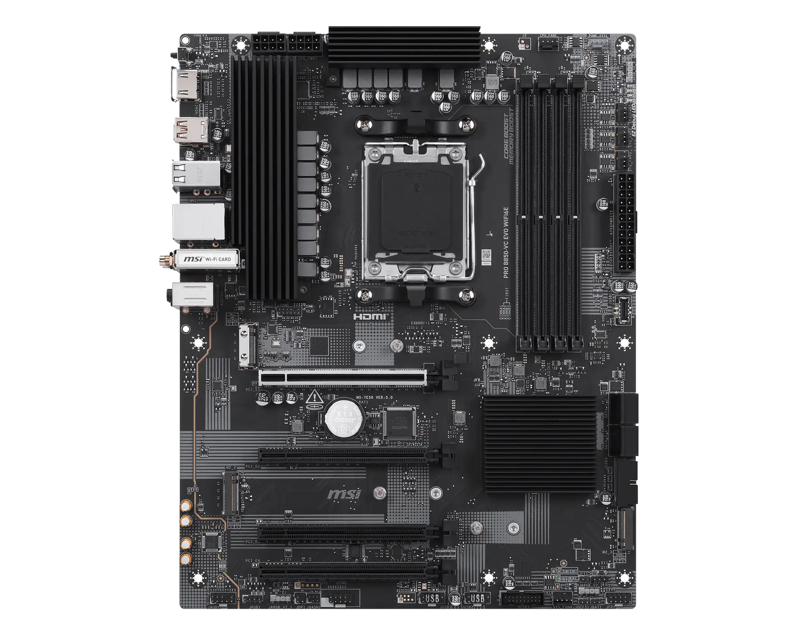{: style="width: 600px;"}

(MSI PRO B850-VC EVO WIFI6E motherboard. Image from https://www.msi.com/Motherboard/PRO-B850-VC-EVO-WIFI6E)

### Intel CPU and AMD CPU 

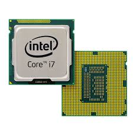{: style="width: 200px;"}
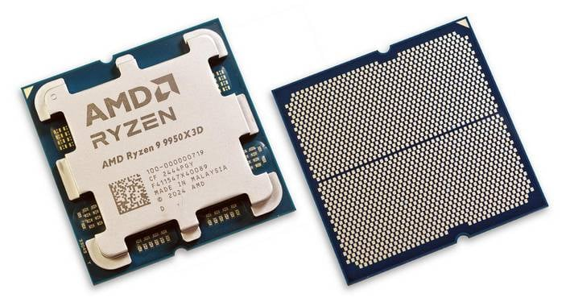{: style="width: 200px;"}

(Images from https://news.softpedia.com/news/Latest-Core-i7-Extreme-Ivy-Bridge-E-Intel-CPU-Delayed-335790.shtml and https://hothardware.com/reviews/amd-ryzen-9-9950x3d-cpu-review)

### Memory

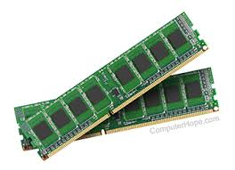{: style="width: 200px;"}
A couple memory sticks / RAM 

(Image from https://medium.com/@sunnybabacom10/ram-a-deep-dive-into-its-importance-types-and-functionality-c042a095ef95)

### SSD storage 

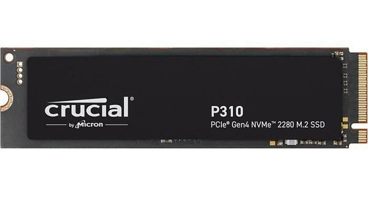{: style="width: 200px;"}
2TB of SSD storage 

(Image from https://ssd-tester.com/crucial_p310_2tb.html) 

### GPU

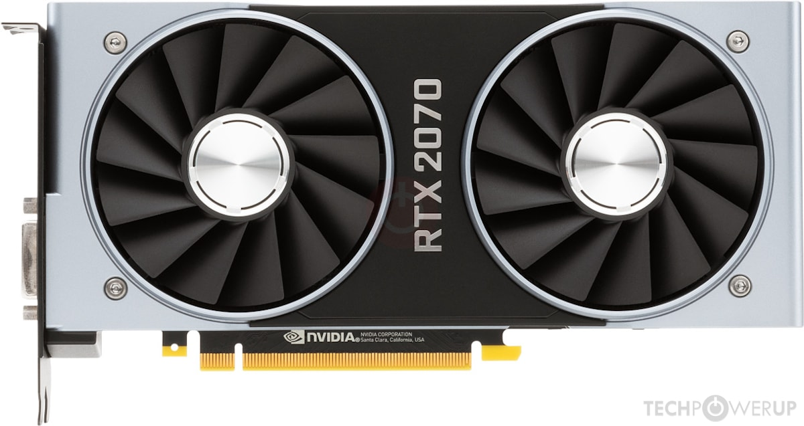{: style="width: 300px;"}
GPU (Nvidia)
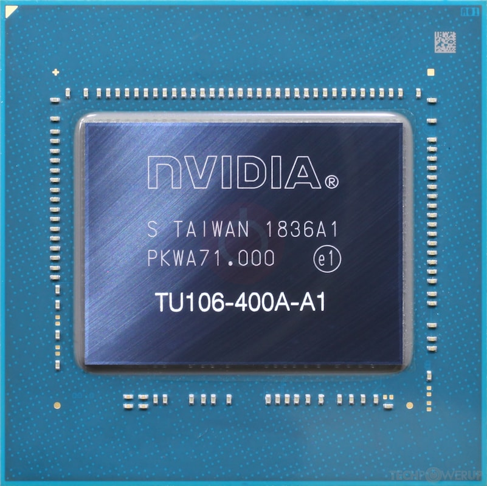{: style="width: 200px;"}
GPU chip

(Images from https://www.techpowerup.com/gpu-specs/geforce-rtx-2070.c3252)

### Cooling 

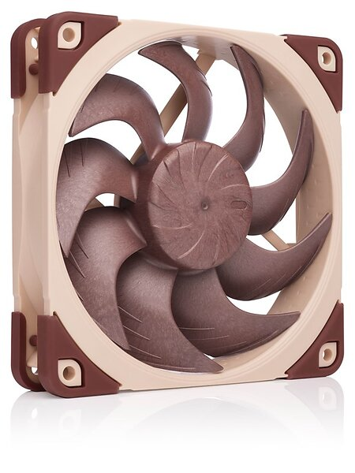{: style="width: 100px;"}
A fan
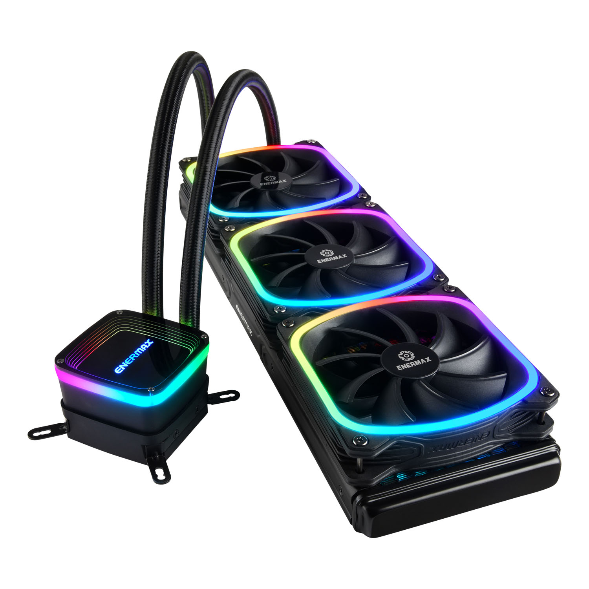{: style="width: 300px;"}
Watercooling including heat sink (the heat sink will be attached on top of a CPU with cooling paste in between) 

(Image from https://www.noctua.at/en/products/nf-a12x25-pwm and https://www.enermax.com/en/search/label/360mm%20Radiaotr) 

## System software 

System software is what is required for the computer to run and to let us interact with it. 

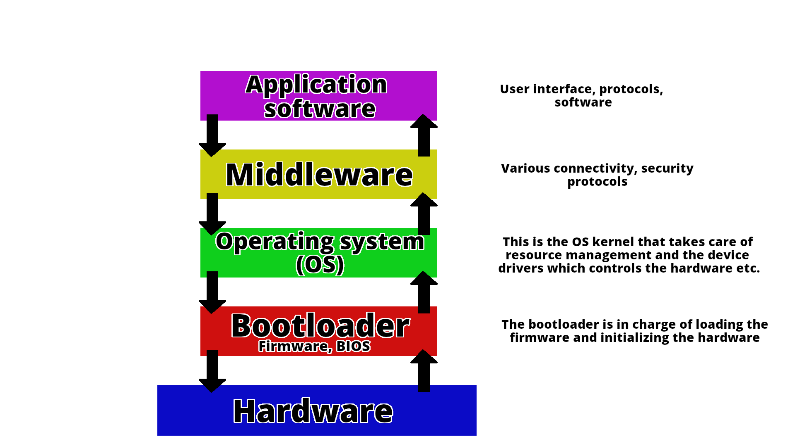{: style="width: 600px;"}

This picture shows how the different components talk together. 
