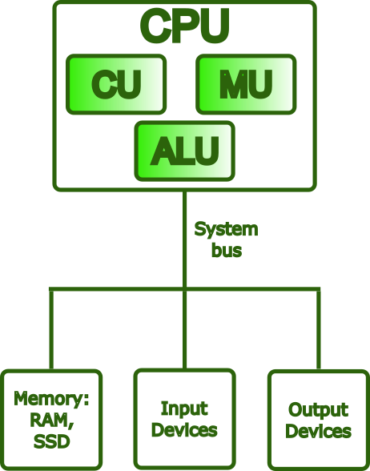
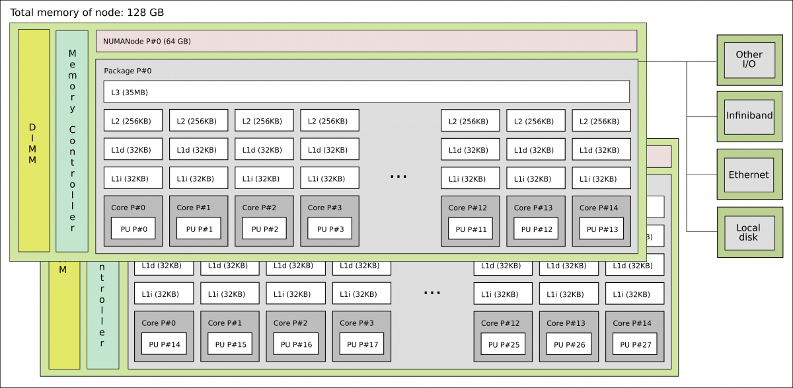

# What is a computer?

!!! note 

    "A computer is a machine that can be programmed to automatically carry out sequences of arithmetic or logical operations (computation)." 
    (Wikipedia) 

In this session we are going to do a short walk-through of what a computer is, both the hardware parts and the system software. 

Everyone has an idea of what a computer is; usually we are thinking of a screen, a keyboard, and internal components like CPU, GPU, HDD/SSH, and RAM/memory. 

Computers are special types of machines. Most machines only do one thing (cars, ovens, sewing machines, coffee machines), but computers are what is called "universal machines". They run programs that means they can do many different tasks. 

## Hardware parts

{: style="width: 600px;"}

Let us take a look inside a typical desktop computer. This shows a simplified sketch of the inside of the case: 

{: style="width: 600px;"}

- PSU is the power supply unit. 
- CD/DVD are getting increasingly rare
- If you have spinning disk/HDD installed, it sits in a rack along the side and is connected to the motherboard (power cable and data cable). Used for long term storage. Do not confuse with memory!
- A motherboard is mounted in the case, and has a socket for a CPU as well as slots for RAM/memory, SSDs/M.2 disk, PCIe etc. 
- How much RAM usually depends on the motherboard, and they should be of the same size (8GB, 16GB, 32GB, etc.) DRAM (Dynamic Random-Access Memory). Memory is a physical device that can be used to store information temporarily - when the computer is shut down the data disappears from the memory. Do NOT confuse with storage space!
- SSD storage are placed in the suitable slots. Size again depends on the motherboard. New SSDs are typically NVMe/M.2, which has better speed usually. Used for long term storage. Do not confuse with memory!  
- PCIe are expansion slots, often used for graphics cards/GPUs. These can be large and the case size is important when seeing if there is space for many of the modern types of GPUs.
- The GPU generally has its own cooling, but the CPU needs cooling. Either fans for air cooling or water cooling 
- Storage is related to "disks" on the computer. A disk is a storage device that stores and retrieves data using magnetic or optical technology. An SSD or a HDD is an example.

### A motherboard

{: style="width: 600px;"}

(MSI PRO B850-VC EVO WIFI6E motherboard. Image from https://www.msi.com/Motherboard/PRO-B850-VC-EVO-WIFI6E)

### Intel CPU and AMD CPU 

{: style="width: 200px;"}
{: style="width: 200px;"}

(Images from https://news.softpedia.com/news/Latest-Core-i7-Extreme-Ivy-Bridge-E-Intel-CPU-Delayed-335790.shtml and https://hothardware.com/reviews/amd-ryzen-9-9950x3d-cpu-review)

### Memory

{: style="width: 200px;"}
A couple memory sticks / RAM 

(Image from https://medium.com/@sunnybabacom10/ram-a-deep-dive-into-its-importance-types-and-functionality-c042a095ef95)

### SSD storage 

{: style="width: 200px;"}
2TB of SSD storage 

(Image from https://ssd-tester.com/crucial_p310_2tb.html) 

### GPU

{: style="width: 300px;"}
GPU (Nvidia)
{: style="width: 200px;"}
GPU chip

(Images from https://www.techpowerup.com/gpu-specs/geforce-rtx-2070.c3252)

### Cooling 

{: style="width: 100px;"}
A fan
{: style="width: 300px;"}
Watercooling including heat sink (the heat sink will be attached on top of a CPU with cooling paste in between) 

(Image from https://www.noctua.at/en/products/nf-a12x25-pwm and https://www.enermax.com/en/search/label/360mm%20Radiaotr) 

## System software 

System software is what is required for the computer to run and to let us interact with it. 

{: style="width: 600px;"}

This picture shows how the different components talk together. 
=======
A computer is a machine that can be programmed to automatically carry out sequences of 
arithmetic or logical operations (computation). (Wikipedia) 

# Basic Functions of a Computer

Computers are built around four fundamental operations:

1. **Input** – Acquiring data from the outside world (e.g., keyboard, mouse, sensors)
2. **Processing** – Transforming that data through calculations and logical operations
3. **Storage** – Retaining data and instructions for immediate or future use
4. **Output** – Delivering results to the user or to other systems (e.g., monitor, printer)

## The Von Neumann Architecture

Nearly every general-purpose computer built since the late 1940s is based on the **Von Neumann architecture**, 
a design model first described by mathematician John von Neumann in his 1945 *First Draft of a Report on the EDVAC*. 
The proposal was revolutionary for its time: rather than having a program hardwired into the machine, von Neumann 
argued that a computer should store both its **instructions and its data in the same memory unit**.

This idea, known as the **stored-program model**, has a profound practical consequence: a machine can be reprogrammed 
simply by loading a different set of instructions into memory, with no changes to the underlying hardware.

The Von Neumann model organizes a computer into four main components, all communicating over a shared **bus**:

- **Central Processing Unit (CPU)** — the active core of the machine; fetches instructions from memory, decodes 
them, and carries out their execution. Internally, it contains the ALU, the Control Unit, and a set of registers 
(each described in detail below).
- **Memory Unit** — a single, unified address space holding both the program instructions and the data those instructions operate on.
- **Input/Output (I/O)** — the mechanisms through which the computer exchanges information with the outside world, receiving input and delivering output.
- **Bus** — the shared communication pathway interconnecting all components, carrying addresses, data, and control signals.

{: style="width: 200px;"}

### The Von Neumann Bottleneck

A fundamental limitation of the Von Neumann architecture is that the CPU and memory share the **same bus** for both instructions and data. 
Because only one transfer can occur at a time, either fetching an instruction *or* reading/writing data, this creates a traffic bottleneck 
known as the **Von Neumann bottleneck**. As CPU speeds improved dramatically over the decades while memory speeds lagged, this 
constraint became an increasingly serious barrier to performance.

Modern hardware addresses this problem through several complementary strategies:

- **Cache hierarchies (L1/L2/L3)** — multiple levels of small, fast memory placed close to the CPU reduce how often the processor needs to 
reach out to main memory over the bus.
- **Harvard-style L1 caches** — the first cache level is split into separate instruction and data caches, allowing both to be accessed 
simultaneously and eliminating a key source of contention.
- **Wide memory buses, DDR channels, and HBM (High Bandwidth Memory)** — these increase the raw throughput of data transfers between memory 
and the CPU, attacking the bottleneck at its source.
- **Hardware prefetching** — dedicated units predict which data the CPU will need next and load it into cache ahead of time, hiding 
memory latency before it stalls execution.

Despite these mitigations, the **memory wall**, the widening gap between CPU computation speed and memory bandwidth, remains one of the 
central challenges in modern computer architecture, and is a particularly critical concern in HPC system design, where data movement often 
dominates overall runtime.

## What Is a CPU?

The **Central Processing Unit (CPU)** is the component responsible for executing a program: it fetches instructions 
from memory, decodes them, and carries them out, repeatedly, billions of times per second. While it is often described 
as the "brain" of the computer, a more precise characterization is that the CPU is the *engine* of computation: 
it does not think or decide, but it executes instructions with extraordinary speed and precision.

### Main Components of a CPU

#### Control Unit (CU)

The Control Unit orchestrates the operation of the entire processor. It fetches each instruction from memory in sequence, 
decodes it to determine what operation is required, and then issues the appropriate control signals to coordinate the ALU, 
registers, and other components accordingly.

#### Arithmetic Logic Unit (ALU)

The ALU is the part of the CPU that performs all computational work. This includes arithmetic operations (addition, 
subtraction, multiplication, and division) and logical operations (comparisons such as equal to or greater than, and 
bitwise operations such as AND, OR, and NOT). Every calculation a program performs ultimately passes through the ALU.

#### Registers

Registers are the smallest and fastest storage locations in the entire memory hierarchy, sitting directly inside the 
processor die. They can be accessed in less than one CPU cycle, far outpacing any external memory. Their role is 
to hold the values the CPU is actively working with: operands going into an operation, intermediate results coming 
out of one, and critical bookkeeping information about the state of execution.

Common register types include:

- **General-purpose registers**, hold operands and results for arithmetic and logical operations (e.g., `rax`, `rbx` on x86-64)
- **Program Counter (PC)**, holds the memory address of the next instruction to be fetched; it advances automatically after each fetch
- **Stack Pointer (SP)**, tracks the current top of the call stack, used to manage function calls, local variables, and return addresses
- **Flags / Status register**, records condition codes produced by the last operation (such as zero, carry, sign, and 
overflow), which are then used by conditional branch instructions to control program flow

## What Is an Instruction?

An **instruction** is the most basic unit of work a CPU can perform. At the lowest level, a program is nothing more than a 
sequence of such instructions encoded in **machine code**, binary patterns that the hardware can fetch, decode, and act on directly.

Each instruction contains two essential pieces of information:

- An **opcode** — a numeric code specifying which operation to perform (e.g., ADD, LOAD, or BRANCH)
- **Operands** — the inputs to that operation: the registers, memory addresses, or immediate values it should act on

### The Instruction Set Architecture (ISA)

The complete set of instructions a CPU can understand and execute is defined by its **Instruction Set Architecture (ISA)**. 
The ISA establishes the contract between software and hardware: it specifies not only which operations exist, but also 
how operands are encoded, how memory is addressed, and how the processor state is managed. Any program compiled for a 
given ISA will run correctly on any CPU that implements it, regardless of how that CPU is built internally. This separation 
between the *interface* (ISA) and the *implementation* (microarchitecture) is one of the foundational principles of computer architecture.

### The Instruction Pipeline

Modern CPUs do not execute one instruction at a time from start to finish. Instead, they use a **pipeline**: 
the execution of each instruction is broken into a series of stages, typically **fetch -> decode -> execute -> write-back**,
and multiple instructions are processed simultaneously, each at a different stage. This overlap means that while one instruction 
is being executed, the next is already being decoded, and the one after that is already being fetched, dramatically 
increasing throughput without requiring the CPU to run any single stage faster.

### Common ISAs

**x86-64** (also known as AMD64 or Intel 64) is the dominant ISA for desktops, laptops, and servers. 
It evolved from Intel's original 16-bit 8086 (1978) through 32-bit x86, before AMD extended it to 
64-bit in 2003. It is a **CISC** architecture, instructions are complex and expressive, capable 
of encoding operations like memory-to-memory moves in a single step. Modern x86-64 CPUs internally 
break these down into simpler micro-operations (µops) for efficient pipelined execution.

**AArch64 (ARM64)** is the 64-bit ARM ISA, introduced with ARMv8 in 2011. ARM follows a **RISC** 
philosophy: a smaller, more uniform instruction set that trades per-instruction expressiveness for 
easier pipelining and lower power consumption. This makes it the dominant choice in mobile 
devices and embedded systems, and it is rapidly expanding into laptops (Apple M-series, Qualcomm 
Snapdragon X), cloud servers (AWS Graviton, Ampere Altra), and HPC, notably, the Fujitsu A64FX 
powering the Fugaku supercomputer uses AArch64 with SVE (Scalable Vector Extension) for wide SIMD operations.

**RISC-V** is an open, royalty-free ISA published by UC Berkeley in 2010. Owned by no single 
company, it is attractive for research, embedded systems, and custom silicon. Its design follows 
clean RISC principles, with a minimal base integer ISA that can be extended through standardized modules 
(`M` for multiply/divide, `F`/`D` for floating-point, `V` for vectors). RISC-V is increasingly 
appearing in HPC accelerators and AI processors.

**Other notable ISAs** include **POWER** (IBM's architecture, used in high-end servers and earlier 
HPC systems such as Summit), **SPARC** (historically significant in scientific workstations, now 
largely retired), and **IA-64/Itanium** (Intel's VLIW architecture, discontinued in 2021). GPU ISAs occupy 
a separate category: NVIDIA uses PTX/SASS for CUDA workloads, while AMD uses RDNA/CDNA for its GPU lines.

## What Are CPU Cores?

A **core** is a complete, independent processing unit within the CPU. Each core contains its own ALU, 
Control Unit, registers, and private L1/L2 cache, and is capable of executing an instruction stream 
without sharing execution resources with other cores.

Modern processors range from a handful of cores in consumer CPUs to dozens or hundreds in server and 
HPC chips. The two broad categories are:

- A **single-core** CPU processes one instruction stream at a time; all operations are serialized 
through a single execution unit.
- A **multi-core** CPU (dual-core, quad-core, many-core, etc.) executes multiple instruction 
streams in parallel, with each core working independently and simultaneously.

More cores can improve throughput significantly, but this benefit is not automatic. A program that 
consists of a single sequential thread will occupy one core and leave the rest idle, regardless of 
how many are available. To take advantage of multiple cores, a workload must be explicitly 
decomposed into parallel tasks and coordinated through an appropriate programming model, 
shared-memory approaches such as **OpenMP** for parallelism within a single node, or 
distributed frameworks such as **MPI** for workloads that span multiple nodes. In HPC, understanding 
this distinction is essential: raw core count only translates into performance when the software is written to use it.

## What Is Cache Memory?

**Cache** is a small, extremely fast memory built directly into (or very close to) the CPU. 
Its purpose is to reduce the time the CPU spends waiting for data from the much slower main 
memory (RAM), by keeping frequently accessed data as close to the execution units as possible.

Caches are organized in levels, each with a trading size for speed:

| Level | Location | Size (typical) | Bandwidth (typical) |
|-------|----------|----------------|---------------------|
| **L1** | Inside each core | 32 – 128 KB | ~1,000 – 3,000 GB/s |
| **L2** | Inside each core (or nearby) | 256 KB – 4 MB | ~400 – 1,000 GB/s |
| **L3** | Shared across all cores | 8 – 64 MB | ~100 – 400 GB/s |
| **RAM** | On the motherboard | 8 – 512 GB | ~50 – 100 GB/s (DDR5) / up to ~3,000 GB/s (HBM) |

When the CPU needs data, it checks each level in order: L1, then L2, then L3, and only 
fetches from RAM if the data is absent from all cache levels, an event called a **cache miss**. 
This hierarchy works because of **locality of reference**: programs tend to access the same 
data and instructions repeatedly, and in contiguous regions of memory, so keeping recently 
used data in fast cache pays off consistently.

Cache efficiency has a profound impact on real-world performance. A cache-friendly algorithm, 
one that accesses memory in predictable, sequential patterns, can run orders of magnitude 
faster than one that repeatedly triggers cache misses and stalls waiting for RAM.

## What Is RAM?

**RAM (Random Access Memory)** is the computer's main working memory, the pool of storage 
where the operating system, applications, and active data reside during execution. Unlike cache, 
which is embedded in the CPU and holds only what the processor is immediately working with, 
RAM holds the broader working set of a running program: its code, stack, heap, and any 
data structures it is operating on.

RAM is substantially faster than disk storage, but it is **volatile**: its contents exist 
only while the system is powered on and are lost the moment power is removed. It also 
sits further from the CPU than cache, which is why, as discussed above, cache hierarchies 
exist to bridge the speed gap between the two.

### Why RAM Matters

- More RAM allows the operating system to keep more programs and data in memory simultaneously.
- Insufficient RAM forces the OS to use **swap space** (disk-based virtual memory), which is orders of 
magnitude slower and can make the system feel unresponsive.
- RAM speed (measured in MT/s or MHz) and latency also affect how quickly the CPU can fetch data that is not in cache.

## NUMA — Non-Uniform Memory Access

Modern servers and workstations often contain multiple CPU **sockets**, each with its own cores and a 
local bank of RAM. This architecture is called **NUMA (Non-Uniform Memory Access)**.

{: style="width: 200px;"}

- A core can access its **local** RAM quickly (low latency).
- Accessing **remote** RAM (on the other socket) is possible but slower, typically 1.5x to 3x more latency.

In HPC and high-performance workloads, NUMA awareness is critical. Placing data in the same NUMA 
node as the cores that process it avoids expensive cross-socket traffic. Tools like `numactl`, 
`hwloc`, and SLURM's `--mem-bind` option help manage NUMA placement on Linux clusters.

## How Everything Works Together

1. **Instructions and data** are loaded from persistent storage into RAM, where the CPU can reach them.
2. The **CPU** fetches instructions from RAM, or from cache, if they are already there, decodes each one, 
and executes it using the ALU and registers.
3. The **cache hierarchy** transparently keeps recently and frequently used data close to the cores, 
reducing how often the CPU has to wait for slower RAM.
4. On multi-socket systems, the **NUMA topology** determines the cost of each memory access: 
local RAM is fast, remote RAM is not.
5. **Results** are written back to RAM, flushed to storage, or sent to output devices.

This cycle: fetch, decode, execute, write back, repeats continuously and at high speed for the entire lifetime of a running program.

## Summary

| Component | Role |
|-----------|------|
| **CPU** | Executes instructions; the "brain" of the computer |
| **Cores** | Independent execution units within a CPU; enable parallelism |
| **Registers** | Tiny, ultra-fast storage inside each core for live data |
| **Instructions / ISA** | The language the CPU understands; defines what operations it can perform |
| **Cache (L1/L2/L3)** | Fast on-chip memory that reduces costly trips to RAM |
| **RAM** | Larger, volatile working memory for active programs and data |
| **NUMA** | Architecture of multi-socket systems where memory access time depends on locality |

!!! tip "References"

    
    - <a href="https://johny4u.com/igcse_theory_2023/07)%20Computer%20Architecture.php" target="_blank">Computer Architecture</a>
    - <a href="https://en.wikipedia.org/wiki/First_Draft_of_a_Report_on_the_EDVAC" target="_blank">Von Neumann Report</a>
    - <a href="https://www.geeksforgeeks.org/computer-organization-architecture/computer-organization-von-neumann-architecture/" target="_blank">Computer organization</a>
    - <a href="https://www.geeksforgeeks.org/computer-organization-architecture/introduction-of-control-unit-and-its-design/" target="_blank">Instruction control units</a>
    - <a href="https://www.geeksforgeeks.org/computer-organization-architecture/essential-registers-for-instruction-execution/" target="_blank">Registers for instruction</a>
    - <a href="https://daemons.net/hardware/processors/x86.html" target="_blank">x86 instruction set</a>
    - <a href="https://en.wikipedia.org/wiki/X86-64" target="_blank">x86-64 instruction set</a>
    - <a href="https://en.wikipedia.org/wiki/AArch64" target="_blank">AArch64</a>
    - <a href="https://jasonblog.github.io/note/arm/introduction_to_armv8_64-bit_architecture.html" target="_blank">ARM64</a>
    - <a href="https://dl.acm.org/doi/10.1145/3757348.3757367" target="_blank">RISC-V instruction set</a>
    - <a href="https://www.geeksforgeeks.org/computer-science-fundamentals/central-processing-unit-cpu/" target="_blank">Central Processing Unit</a>
    - <a href="https://en.wikipedia.org/wiki/CPU_cache" target="_blank">Central Processing Unit cache</a>
    - <a href="https://www.geeksforgeeks.org/computer-science-fundamentals/cache-memory/" target="_blank">Cache memory</a>
    - <a href="https://www.geeksforgeeks.org/computer-organization-architecture/cache-memory-performance/" target="_blank">Cache memory performance</a>
    - <a href="https://www.geeksforgeeks.org/computer-science-fundamentals/random-access-memory-ram/" target="_blank">Random Access Memory</a>
    - <a href="https://www.geeksforgeeks.org/computer-organization-architecture/difference-between-uniform-memory-access-uma-and-non-uniform-memory-access-numa/" target="_blank">Non Uniform Access Memory</a>
    - <a href="https://en.wikipedia.org/wiki/Non-uniform_memory_access" target="_blank">NUMA</a>

