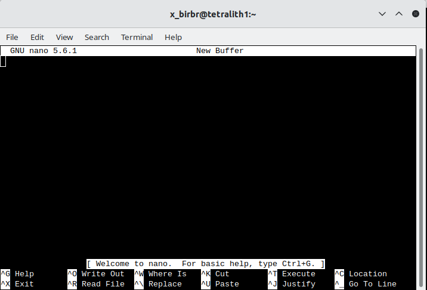
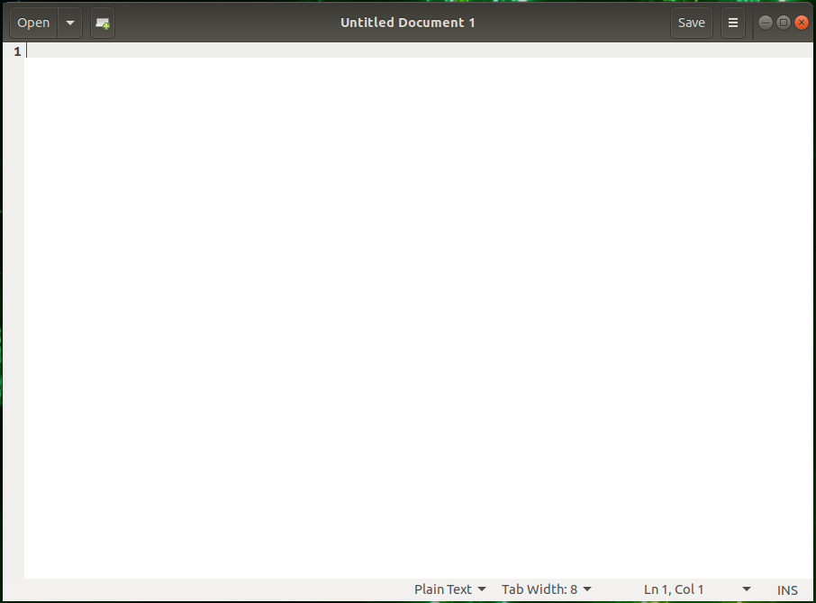
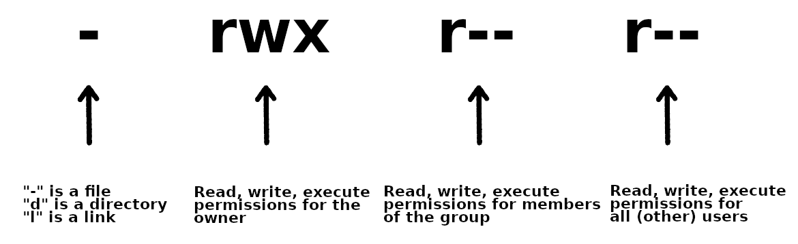

# Introduction to files and filesystems

This presentation will look at the following: 

- What is a file?
    - how to open, create, a file
    - editors
    - folders 
- What are extensions?
- What are permissions?
- What is a file system? (next slides)  

## What is a file? 

Files are containers for data. There are several types. Common ones are: 

- document/text (.txt, .pdf, .xlsx, .docx, .tex, .pptx, ...)
- image (.jpg/.jpeg, .png, .gif, .svg, .tiff, ...)
- video (.mp4, .mkv, .mov, .avi, ...)
- audio (.mp3, .wav, .ogg, .m4a, .flac, ...)

In addition there are: 

- executable files (.exe, .app, .bat, .bin, ...)
- compressed files (.zip, .gz, .rar, .7z, .bz2, ...)
- system files (.sys, .dll, .ini, ...) 

!!! warning 

    Configuration files in Linux are often prefaced with a dot - and are often hidden unless you use specific options. 

!!! note 

    The word "file" derives from the Latin filum ("a thread, string"). In extended use the English term "file" came to refer to various systems of arranging papers and documents for retrieval. "File" was used in the context of computer storage as early as January 1940.
    - Wikipedia

A file is commonly represented with this picture, which we are going to use in this presentation: 

{: style:"width="200px;"}

If it is important what type of file it is, we will write something like this (a document of type PDF): 

{: style:"width="200px;"}

!!! tip

    To list files in Linux, you use the command ``ls``. You need the option ``-a`` to see hidden files. 

### How to create a file and open a file

Files are generally accessed either directly through an editor, or from a program. They are also generally created this way. 

!!! note "Editors on Linux"

    Linux editors falls in two categories; graphical and non-graphical. If you are using Linux on your own computer, or connecting to say, Kebnekaise through either ThinLinc or OpenOnDemand, you can use an editor with a graphical user interface GUI). If you are connecting with SSH through a terminal, you are generally restricted to the non-graphical editors (unless you are connecting with X11 forwarding or remote desktop, or something like that - more about this later in the course). 

### Editors 

Some editors are more suited for a GUI environment and some are more suited for a command line environment.

#### Command line

These are all good editors for using on the command line:

- <a href="https://www.nano-editor.org/" target="_blank">nano</a>
- <a href="https://en.wikipedia.org/wiki/Vi" target="_blank">vi</a>, <a href="https://en.wikipedia.org/wiki/Vim_(text_editor)" target="_blank">vim</a>
- <a href="https://www.gnu.org/software/emacs/" target="_blank">emacs</a>

They are all installed on Kebnekaise.

Of these, <code>vi/vim</code> as well as <code>emacs</code> are probably the most powerful, though the latter is better in a GUI environment. The easiest editor to use if you are not familiar with any of them is <code>nano</code>.

!!! Example "Nano"

    1. Starting "nano": Type <code>nano</code> FILENAME on the command line and press <code>Enter</code>. FILENAME is whatever you want to call your file.
    2. If FILENAME is a file that already exists, <code>nano</code> will open the file. If it dows not exist, it will be created.
    3. You now get an editor that looks like this: <br>
    {: style="width: 400px"}
    4. First thing to notice is that many of the commands are listed at the bottom.
    5. The **^** before the letter-commands means you should press CTRL and then the letter (while keeping CTRL down).
    6. Your prompt is in the editor window itself, and you can just type (or copy and paste) the content you want in your file.
    7. When you want to exit (and possibly save), you press CTRL and then x while holding CTRL down (this is written CTRL-x or ^x). <code>nano</code> will ask you if you want to save the content of the buffer to the file. After that it will exit.

    There is a <a href="https://www.nano-editor.org/dist/latest/nano.html" target="_blank">manual for <code>nano</code> here</a>.

#### GUI 

If you are connecting with [ThinLinc](https://docs.hpc2n.umu.se/tutorials/connections/#ThinLinc), you will be presented with a graphical user interface (GUI). From there you can either open a terminal window/shell (Applications -> System Tools -> MATE Terminal) or you can choose editors from the menu by going to Applications -> Accessories. This gives several editor options, of which these have a graphical interface:

- <a href="https://help.gnome.org/users/gedit/stable/" target="_blank">Text Editor (gedit)</a>
- <a href="https://en.wikipedia.org/wiki/Pluma_(text_editor)" target="_blank">Pluma</a> - the default editor on the MATE desktop environments (that Thinlinc runs)
- <a href="https://en.wikipedia.org/wiki/Atom_(text_editor)" target="_blank">Atom</a> - not just an editor, but an <a href="https://en.wikipedia.org/wiki/Integrated_development_environment" target="_blank">IDE</a>
- <a href="https://www.gnu.org/software/emacs/" target="_blank">Emacs (GUI)</a>
- <a href="https://en.wikipedia.org/wiki/NEdit" target="_blank">NEdit "Nirvana Text Editor"</a>

If you are not familiar with any of these, a good recommendation would be to use <code>Text Editor/gedit</code>.

!!! Example "Text Editor/gedit"

    1. Starting "gedit": From the menu, choose Applications -> Accessories -> Text Editor.
    2. You then get a window that looks like this: <br>
    {: style="width: 400px"}
    3. You can open files by clicking "Open" in the top menu.
    4. Clicking the small green file icon with a green plus will create a new document.
    5. Save by clicking "Save" in the menu.
    6. The menu on the top right (the three horizontal lines) gives you several other options, including "Find" and "Find and Replace".

### What is a folder?

A folder is a container used to organize files (documents, images, etc.) as well as possibly other folders (subfolders). 

Think of it the same way as a physical file folder that you can put files (or maybe other folders) into in order to keep things organized and easier to locate. 

COmputer folders can contain many files and other subfolders. This forms a hierarchical structure. A folder is also often called a **directory**. 

We will use this (common) picture to represent a folder: 

{: style:"width="200px;"}

## What are extensions?

File extensions are the suffix (sometimes) at the end of a filename. In Linux they are generally **not needed**, but often a good idea. 

!!! note "File extension aspects"

    - Identification: They can often be used to identify the file type (e.g., text, image, executable). 
        - In Linux, files can be made executable with any or no extensions! 
    - Functionality: They can help the operating system select the correct icon and sometimes also the associated software for handling the file.
    - Structure: Normally 1-4 characters, usually found after the last dot in a filename.
    - Modification: Changing the extension (e.g., from .txt to .jpg) does not convert the file format. This can make it unreadable if the operating system expects an image file and tries to open it using an associated software, but in reality it is a text file with a wrong extension. 

Common examples: 

- Executables: .exe (Windows executable), .app (Mac application), .bat (Batch file. NOTE: Linux does not generally use a specific extension for executables. It is handles with **permissions**. 
- Documents: .docx (Word), .pdf (Portable Document Format), .txt (Plain text), .tex (Latex file). 
- Images: .jpg / .jpeg (JPEG image), .png (Portable Network Graphic), .gif (Graphics Interchange Format).
- Audio/Video: .mp3 (Audio), .mp4 (Video), .wav (Audio).
    
## What are permissions?

Permissions can relate to the permissions of various user roles or permissions of files and folders. It is the latter we are going to cover here. 

Files and folders have readable, writable, and executable permission bits that can be set to control what can be done and by who (user, group, others). 

Permissions can be set to various degrees in Windows, macOS, and Linux/Unix. Here we will focus on how it is done in Linux/Unix. 

In order to see the permissions, you could list the content of a folder, using an option to ``ls``. 

- `ls -l` lists content in long table format (permissions, owners, size in bytes, modification date/time, file/directory name)

```bash
$ ls -l
total 36
-rwxr--r-- 1 bbrydsoe folk   99 jan 16  2025 analysis.sh
-rw-rw-r-- 1 bbrydsoe folk  188 okt  2  2025 file2.dat
-rw-r----- 1 bbrydsoe folk  120 jan 16  2025 file.dat
-rw-r--r-- 1 bbrydsoe folk   54 jan 16  2025 file_filtered.dat
-rw-r--r-- 1 bbrydsoe folk  128 jan 14  2025 file.txt
drwxr-xr-x 2 bbrydsoe folh 4096 jan 16  2025 image
-rwxr-xr-x 1 bbrydsoe folk  153 jan 16  2025 imagefind.sh
drwxr-xr-- 2 bbrydsoe folk 4096 jan 16  2025 myimages
-rwxr--r-- 1 bbrydsoe folk    9 jan 16  2025 program.sh
```

The left-hand side "drwxr-xr-x" and "-rw-r\--r\--" are examples of **permissions**. The prefex "d" means is it a directory. A "-" means no permission for that. Another possibility is "s" for a symbolic link (later). There are three groups: owner, group, and all. Note that “r” is for read, “w” is for write, and “x” is for execute.

!!! note

    The command <code>chmod</code> is used to change permissions for files and directories.

Permissions are needed to, among other things, make a file executable. Another common use is to make a file or folder readable to your coworkers. 

!!! Note "There are three types of permission groups"

    - **owners**: these permissions will only apply to owners and will not affect other groups.
    - **groups**: you can assign a group of users specific permissions, which will only impact users within the group. The members of your storage directory belongs here.
    - **all users**: these permissions will apply to all users, so be careful with this.

!!! Note "There are three kinds of file permissions"

    - Read (r): This allows a user or a group to view a file (and so also to copy it).
    - Write (w): This permits the user to write or modify a file or directory.
    - Execute (x): A user or a group with execute permissions can execute a file. They can also view a subdirectory.

The permissions for a file, directory, or symbolic link has 10 "bits" and looks similar to this:

{: style="width: 400px}

As shown, the first bit can be "-" (a file), "d" (a directory), or "l" (a link).

The following group of 3 bits are for the owner, then the next 3 for the group, and then the last 3 for all users. Each can have the r(ead), w(rite), and (e)x(ecute) permission set.

!!! Note "To change permissions, here are some examples"

    - owner (user)
        - **chmod u+rwx FILE/DIR** to add all permissions of a file with name FILE or a directory with name DIR
        - **chmod u-rwx FILE/DIR** to remove all permissions from a file with name FILE or a directory with name DIR
        - **chmod u+x FILE** to add executable permissions
        - **chmod u-wx FILE** to remove write and executable permissions
    - group
        - **chmod g+rwx FILE** to add all permissions to FILE
        - **chmod g-rwx FILE** to remove all permissions to FILE
        - **chmod g+wx FILE** to give write and execute permissions to FILE
        - **chmod g-x FILE** to remove execute permissions to FILE
    - others
        - **chmod o+rwx FILE** to add all permissions to FILE
        - **chmod o-rwx FILE** to remove all permissions to FILE
        - **chmod o+w FILE** to add write permissions to FILE
        - **chmod o-rwx DIR** to remove all permissions to DIR
    - all
        - **chmod ugo+rwx FILE/DIR** to add all permissions for all users (owner, group, others) to file named FILE or directory named DIR
        - **chmod a=rwx FILE/DIR** same as above
        - **chmod a=r DIR** give read permissions to all for DIR

!!! Note

    It is also possible to change the ownership of a file or a directory. We are not going to cover this here, but the command is ``chown``. 


