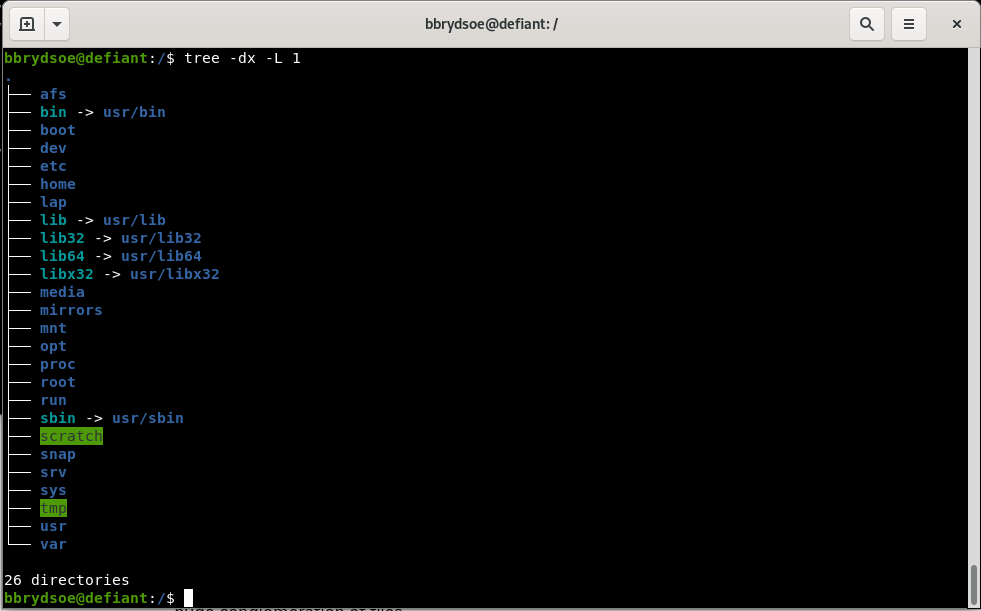
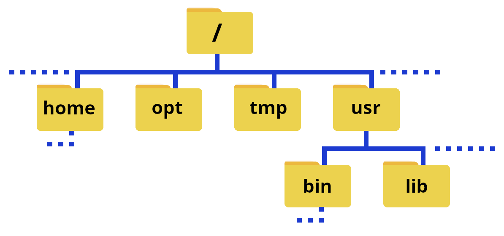

# File systems 

This section will be a basic overview of the Linux filesystem concepts, not an in-depth description of filesystem types. 
When we come to the "Introduction to Linux" session, we will look more at commands to navigate and modify the filesystem. 

!!! note 

    A file system is a hierarchical structure of directories/folders used by the operating system to manage, organize, store, and retrieve data from storage devices (SSG, HDD, USB, ...) 

    It is an interface between applications and hardware. 

    Windows, macOS, Linux/Unix, etc. all use file systems. Often they are "hidden" to the user when using a graphical interface, especially as files are commonly found by searching. Many applications save to specific directories and remember where files were last placed, and so can quickly offer the correct file to the user. 

{: style="width: 400px;float: right"}

The Linux filesystem directory structure starts with the top root directory, which is shown as `/`. Below this are several other standard directories. Of particular interest are `usr/bin`, `home`, `usr/lib`, and `usr/lib64`. A common directory which you will also often find is `usr/local/bin`.

The picture on the above right shows typical subdirectories under `/` (note that the command `tree` does not work at all HPC centers, though it does work on Tetralith---see the page [tree](../tree) under the "Extras" section for how to install if it is missing). Some of the directories have a **symbolic link** to a different name---this is often done to make it quicker to write, but can also be for compatibility reasons since some software have hardcoded paths.

Shown with folders, part of it could look like this: 

{: style="width: 400px;float: right"}

!!! Note

    The `path` or `pathname` is the representation of the location of a file or folder/directory on a computer file system.

- **/** is the root of the directory structure on a Linux filesystem
- **/usr/bin** contains (most) of the system-specific binaries
- **/usr/local/bin** holds non-system binaries. often locally compiled/maintained packages
- **/home** is where the home directories of the users of the system are located
- **/usr/lib** holds kernel modules and shared library images needed to boot the system and run commands in the root filesystem
- **/usr/lib64** is the same as **/usr/lib**, just for 64-bit libraries

User installed binaries are often located in **/opt**.

!!! important "Note about `/`"

    The character `/` can be

    1. the root directory, if it appears alone or at the front of a file or directory name
    2. a separator if it appears in other positions within the path.

!!! note

    If you are on a local cluster, on an HPC center, etc. where you are not root, you will be in your home directory by default when you login. You can use `cd ..` a couple times to go to the root of the system and do `tree` there if you want, or do `tree` in your home directory (you can always return there with just `cd`).

!!! caution

    Running `tree` in `/` on a supercomputing center will probably give a very large/long output!

## Your home directory

When you login to the computer (as a non root user), you will end up in your home directory. At most HPC centers, your home directory will appear as `~` in the terminal prompt, and can also be used in commands instead of having to type out `/home/YOUR_USERNAME`.

The `path` to your home directory varies somewhat. Here are some examples for me:

- Kebnekaise: `/home/b/bbrydsoe`
- My laptop, ncc-1701: `/home/bbrydsoe`
- My home desktop, defiant: `/home/bbrydsoe`

We will look more at file systems and how to navigate them in the session "Introduction to Linux". 
