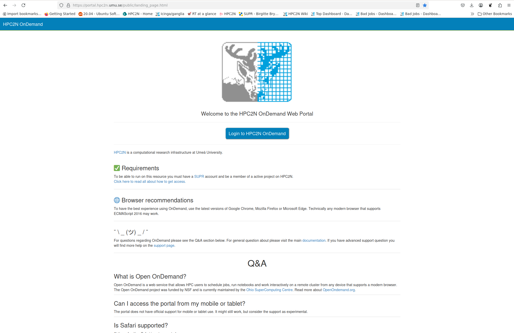
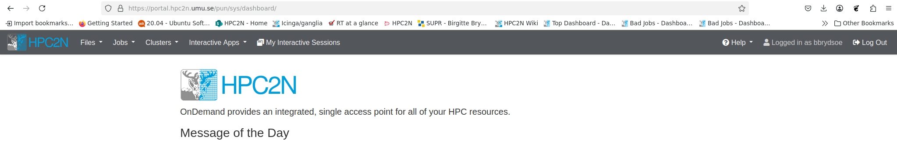
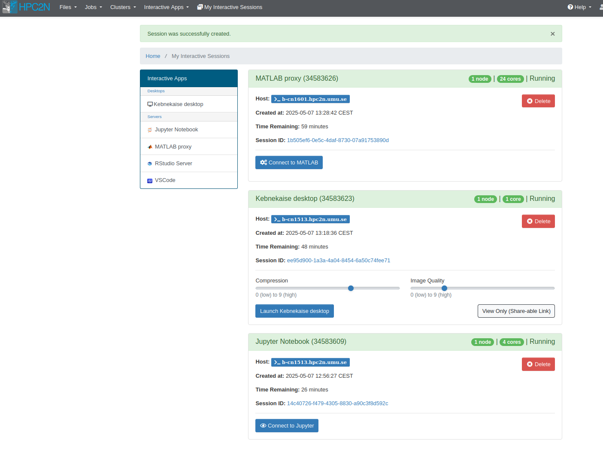
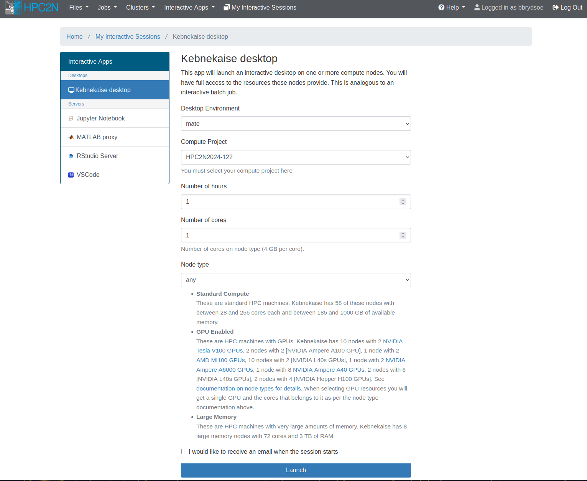
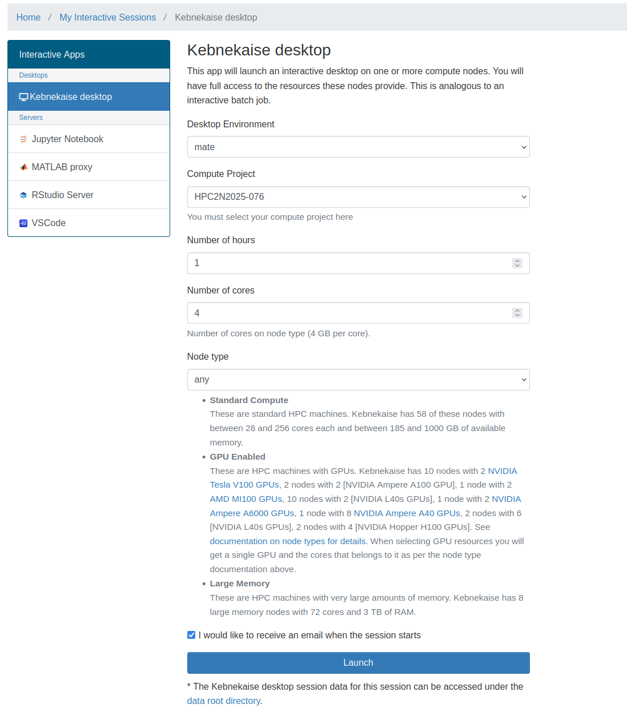
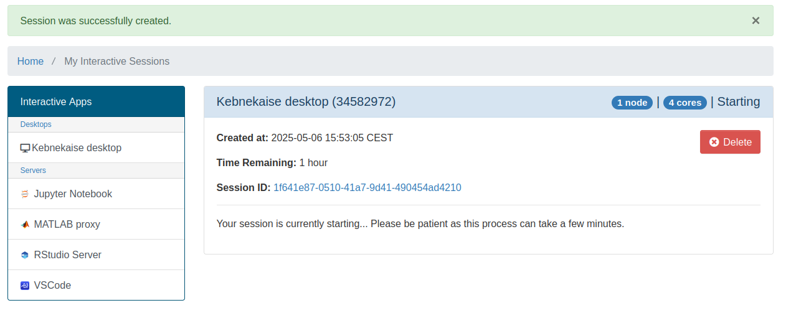
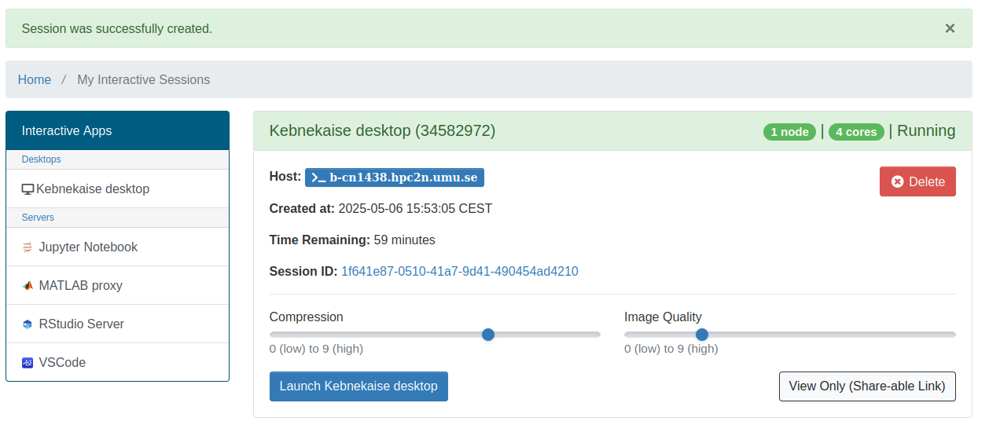
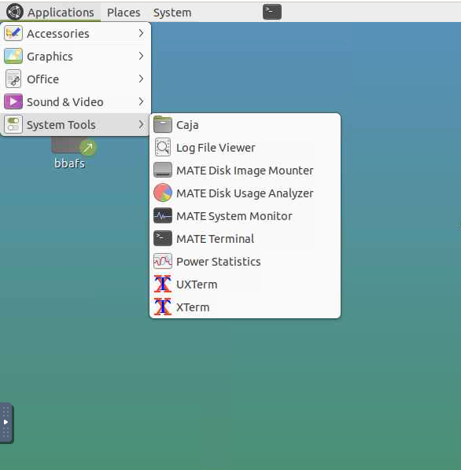
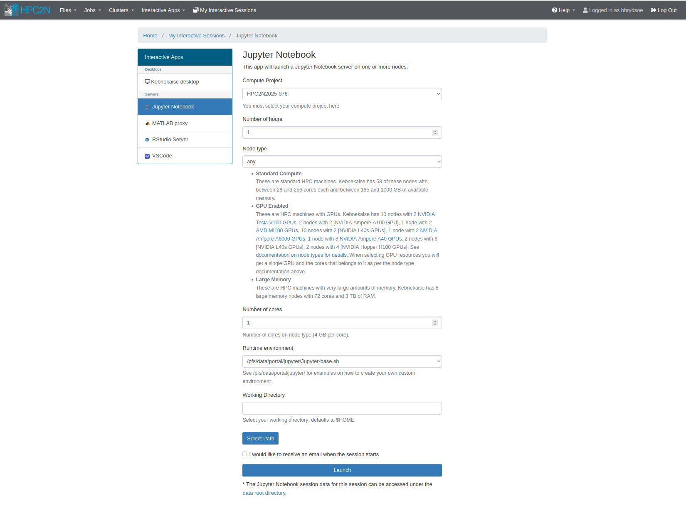

# OpenOnDemand 

Open OnDemand is a web service that allows HPC users to schedule jobs, run notebooks and work interactively on a remote cluster from any device that supports a modern browser. The Open OnDemand project was funded by NSF and is currently maintained by the <a href="https://www.osc.edu/" target="_blank">Ohio SuperComputing Centre</a>. Read more about <a href="https://openondemand.org/" target="_blank">OpenOndemand.org</a>.

There is a YouTube video covering parts of this documentation as well. You can find it here: <a href="https://youtu.be/-nx3iXmOhPI?si=NS7B8UuGfxjQEZrn" target="_blank">How to use OpenOnDemand to connect to HPC2N's Kebnekaise cluster</a>.

!!! tip "NOTE"

    Anything you run through OpenOnDemand is already running as a batch job, and will be running on the compute nodes you got allocated. 

!!! note "Access"

    1. In order to access the HPC2N OnDemand Web Portal, point your browser to
    ```bash
    https://portal.hpc2n.umu.se
    ```
    The page will look something like this
    {: style="width: 90%;"}
    2. Click the blue button labeled "Login to HPC2N OnDemand"
    3. You are sent to the login window. Put your HPC2N username and password, then click "Sign In"
    4. You will now be on the HPC2N Open OnDemand dashboard. The top of it looks like this:
    {: style="width: 90%;"}

!!! note "Overview - dashboard"

    Looking at the top of the HPC2N Open OnDemand dashboard
    {: style="width: 90%;"}
    <br>you find several menu points:

    - **Files**: Links to a file browser that starts in either your home directory or in (one of) your project storage directories
    - **Jobs**: Links to a list of your "Active Jobs" and to a "Job Composer" to create new jobs
    - **Clusters**: the submenu is for shell access (does not currently work)
    - **Interactive Apps**: a list of apps that can be started directly from the dashboard (currently Jupyter, MATLAB, RStudio, VSCode)
    {: style="width: 90%;"}
    - **My Interactive Sessions**: here you find your **active** interactive sessions, for instance Jupyter, MATLAB, etc. You can enter them again as long as they are active, and you can delete them. It could look like this if you have active sessions of MATLAB, the Kebnekaise desktop, and Jupyter notebook:
    {: style="width: 90%;"}
    - as well as a logout button to the right in the menu.

Now let us look a little closer at how to use the various Interactive Apps in the Open OnDemand desktop. Right now there are: Kebnekaise desktop, Jupyter notebook, MATLAB, RStudio, and VS Code, but that may change in the future.

Generally, they are started in the same way, with minor differences. As examples we will look at "Kebnekaise desktop" and "Jupyter Notebook". 

## Interactive Apps - Kebnekaise desktop 

This is the first submenu point, under "Interactive Apps" -> "Desktops".
After clicking it, you will after a few moments get this:

{: style="width: 90%;"}

!!! note

    This is used to start a desktop on one of the compute nodes after you have allocated resources.

    This means you will be able to work as if on that node. That means that anything you run from the desktop immediately runs on the allocated resources, without you having to start (another) job.

    Very useful if you want to work interactively with one of the installed pieces of software or your own code.

    In addition to starting programs from the terminal, there are various applications available directly from the menu, like Libreoffice and Firefox.

Let us look at the options for launching this, one by one:

- **Desktop Environment**: Here you can choose either "mate" (resembles Gnome 2/classic) or "xfce" (lightweight and fast). Personal preferrence.
- **Compute Project**: Dropdown menu where you can choose (one of) your compute projects to launch with.
- **Number of hours**: How long you want the job available for. Here you can choose 1-12 hours, but beware that it is a bad idea to pick longer than you need. Not only will it take longer to start, but it will also use up your allocation even if you are not actively doing anything on the desktop. Pick as long as you need to do your job.
- **Number of cores**: How many cores you want access to. You can choose 1-28 and they each have 4GB memory. This is only a valid field to choose if you pick "any" or "Large memory" for the "Node type" selection.
- **Node type**: Here you can choose "any", "any GPU", or "Large memory". If you pick "any GPU" you will not pick anything for "Number of cores".

You can tick the box "I would like to receive an email when the session starts" if you want that. Depending on your choices (mainly number of hours and number of cores), it can take longer or shorter to launch your job.

!!! warning "Note" 

    You cannot choose type of CPU or type of GPU here.

After you have made the choices, click "Launch".

You can find all the active sessions under "My Interactive Sessions" and you can shut one down with "Delete". You can also shut it down from inside the desktop. 
!!! note "Example" 

    In this example we start a desktop for 1 hour, and with 4 cores. We then start a terminal inside it. 

    **Filling options**

    This is how it could look, for 1 hour, 4 cores

    {: style="width: 90%;"}

    **Waiting to launch**

    Then, this is how it looks while it is waiting to start/sitting in queue

    {: style="width: 90%;"}

    **Ready**

    Then, when the resources have been allocated and you can go to the desktop

    {: style="width: 90%;"}

    **Desktop - mate**

    This is how the desktop could look, running "mate" desktop environment

    {: style="width: 90%;"}

    When you have a desktop open on the allocated resources, you have the option to run

    - one of the applications that can be launched from the menu
        - Libreoffice
        - Firefox
        - editors
        - a terminal/shell to load modules and start programs
    - a terminal/shell where you can
        - run your own code
        - load modules and run installed software

    **Start a terminal to run something**

    You can now work as normal, from a desktop on the resources you allocated. Anything you run there will run on those resources, and they are available for the time you asked for.

    To start a terminal, for instance, you find "MATE terminal" in the menu:     

    {: style="width: 90%;"}

    Since we have 4 cores allocated, let us try run something on them.

    Let us first see that we did get the four cores:

    ```bash
    b-cn1517 [~]$ srun /bin/hostname
    b-cn1517.hpc2n.umu.se
    b-cn1517.hpc2n.umu.se
    b-cn1517.hpc2n.umu.se
    b-cn1517.hpc2n.umu.se
    ```

    === "Run a small python script on the cores"

        I will run this Python script as a test: <a href="https://github.com/hpc2n/bioinformatics-hpc/raw/refs/heads/main/exercises/4.connecting/mmmult.py" target="_blank">mmmult.py</a>.

        First I load some modules:

        ```bash
        b-cn1517 [~]$ module load GCC/12.3.0
        b-cn1517 [~]$ module load Python/3.11.3
        b-cn1517 [~]$ module load SciPy-bundle/2023.07
        ```

        Now let us run ``mmmult.py``

        ```bash
        b-cn1517 [~]$ python mmmult.py
        This is matrix A:
         [[ 2318  1636 -2882 ...  -227 -3924  1979]
         [ 3069   435  3025 ...   728  3257 -2446]
         [ 1890 -2961  3835 ... -3071 -2949  -214]
         ...
         [ 3227 -3088  3030 ...  3213  1721 -1234]
         [-3966 -1899  3627 ...  2835  -526  3421]
         [ -805  1987 -3289 ...  2178 -3185  -765]]
        The shape of matrix A is  (1024, 512)

        This is matrix B:
         [[-2136  -595 -3375 ...  -655  -509  3732]
         [ 1491  1187   835 ...  2665  -306  -807]
         [ -416   258  -990 ...  -600  1960  2774]
         ...
         [-1003  3205  2598 ... -1636    19 -2998]
         [-3700 -2150 -1159 ... -2486  3687  2903]
         [-3218 -2997  2757 ... -3529   313  2796]]
        The shape of matrix B is  (512, 512)

        Doing matrix-matrix multiplication...

        The product of matrices A and B is:
         [[  49486980  103461814 -117631503 ... -108846834   41010684 -139620836]
         [ -96734464  161139192  134600312 ...   99850009   21346359   41858142]
         [  11259501  168047528  -32237508 ... -110635619  129483079 -303047294]
         ...
         [-168782795 -187369405   80437659 ...   55378363   50071222  -81638625]
         [ 289552718  -20697142  -28517135 ...  113819387  148940233  151167784]
         [ -23002353  -27489963  -96396293 ... -182708952 -198664534  146521479]]
        The shape of the resulting matrix is  (1024, 512)

        Time elapsed for generating matrices and multiplying them is  0.8399104890413582
        ```

    === "Graphics"

        For this example I need some modules:

        ```bash
        b-cn1517 [~]$ module load GCC/12.3.0
        b-cn1517 [~]$ module load Python/3.11.3
        b-cn1517 [~]$ module load SciPy-bundle/2023.07
        b-cn1517 [~]$ module load GCC/12.3.0
        b-cn1517 [~]$ module load Python/3.11.3
        b-cn1517 [~]$ module load SciPy-bundle/2023.07
        b-cn1517 [~]$ module load GCC/12.3.0
        b-cn1517 [~]$ module load matplotlib/3.7.2
        b-cn1517 [~]$ module load Tkinter/3.11.3
        ```

        Now let us start Python and plot something, using this dataset (<a href="https://github.com/hpc2n/bioinformatics-hpc/raw/refs/heads/main/exercises/4.connecting/scottish_hills.csv" target="_blank">scottish_hills.csv</a>:

        ```bash
        import pandas as pd
        import matplotlib
        import matplotlib.pyplot as plt
        matplotlib.use('TkAgg')
        dataframe = pd.read_csv("scottish_hills.csv")
        x = dataframe.Height
        y = dataframe.Latitude
        plt.scatter(x, y)
        plt.show()
        ```

        Which looks like this:

        {: style="width: 90%;"}

    === "Run a small python script on 1 core"

        To compare, I started a job and asked for 1 core. I then ran the same Python script, after loading modules and checking I got 1 core (the type of node is the same in both cases: Intel Skylake):

        ```
        b-cn1420 [~]$ module load GCC/12.3.0
        b-cn1420 [~]$ module load Python/3.11.3
        b-cn1420 [~]$ module load SciPy-bundle/2023.07
        b-cn1420 [~]$ srun /bin/hostname
        b-cn1420.hpc2n.umu.se
        b-cn1420.hpc2n.umu.se
        b-cn1420 [~]$ python mmmult.py
        This is matrix A:
         [[ 2318  1636 -2882 ...  -227 -3924  1979]
         [ 3069   435  3025 ...   728  3257 -2446]
         [ 1890 -2961  3835 ... -3071 -2949  -214]
         ...
         [ 3227 -3088  3030 ...  3213  1721 -1234]
         [-3966 -1899  3627 ...  2835  -526  3421]
         [ -805  1987 -3289 ...  2178 -3185  -765]]
        The shape of matrix A is  (1024, 512)

        This is matrix B:
         [[-2136  -595 -3375 ...  -655  -509  3732]
         [ 1491  1187   835 ...  2665  -306  -807]
         [ -416   258  -990 ...  -600  1960  2774]
         ...
         [-1003  3205  2598 ... -1636    19 -2998]
         [-3700 -2150 -1159 ... -2486  3687  2903]
         [-3218 -2997  2757 ... -3529   313  2796]]
        The shape of matrix B is  (512, 512)

        Doing matrix-matrix multiplication...

        The product of matrices A and B is:
         [[  49486980  103461814 -117631503 ... -108846834   41010684 -139620836]
         [ -96734464  161139192  134600312 ...   99850009   21346359   41858142]         [  11259501  168047528  -32237508 ... -110635619  129483079 -303047294]
         ...
         [-168782795 -187369405   80437659 ...   55378363   50071222  -81638625]
         [ 289552718  -20697142  -28517135 ...  113819387  148940233  151167784]
         [ -23002353  -27489963  -96396293 ... -182708952 -198664534  146521479]]
        The shape of the resulting matrix is  (1024, 512)

        Time elapsed for generating matrices and multiplying them is  0.8590587209910154
        b-cn1420 [~]$
        ```

    **Ending the session**

    The session is active for as long as you allocated it for (number of hours), or you can end it earlier if you do not need it longer.

    - From the desktop, you can exit it by clicking "System" -> "Log Out <user>" 
    - If you left the desktop running, you can enter it again with "Launch Kebnekaise desktop" from the "My Interactive Sessions" menu point.

    - Or you can shut it down by clicking "Delete"

    {: style="width: 90%;"}

### Interactive Apps - Jupyter Notebook

If you choose "Interactive Apps" -> "Jupyter Notebook", you will get an app that can launch a Jupyter Notebook server on one or more nodes.

{: style="width: 90%;"}

!!! note

    This is used to start a Jupyter Notebook on one (or more) of the compute nodes after you have allocated resources.

    This means you will be able to work as if on those resources. That means that anything you run from inside the Jupyter notebook immediately runs on the allocated resources, without you having to start (another) job.

    Very useful if you want to work interactively.

    NOTE: another way to start [Jupyter at Kebnekaise is through a batch job inside ThinLinc](../../software/jupyter).

Let us look at the options for launching this, one by one:

- **Compute Project**: Dropdown menu where you can choose (one of) your compute projects to launch with.
- **Number of hours**: How long you want the job available for. Here you can choose 1-12 hours, but beware that it is a bad idea to pick longer than you need. Not only will it take longer to start, but it will also use up your allocation even if you are not actively doing anything in Jupyter. Pick as long as you need to do your job.
- **Node type**: "any", "any GPU", or "Large memory". If you pick "any GPU" you cannot also chose "Number of cores". The other options (for any CPU or for large memory nodes) means you also pick number of cores. Possibe to pick between 1-28.
- **Number of cores**: This is only shown if you pick "any" or "Large memory" fo
r "Node type". You can pick 1-28 cores.
- **Runtime environment**: Here you can pick "System provided", "Project provided", or "User provided". If you or your project do not have a custom Jupyter environment (for instance with specific Python packages or such), then just go with the "System provided". See examples in the directory at the path ``/pfs/data/portal/jupyter/`` for how to create your own.
- **Working Directory**: Pick the working directory to start in. This will be ``$HOME`` unless you pick something else (for instance, maybe you prefer to start in your project storage directory). You can either type in the path or you can click the button "Select Path" and choose from the directory tree.

You can tick the box “I would like to receive an email when the session starts” if you want that. Depending on your choices (mainly number of hours and number of cores), it can take longer or shorter to launch your job.

#### Simple example 

In this example we start a Jupyter Notebook for 1 hour, and with 4 cores.

!!! note "Filling options"

    This is how it could look, for 1 hour, 4 cores. Using the system runtime environment and chosing a project storage directory of mine.

    {: style="width: 90%;"}

!!! note "Waiting to launch"

    Then, this is how it looks while it is waiting to start/sitting in queue

    {: style="width: 90%;"}

!!! note "Ready"

    Then, when the resources have been allocated and you can go to the Jupyter notebook. As you can see, a host node is assigned.

    {: style="width: 90%;"}

    Click "Connect to Jupyter" to go to the notebook.

!!! note "Go to Jupyter notebook"

    After connecting, you will have a Jupyter notebook to work in.

    **NOTE**: you may get an error message about "Error Starting Kernel" if you have previously run Jupyter notebook [started through a batch job](../../software/jupyter).
    - If so, then just click OK and then pick the correct kernel from the pop-up box "Select Kernel".
    - Most likely the one you want is "Start Other Kernel" -> "Python 3 (ipykernel)".
    - Pick that and click "Select".

    {: style="width: 90%;"}

!!! note "Shutting down Jupyter"

    You will at most keep the connection for as long as you asked for when you launched it.

    However, if you want to shut down Jupyter notebook before that, you can choose "File" -> "Shut Down" from the menu.

    If you just close the window, then the sessions can be found under "My Interactive Sessions" for as long as you asked for when you started it, and you can re-enter the notebook by just clicking "Connect to Jupyter" again.

#### Example - Jupyter with extra modules 

For this example we will create a Jupyter environment with some modules we need, and then use that when we start Jupyter.

1. Login to Kebnekaise (either of SSH, ThinLinc, Kebnekaise desktop through Open OnDemand)
2. Open a terminal if you did not login with SSH.
3. Copy ``/pfs/data/portal/jupyter/jupyter-base.sh`` to $HOME/portal/jupyter (and rename it to something easy to remember): ``mkdir -p $HOME/portal/jupyter;cp /pfs/data/portal/jupyter/jupyter-base.sh $HOME/portal/jupyter/myjupenv.sh``
4. Edit it (with nano for instance) to contain the modules you need. **Note** a specific Jupyter notebook compatible with Python/3.11.5 is loaded! Do not specify versions here! I will add these:
    - SciPy-bundle
    - matplotlib
{: style="width:95%; float:left;"} <br>
5. Now start a new Jupyter Notebook session in Open OnDemand, choosing your own environment:<br>
{: style="width:50%;"}
6. When it is ready, connect to Jupyter. Remember: you may get an error message about "Error Starting Kernel" if you have previously run Jupyter notebook [started through a batch job](../../software/jupyter).
    - If so, then just click OK and then pick the correct kernel from the pop-up box "Select Kernel".
    - Most likely the one you want is "Start Other Kernel" -> "Python 3 (ipykernel)".
    - Pick that and click "Select".
7. You can now run something which requires, say, pandas and matplotlib.
8. You can find an example to try (from the "Intro to Pandas" part of the course "Using Python in an HPC environment) here: <a href="../pandas-example.ipynb" target="_blank">pandas-example.ipynb</a>. It needs the file <a href="../exoplanets_5250_EarthUnits.csv" target="_blank">exoplanets_5250_EarthUnits.csv</a> in the same directory.

## References

- More examples here: https://docs.hpc2n.umu.se/tutorials/connections/#open__ondemand
