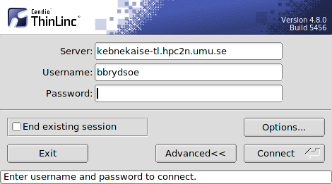
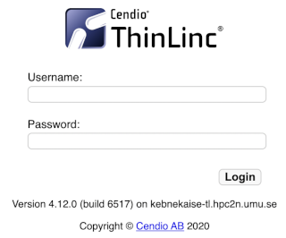
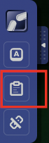
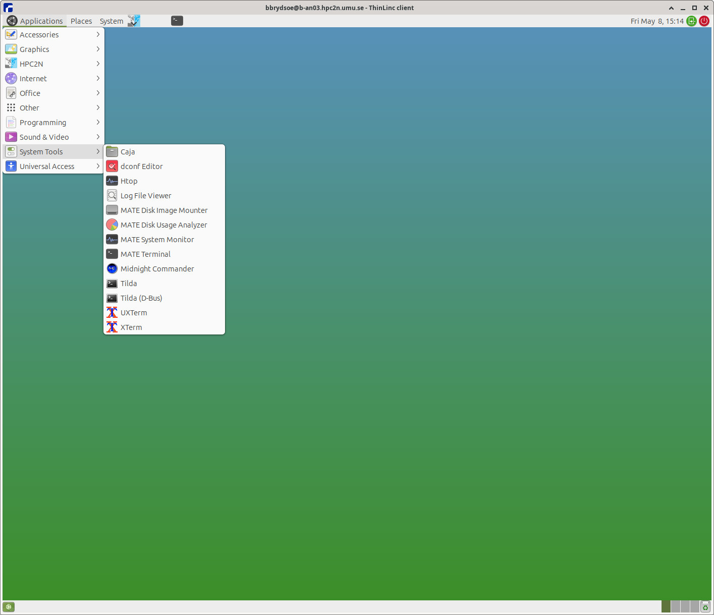

# ThinLinc

<a href="http://www.cendio.com/thinlinc/what-is-thinlinc" target="_blank">ThinLinc</a> is a cross-platform remote desktop server developed by Cendio AB. You can access Kebnekaise through ThinLinc.

ThinLinc is especially useful when you need to use software with a graphical interface, like INTEL VTune or MATLAB. Look at [our MATLAB page](https://docs.hpc2n.umu.se/documentation/software/matlab) for information about running MATLAB.

ThinLinc can be used as a standalone application and also through a browser with the Web Access desktop.

!!! NOTE

    When you are logged in through ThinLinc you are logged into the **Kebnekaise ThinLinc login node** which is shared, just like the regular login node. Anything you run directly in an application is run there, unless you start a regular batch job or for instance start a batch job from inside MATLAB. 

    Thus; start a batch job if you are doing anything longer/heavy inside ThinLinc, just as you would from the regular Login node. 

## ThinLinc standalone client

The full capabilities of ThinLinc can be obtained with the standalone version. Here, you need to follow the next steps for installing ThinLinc.

**Download and Install instructions**

Download the ThinLinc client from <a href="https://www.cendio.com/thinlinc/download" target="_blank">https://www.cendio.com/thinlinc/download</a>to your own workstation/laptop and install it.

#### Login to cluster login node

- Start the ThinLinc client (ThinLinc client, tlclient depending on your platform)
- Enter the name of the server: **kebnekaise-tl.hpc2n.umu.se** and then enter your own username at HPC2N under "Username":
{: style="width: 420px;float: right"}
    - If you don't see the Options button, click on Advanced
    - Go to "Options" -> "Security" and check that authentication method is set to "password".
    - Go to "Options" -> "Display" and mark "Windowed"
    - Go to "Options" -> "Local Devices" and uncheck Sound, Serial ports, Drives, Printer, Smart card readers
    - Enter your HPC2N password.
    - Click "Connect"
    - Click "Continue" when you are being told that "the server's host key is not in the registry".
    - After a short time, the ThinLinc desktop opens, running Mate. It is fairly similar to the Gnome desktop.
    - All your files on HPC2N should now be available.

## Web Access desktop

On your local web browser, enter <a href="https://kebnekaise-tl.hpc2n.umu.se:300/">https://kebnekaise-tl.hpc2n.umu.se:300/</a> in the address bar. This will display the login box:

{: style="width: 320px;float: right"}

Here, you can type the username and password for HPC2N. This web browser version can be handy to get started with ThinLinc or if you do not want to install another software in your machine. Also, if you are working mainly with a tablet.

!!! NOTE

    Some things you need to keep in mind with this version:
    {: style="width: 70px;float: right"}

    - direct copy and paste does not work. One can use the clipboard at the bottom (enclosed in a red square) of the Toolbar that appear on a side of the browser session (see picture) 
    - features like multiple sessions are not fully supported
    - In addition to this, some key bindings are not supported. Workarounds for this and more information on the ThinLinc Web Access can be found in the ThinLinc documentation: <a href="https://www.cendio.com/resources/docs/tag/tlwebaccess_usage.html" target="_blank">https://www.cendio.com/resources/docs/tag/tlwebaccess_usage.html</a>

## General ThinLinc usage (both versions)

### Opening a Linux terminal in the ThinLinc desktop

To start a terminal window, go to the menu at the top. Click “Applications” → “System Tools” → “MATE Terminal”.

{: style="width: 570px;float: right"}

### Disconnect or logout from the ThinLinc desktop

When you want to logout from the ThinLinc connection, do the following:

- **Note!** This does not affect any jobs in the batch queue or jobs running on the cluster, and any finished jobs will be available when you login again.
- The following two ways are equivalent, both uses the top menu bar. Use one of them
    - "Applications” → “HPC2N” → “Log Out”
    - "The blueish HPC2N icon to the right of System menu point" → “Log Out”

### Reconnecting to an older ThinLinc session

If you have a running ThinLinc session and there is a problem with the ThinLinc session when you connect again. The best way to solve this is to:

- Logout from the current ThinLinc session (if still logged in)
- Open the client or the Web Access desktop again, but this time specify "End existing session" in the dialog or through the command options.
    - Do the final step and login

