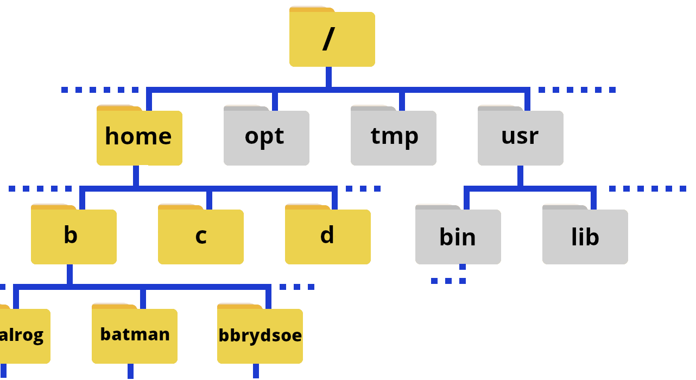
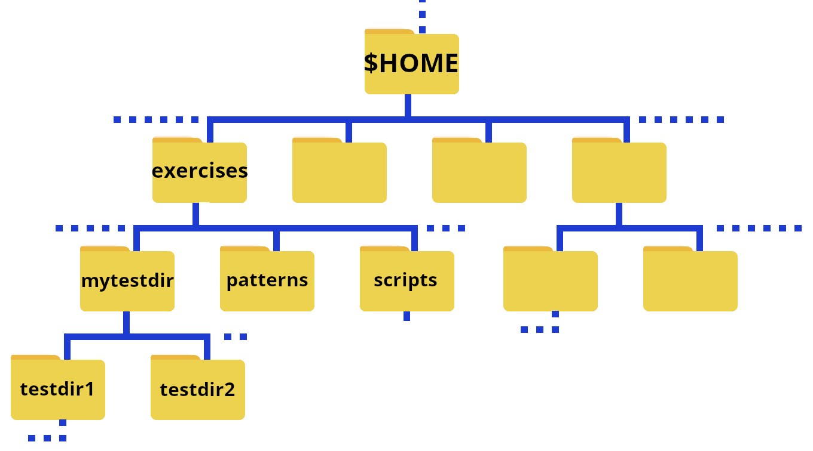

# Navigating the File System

This section will focus on the file system commands as the file system itself was covered in the session [File systems](https://hpc2n.github.io/bioinformatics-hpc/3.files-filesystems/filesystems/).  

!!! Note "Learning objectives" 

    **Questions** 

    - How do I change directory? 
    - How do I list my files?
    
    **Learning objectives** 

    - Learn how to navigate the Linux file system
    - Learn about paths 
    - Learn about options (flags) and arguments to shell commands 
    - Learn about the **tab completion**
     
!!! important "Reminder about `/`"

    The character `/` can be 

    1. the root directory, if it appears alone or at the front of a file or directory name 
    2. a separator if it appears in other positions within the path.

## Home folders on Kebnekaise

{: style="width: 500px;float: left"}   
<br><br style="clear: both;">

The above shows an illustration where the home folders are emphasized. 

## Your home directory

When you login to the computer (as a non root user), you will end up in your home directory. At most HPC centers, your home directory will appear as `~` in the terminal prompt, and can also be used in commands instead of having to type out `/home/YOUR_USERNAME` or on Kebnekaise. ``/home/first-letter-of-username/YOUR-USERNAME``.

The `path` to your home directory varies somewhat. Here are some examples for me: 

- Tetralith: `/home/x_birbr`
- Kebnekaise: `/home/b/bbrydsoe`
- Cosmos: `/home/bbrydsoe`
- My laptop, ncc-1701: `/home/bbrydsoe`
- My home desktop, enterprise: `/home/bbrydsoe`

!!! note 

    You can always use the command `pwd` to see the path to your current working directory! 

    You can also always return to your home directory by giving the command `cd` and pressing `enter`. 

There are is also an "environment variable" that can be used as shortcut for the path: `$HOME`. We will talk more about (environment) variables later. 

## pwd

The command `pwd` (**p**rint **w**orking **d**irectory) will print out the full pathname of the working directory to the screen. 

You can use this to find out which directory you are in.

### Example, in your home directory 

=== "On Kebnekaise"

     user ``bbrydsoe``: 

     ```bash
     b-cn1613 [~]$ pwd
     /home/b/bbrydsoe
     b-cn1613 [~]$ 
     ```

=== "On my desktop ``enterprise``"

     user ``bbrydsoe``: 

     ```bash
     [bbrydsoe@enterprise ~]$ pwd
     /home/bbrydsoe
     [bbrydsoe@enterprise ~]$ 
     ```

### Example, in a directory named `testdir` on Kebnekaise

User ``bbrydsoe``:

```bash
b-cn1613 [~/testdir]$ pwd
/home/b/bbrydsoe/testdir
b-cn1613 [~/testdir]$
```

### Example, in subdirectory `mydir` under directory `testdir`

On Kebnekaise, user ``bbrydsoe``: 

```bash
b-cn1613 [~/testdir/mydir]$ pwd
/home/b/bbrydsoe/testdir/mydir
b-cn1613 [~/testdir/mydir]$ 
```

So the full path is in the prompt. That is not the case at all centers. Advantages and disadvantages: long prompt perhaps, but you can easily see where you are. 

## ls - listing files/directories

The `ls` command is used to list files and/or directories. If you just give the command `ls` with no flags, it will list all files and subdirectories in the current directory except for hidden files.

<div>
```bash
ls [flags] [directory]
```
</div>

This way you can to list files/subdirectories for any directory, but the default one is the one you are currently standing in. 

Some examples: 

- `ls /` lists contents of the root directory
- `ls ..` lists the contents of the parent directory of the current
- `ls ~` lists the contents of your user home directory
- `ls *` lists contents of current directory and subdirectories

!!! Note "Commonly used flags" 

    - `-a` lists content including hidden files and directories
    - `-l` lists content in long table format (permissions, owners, size in bytes, modification date/time, file/directory name)
    - `-lh` adds an extra column to above representing size of each file/directory
    - `-t` lists content sorted by last modified date in descending order
    - `-tr` lists content sorted by last modified date in ascending order
    - `-s` list files with their sizes

To get more flags, type `ls --help` or `man ls` in the terminal to see the manual. 

!!! tip

    You can often get more info on flags/options and usage for a Linux command with 

    - `COMMAND --help`
    - `man COMMAND`

    where COMMAND is the Linux command you want information about, like `ls`, `mkdir`, etc. 

!!! Example "The output for a few of the flags, for a directory with two subdirectories and some files" 

    ```bash
    b-cn1613 [~/mytestdir]$ ls
    myfile.txt  myotherfile.txt  testdir1  testdir2
    
    b-cn1613 [~/mytestdir]$ ls -a
    ./  ../  myfile.txt  myotherfile.dat  testdir1/  testdir2/

    b-cn1613 [~/mytestdir]$ ls -l
    total 3
    -rw-rw-r-- 1 bbrydsoe folk   27 Sep 11 11:43 myfile.txt
    -rw-rw-r-- 1 bbrydsoe folk   33 Sep 11 11:43 myotherfile.txt
    drwxrwxr-x 2 bbrydsoe folk 4096 Sep 11 11:40 testdir1
    drwxrwxr-x 2 bbrydsoe folk 4096 Sep 11 11:39 testdir2

    b-cn1613 [~/mytestdir]$ ls -la
    total 5
    drwxrwxr-x 4 bbrydsoe folk 4096 Sep 11 11:43 .
    drwx------ 3 bbrydsoe folk 4096 Sep 11 11:43 ..
    -rw-rw-r-- 1 bbrydsoe folk   27 Sep 11 11:43 myfile.txt
    -rw-rw-r-- 1 bbrydsoe folk   33 Sep 11 11:43 myotherfile.txt
    drwxrwxr-x 2 bbrydsoe folk 4096 Sep 11 11:40 testdir1
    drwxrwxr-x 2 bbrydsoe folk 4096 Sep 11 11:39 testdir2

    b-cn1613 [~/mytestdir]$ ls -lah
    total 5.0K
    drwxrwxr-x 4 bbrydsoe folk 4.0K Sep 11 11:43 .
    drwx------ 3 bbrydsoe folk 4.0K Sep 11 11:43 ..
    -rw-rw-r-- 1 bbrydsoe folk   27 Sep 11 11:43 myfile.txt
    -rw-rw-r-- 1 bbrydsoe folk   33 Sep 11 11:43 myotherfile.txt
    drwxrwxr-x 2 bbrydsoe folk 4.0K Sep 11 11:40 testdir1
    drwxrwxr-x 2 bbrydsoe folk 4.0K Sep 11 11:39 testdir2

    b-cn1613 [~/mytestdir]$ ls -latr
    total 5
    drwxrwxr-x 2 bbrydsoe folk 4096 Sep 11 11:39 testdir2
    drwxrwxr-x 2 bbrydsoe folk 4096 Sep 11 11:40 testdir1
    -rw-rw-r-- 1 bbrydsoe folk   27 Sep 11 11:43 myfile.txt
    -rw-rw-r-- 1 bbrydsoe folk   33 Sep 11 11:43 myotherfile.txt
    drwx------ 3 bbrydsoe folk 4096 Sep 11 11:43 ..
    drwxrwxr-x 4 bbrydsoe folk 4096 Sep 11 11:43 .

    b-cn1613 [~/mytestdir]$ ls *
    myfile.txt  myotherfile.dat

    testdir1:
    file1.txt  file2.sh  file3.c  file4.dat

    testdir2:
    file1.txt  file2.txt  file3.c

    b-cn1613 [~/mytestdir]$ cd testdir1
    b-cn1613 [~/mytestdir/testdir1]$ ls -l
    total 2
    -rw-rw-r-- 1 bbrydsoe folk 31 Sep 11 11:47 file1.txt
    -rw-rw-r-- 1 bbrydsoe folk 16 Sep 11 11:49 file2.sh
    -rw-rw-r-- 1 bbrydsoe folk 74 Sep 11 11:49 file3.c
    -rw-rw-r-- 1 bbrydsoe folk 25 Sep 11 11:50 file4.dat

    b-cn1613 [~/mytestdir/testdir]$ ls -ls
    total 2
    1 -rw-rw-r-- 1 bbrydsoe folk 31 Sep 11 11:47 file1.txt
    1 -rw-rw-r-- 1 bbrydsoe folk 16 Sep 11 11:49 file2.sh
    1 -rw-rw-r-- 1 bbrydsoe folk 74 Sep 11 11:49 file3.c
    1 -rw-rw-r-- 1 bbrydsoe folk 25 Sep 11 11:50 file4.dat
    ```

    The "drwxr-xr-x" and "-rw-r\--r\--" are examples of **permissions**, as mentioned in the earlier session on file systems. The prefex d means is it a directory. A "-" means no permission for that. There are three groups: owner, group, and all. Note that “r” is for read, “w” is for write, and “x” is for execute.  

    We will talk a little bit more about permissions and how to change them when we come to the section on **scripting**. 

## Wild cards

Wild cards are useful "stand-ins" for one or more characters or numbers, that you can use for instance when finding patterns or when removing/listing all files of a certain type.

Wild cards are also called "glob" or "globbing" patterns. 

??? Globs

    Globs, also known as glob (or globbing) patterns are special characters that can expand a wildcard pattern into a list of pathnames that match the given pattern.
    
    On the early versions of Linux, the command interpreters relied on a program that expanded these characters into unquoted arguments to a command: `/etc/glob`.

<br>

**Common wildcards**

- **`?`** represents a single character.
- **`*`** represents a string of characters (0 or more).
- **`[ ]`** represents a range of alphanumeric characters in ascending order.
- **`{ }`** the terms are separated by commas and each term must be a wildcard or exact name.
- **`[!]`**  matches any character that is NOT listed between `[!` and `]`. This is a logical NOT.
- **`\`** specifies an "escape" character, when using a subsequent special character.

!!! Warning 

    You may need quotation marks around some wildcards as well.

!!! Warning

    Wildcards are typically case-sensitive by default. The `[]` expression in particular treats the set of all uppercase characters as preceding the set of all lowercase characters. For example `[T-g]` will match all uppercase letters from "T" through "Z" and all lowercase letters from "a" through "g", but will not include uppercase "G" or lowercase "t".

    Many relevant commands, like `ls`, have an `-i` flag to ignore case.

!!! tip "Try some of the commands below" 

    Useful files for these examples are found in `exercises/patterns`. 

!!! Example "Some examples of the use of wildcards"

    ```bash
    myfile?.txt
    ``` 

    This matches myfile0.txt, myfile1.txt,... for all letters from A to z and numbers from 0 through 9. Try with ``ls myfile?.txt``. 

    ```bash
    r*d
    ```

    This matches red, rad, ronald, ... anything starting with r and ending with d, including rd. 

    ```bash
    r[a,i,o]ck
    ```

    This matches rack, rick, and rock.

    ```bash
    a[d-j]a
    ```

    This matches ada, afa, aja, ...  and any three letter word that starts with an a, ends with an a, and has any character from d to j in between (but no capital letters). Try with ``ls a[d-j]a``. 
   
    ```bash
    [0-9]
    ``` 
  
    This matches a range of numbers from 0 through 9. 

    ```bash
    cp {*.dat,*.c,*.pdf} ~
    ```

    This command copies any files ending in .dat, .c, and .pdf to the user's home directory. No spaces are allowed between the commas, etc. You could test it by creating a matching file in the `patterns` directory with `touch file.c` and running the above command to see it only copies that one from the `patterns` directory. 

    ```bash
    rm thisfile[!8]*
    ```

    This will remove all files named `thisfile*`, except those that have an 8 at that position in their name. Try running it in the `patterns` directory! Do `ls` before and after to see the change. Remember, you can always recreate the directory `patterns` by untarring it again.  

## cd - changing directory 

The command `cd` is used to change directory. 

- **`cd`** or **`cd ~`**: Go to your home directory ($HOME)
- **`cd DIR`**: Change directory to DIR (whatever path you specify)
- **`cd ..`**: Change directory to the parent directory of the current directory
- **`cd -`**: go back to the previous working directory

!!! example

    This is the structure of the exercises directory that you got after extracting the tarball: 

    {: style="width: 500px;float: left"}
    <br><br style="clear: both;">

    Remember, `$HOME` is an *environment variable* which gives a shortcut to your home directory.

    **NOTE** if you are on Kebnekaise and placed the exercises under `/proj/nobackup/bioinfo-course/YOURDIR` then `$HOME` would be replaced by that path. 

    To change to the directory `exercises` when you are in your home directory, you do
    ```bash
    cd exercises
    ```

    To then change to the directory `testdir1` you do
    ```bash
    cd testdir1
    ```

    To quickly go back to your home directory, do 
    ```bash
    cd 
    ```

    To quickly go to a subdirectory, for instance ``exercises/testdir2`` you then do 
    ```bash
    cd exercises/testdir2
    ```

    To go to the above directory from anywhere on the system in question, do 
    ```bash
    cd $HOME/exercises/testdir2
    ```

!!! info

    You can use **full paths** (also known as **absolute paths**) or **relative paths** to give the location. 

    An absolute path makes no assumptions about your current location in relation to the location of the file or directory you want to access. It specifies the location from the root of the file system. Absolute paths are required if the file or directory you want to access is not in your current directory or any sub-directory therein.

    The path with reference to your current directory is called the relative path. A relative path only explicitly specifies sub-directories of your current directory, leaving the part of the path from the root to the current directory implicit.

!!! summary

    - Your home directory is generally located in `/home/USERNAME` or `/home/U/USERNAME`
    - Your home directory is also stored as the environment variable ``$HOME``
    - `pwd` displays your path and current location
    - `cd DIR` changes your current working directory to DIR
    - Using `cd` without providing a destination takes you to your home directory 
    - `ls` is used to list files and directories
    - Wildcards are metacharacters for one or more character or number, and are useful when you are finding patterns or removing/copying/listing all files of a certain type 
