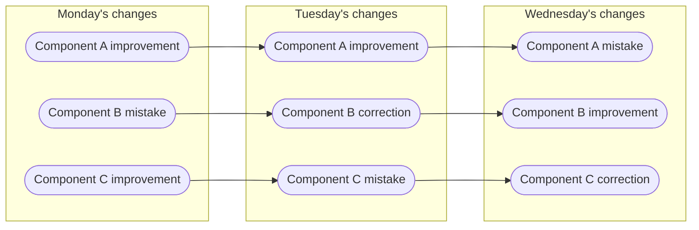

# Introduction to Git and setup

The purpose of this session is to learn the fundamentals of version control — manage file history, collaborate efficiently, and protect your work from accidental loss. 

## Understanding Git

Git is a **version control tool** designed to keep track of modifications made to files over time. It allows developers to revisit earlier versions of a project, compare changes, and work together without overwriting each other’s progress.

### Why Git and version control matters

In an ideal world, things develop linearly: 

- Every new version is an improvement upon the previous version. 
    - No need to backtrack. 
- Everyone knows what everyone else is doing 
- In the end, things are simply finished. 


In the real world, things develop non-linearly: 

- A new version can be anything between 
    - a complete catastrophe and 
    - a major breakthrough.
- People do not know what others are doing 
- Sometimes we are simply fixing earlier mistakes... 


!!! note "Going back to an earlier version"

    Sometimes, it is easier to simply backtrack to an *earlier version*...

    ```mermaid
    graph LR
      Mon@{ shape: stadium, label: "Monday's improvements"}
      Tue@{ shape: stadium, label: "Tuesday's mistakes"}
      Wed@{ shape: stadium, label: "Wednesday's improvements"}
      Mon --> Tue
      Mon --> Wed
    ```

    But without using a version control system, where is this *earlier version*?

    - CTRL + Z 
    - my_file.txt, my_file.txt.old, ... 
    - My project/ 
         - 2020-08-12/
         - 2020-08-13/
         - ...
    - Daily home directory backup 

    Also, this is: 

    - Prone to mistakes 
         - CTRL + Z has limits, overwritten/deleted files, human/hardware error 
    - How much to save? 
         - Individual files? Everything? How much space is required? 
    - How to organize versions? 
         - What is the difference between different versions? 

    *Overall, difficult to manage!* 

#### What about the granularity?



*This compounds the problems!*

!!! note "How does VCS solve this?"

    - Stores the history using snapshots (commits) 
        - Each snapshot represents the project at a given point in time 
    - Manages snapshots and associated metadata 
        - Naming (tags), comments, dates, authors, etc 
    - Easy to move between different snapshots 
    - Can handle different degrees of granularity 
    - Can handle multiple development paths (branches) 

### Comparing and joining

 - VCS makes it easy to compare different snapshots 
     - Named revisions, comments, time information, author information 
     - Diff tools 
     - Search tools 
     - Bisection search 
 - VCS also allows the joining (merging) of different snapshots  
     - Easy to experiment with ideas 

### Collaboration

 - One of the primary functions of VCS is to allow collaboration 
 - Usual setup: server (remote) + multiple clients 
     - People work locally and send (push) the changes to the server 
     - VCS keeps track of what has been done and by whom 
 - Safer since mistakes can be easily remedied 
 - The contributions of several people can be merged 

### Backup

 - VCS functions as a backup 
 - Locally, the system maintains a copy of each file 
     - Usually only the changes or the files that have changed are stored 
 - Globally, lost files can be recovered from the server 

### Integration

 - VCSs such as Git have been integrated with several services 
     - HackMD, Overleaf, ...
 - Services such as GitHub can do almost everything for you 
     - Store history, distribute, testing / continuous integration, bug reports, milestones, website, ... 

!!! note "Summing up"

    Version control systems

    - keeps track of your files and other output
    - tracks what is created and modified
    - tracks who made the modifications
    - tracks why the modifications were made (if you make good commit comments!)
    - Is important to reproducible research, helping you to explain what was changed, when, and why (for instance, why you filtered out specific data)

## Practical use cases

What are the practical use cases for VCS?

### Source code

 - Many VCSs are designed for managing source code 
 - Manage deployment (production, development, testing, etc) 
 - Manage published versions (v0.1 etc) 
 - Manage (experimental) features 
 - Bug hunting 
 - But also for: writers, artists, composers... 

### Latex files

 - Track which version of a manuscript has been 
     - submitted, 
     - revised and/or 
     - accepted
 - Collaboration between several authors 

### HPC: batch files and data

 - Track different versions of your batch scripts 
     - Easy to check the used configuration afterwards
 - Track input and output files 
     - Limited to smallish files


    
