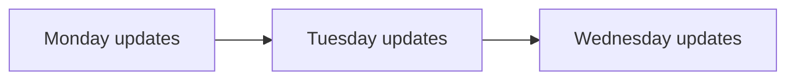
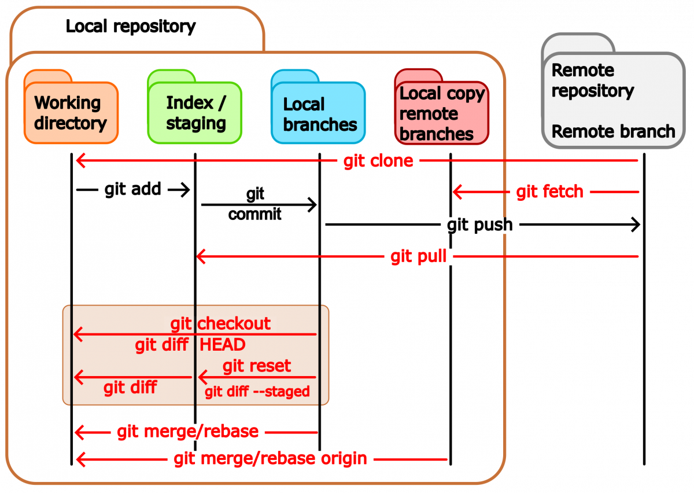

# Introduction to Git

Learn the fundamentals of version control — manage file history, collaborate efficiently, and protect 
your work from accidental loss.


# 1. Understanding Git

Git is a **version control tool** designed to keep track of modifications made to files over time.
It allows developers to revisit arlier versions of a project, compare changes, and work together without 
overwriting each other’s progress.

## Why Git Matters

In a perfect workflow:

* Each update improves the previous version.
* Mistakes are easy to recover from.
* Team members stay synchronized.
* Projects progress smoothly toward completion.

Git helps make that possible by offering:

* **History tracking** — every saved version is preserved permanently.
* **Collaboration support** — several people can edit the same project simultaneously.
* **Safe experimentation** — new ideas can be tested independently without affecting the main codebase.
* **Easy recovery** — bugs or deleted files can be restored quickly.




## How Git Organizes Your Project

Git views your files through four main areas:

<figure>
  
  <figcaption>Overview of the main areas Git uses to manage project files.</figcaption>
</figure>

* **Working Directory**: the files currently visible and editable on your computer.
* **Staging Area**: a temporary space where selected changes are prepared before saving.
* **Local Repository**: the project history stored in the hidden `.git` directory on your machine.
* **Remote Repository**: an online copy of the project hosted on services such as GitHub or GitLab.

## Common Git Vocabulary

| Term                  | Description                                     |
| --------------------- | ----------------------------------------------- |
| **commit**            | A recorded snapshot of your project             |
| **repository (repo)** | A project managed by Git, including its history |
| **branch**            | A separate line of development                  |
| **merge**             | Combining work from different branches          |
| **HEAD**              | A reference to your current commit              |
| **remote**            | A repository stored elsewhere online            |
| **clone**             | A local copy of a remote repository             |


# 2. Setting Up Git

## Initial Configuration

Before creating commits, configure your identity:

```bash
git config --global user.name "Your Name"
git config --global user.email "you@example.com"
```

Git attaches this information to every commit you make.

## Starting a New Repository

Create a folder and initialize Git tracking:

```bash
mkdir myproject
cd myproject

git init
```

Git creates a hidden `.git` directory that stores the repository’s complete history and metadata.

## Downloading an Existing Repository

To copy an existing project from a hosting platform:

```bash
git clone https://github.com/username/my-project.git ./my-project

cd my-project
```

This downloads the project and its entire history to your machine.


## Checking Repository Status

The `git status` command displays:

* modified files
* staged files
* current branch information

```bash
git status
```

Example:

```bash
# On branch master
# No commits yet
# nothing to commit
```

## Creating Your First Commit

The standard Git workflow follows three steps:

1. Modify files
2. Stage changes
3. Commit changes

### Create a file

```bash
echo "Hello, Git!" > README.md
```

### Stage the file

```bash
git add README.md
```

### Save the snapshot

```bash
git commit -m "Add README file"
```

Commit messages should explain the purpose of the change clearly and concisel.

## Staging Multiple Files

```bash
# Add one file
git add file.txt

# Add files matching a pattern
git add *.txt

# Stage everything
git add -A

# Commit tracked files directly
git commit -a -m "Update project files"
```

> `git commit -a` only affects files already tracked by Git.

# 3. Tracking and Saving Changes

## Inspecting Changes

Use `git diff` to compare file versions.

```bash
# Unstaged changes
git diff

# Staged changes
git diff --staged

# Compare against latest commit
git diff HEAD
```

* `+` indicates added lines
* `-` indicates removed lines


## Viewing Commit History

Browse previous commits with `git log`.

```bash
git log
```

Compact format:

```bash
git log --oneline
```

Graphical history:

```bash
git log --all --graph --decorate --oneline
```

Example:

```bash
3a7625b (HEAD -> master) Add README file
1f2cdcc Initial commit
```

## Renaming and Moving Files

Use Git’s built-in move command so history remains intact:

```bash
git mv old-name.txt new-name.txt
```

Move a file into another folder:

```bash
git mv myfile.txt src/myfile.txt
```

These actions are automatically staged.

## Deleting Files

```bash
git rm myfile.txt
```

This removes the file and stages the deltion simultaneously.


## Ignoring Unwanted Files

Some files should never be committed, such as:

* temporary files
* logs
* build outputs
* environment secrets

Create a `.gitignore` file:

```text
*.log
*.tmp
build/
.env
node_modules/
```

Commit it like any other file:

```bash
git add .gitignore
git commit -m "Add ignore rules"
```

## Reverting Changes

### Remove a file from staging

```bash
git restore --staged filename.txt
```

### Discard local edits

```bash
git restore filename.txt
```

> This permanently removes uncommitted modifications.

### Undo the most recent commit safely

```bash
git revert HEAD
```

Git creates a new commit that reverses the previous one.

## Creating Command Aliases

Frequently used commands can be shortened:

```bash
git config --global alias.graph "log --all --graph --decorate --oneline"
```

Now you can simply run:

```bash
git graph
```

# 4. Using Branches

Branches allow developers to work independently on features, fixes, or experiments.

## What Is a Branch?

A branch represents a separate development path.
Repositories typically begin with a default branch called `main` or `master`.

Example branch history:

```text
* a3f9c1b (HEAD -> main)  Merge cool-feature
|\
| * 7de12ab (cool-feature) Add new feature
* | bc04f3e               Fix bug in main
|/
* 1f2cdcc                 Initial commit
```

## Basic Branch Commands

```bash
# List branches
git branch

# Create a branch
git branch cool-feature

# Switch branches
git switch cool-feature

# Create and switch immediately
git switch -c cool-feature
```

## Typical Branch Workflow

```bash
# Create and enter a branch
git switch -c my-feature

# Make edits
echo "Feature content" > feature.txt

git add feature.txt
git commit -m "Add feature"

# Return to main
git switch main

# Merge the branch
git merge my-feature

# Delete merged branch
git branch -d my-feature
```

## Handling Merge Conflicts

Conflicts happen when two branches modify the same part of a file.

Git inserts markers like this:

```text
<<<<<<< HEAD
Current branch content
=======
Incoming branch content
>>>>>>> feature_1
```

To resolve:

1. Edit the file manually.
2. Remove the conflict markers.
3. Stage the corrected file:

```bash
git add filename
```

4. Continue the merge:

```bash
git merge --continue
```

Abort the merge if necessary:

```bash
git merge --abort
```

## Temporarily Saving Work with Stash

If you need to switch branches without committing:

```bash
git stash
```

View saved stashes:

```bash
git stash list
```

Restore the latest stash:

```bash
git stash apply
```

# 5. Working with Remote Repositories

Remote repositories allow online backup and team collaboration.

## General Workflow

```text
Edit → git add → git commit → git push
                          ↑
                      git pull
```

## Adding a Remote Repository

```bash
git remote add origin https://github.com/you/your-project.git
```

List configured remotes:

```bash
git remote -v
```

## Uploading Changes

Send commits to the remote repository:

```bash
git push origin main
```

After initial setup:

```bash
git push
```

## Downloading Updates

Retrieve and merge remote changes:

```bash
git pull
```

Cleaner history using rebase:

```bash
git pull --rebase
```

> A good habit is to pull changes before beginning work and before pushing commits.


## Publishing a New Branch

```bash
git switch -c my-new-branch

# Make changes and commit them

git push -u origin my-new-branch
```

Afterward, standard `git push` and `git pull` commands work automatically for that branch.

## Standard Team Workflow

1. Update local main branch with `git pull`
2. Create a feature branch
3. Commit changes regularly
4. Push the branch to the remote
5. Open a Pull Request for review
6. Merge after approval

# Quick Command Reference

| Command                       | Purpose                       |
| ----------------------------- | ----------------------------- |
| `git init`                    | Create a new repository       |
| `git clone <url>`             | Download a remote repository  |
| `git status`                  | Display repository status     |
| `git add <file>`              | Stage changes                 |
| `git commit -m "msg"`         | Save a commit                 |
| `git log --oneline`           | Show compact history          |
| `git diff --staged`           | View staged changes           |
| `git restore --staged <file>` | Unstage a file                |
| `git revert HEAD`             | Undo the latest commit safely |
| `git branch <name>`           | Create a branch               |
| `git switch <name>`           | Switch branches               |
| `git switch -c <name>`        | Create and switch branches    |
| `git merge <name>`            | Merge another branch          |
| `git stash`                   | Save temporary changes        |
| `git push`                    | Upload commits                |
| `git pull`                    | Download updates              |
