# Working with remotes

Remote repositories allow online backup and team collaboration.

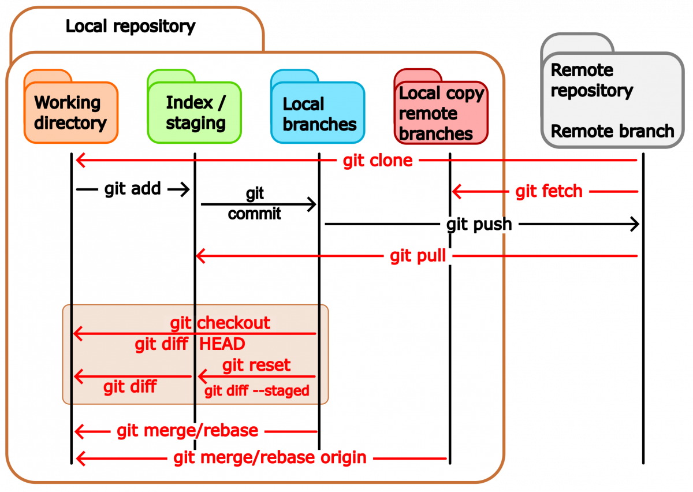

## General Workflow

```text
Edit → git add → git commit → git push
                          ↑
                      git pull
```

## Adding a Remote Repository

```bash
git remote add origin https://github.com/you/your-project.git
```

List configured remotes:

```bash
git remote -v
```

## Uploading Changes

Send commits to the remote repository:

```bash
git push origin main
```

After initial setup:

```bash
git push
```

## Downloading Updates

Retrieve and merge remote changes:

```bash
git pull
```

Cleaner history using rebase:

```bash
git pull --rebase
```

> A good habit is to pull changes before beginning work and before pushing commits.


## Publishing a New Branch

```bash
git switch -c my-new-branch

# Make changes and commit them

git push -u origin my-new-branch
```

Afterward, standard `git push` and `git pull` commands work automatically for that branch.

## Working with remotes
One can push or fetch/pull to or from remotes:

```shell
$ git push  remote_name branch_name
$ git fetch remote_name branch_name
$ git pull  remote_name branch_name 
```


In case you obtained the repository by cloning an existing one you will have the **origin** remote. You can do push/fetch/pull for this remote with

```shell
$ git push  origin master      
$ git fetch origin master
$ git pull  origin master
```


or 

```shell
$ git push
$ git fetch
$ git pull
```

because the remote *origin* and the *master* branch are configured for pushing and pulling by default upon cloning.


The command: 
```shell
$ git pull
```
brings all the changes (branches) that are in the remote and tries to merge them with the current branch of the local repo. The default behavior of *git pull* (*fetch* part) is in the *$GIT_DIR/config* file:
```shell
[remote "origin"]
  fetch = +refs/heads/*:refs/remotes/origin/*
```


In fact, *git pull* is a combination of two commands:
```shell
$ git fetch remote_name branch_name
$ git merge remote_name/branch_name
```

If you want to fetch all branches and merge the current one:

```shell
$ git fetch 
$ git merge
```


The command
```shell
$ git push 
```
will send the changes in the current branch to the remote by default.


## Advanced

The default behavior can be seen with:
```shell
$ git config --get push.default
```
This can be changed by applying:
```shell
git config --global push.default matching(default), current, ...
```


If you have a brand-new branch called **new**, you can push it the first time with the command:

```shell
git push -u origin new
```

which is equivalent to

```shell
git push origin new
git branch --set-upstream new origin/new
```


then, you will be able to push/pull the changes in the branch by simply typing **git push/pull**


### Displaying remote information

```console
$ git remote show origin
* remote origin
  Fetch URL: git@bitbucket.org:arm2011/gitcourse.git
  Push  URL: git@bitbucket.org:arm2011/gitcourse.git
  HEAD branch: master
  Remote branches:
    experiment     tracked
    feature        tracked
    less-salt      tracked
    master         tracked
    nested-feature tracked
  Local branches configured for 'git pull':
    feature        merges with remote feature
    master         merges with remote master
    nested-feature merges with remote nested-feature
  Local refs configured for 'git push':
    feature        pushes to feature        (fast-forwardable)
    master         pushes to master         (up to date)
    nested-feature pushes to nested-feature (up to date)
```


### Renaming remotes

```shell
$ git remote rename initial_name new_name
```

### Deleting remotes

```shell
$ git remote remove remote_name 
```


## Bare repositories

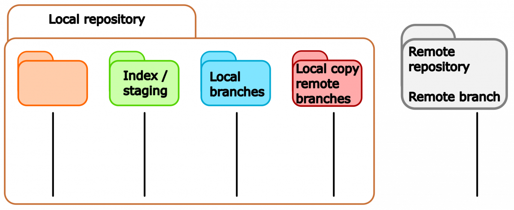


A bare repository is a repository with no working directory.


### Creating a bare repository

```shell
$ mkdir bare.git && cd bare.git
$ git init --bare
```

### Cloning a bare repository cont.

```shell
$ git clone --bare location
```


## Using GitHub

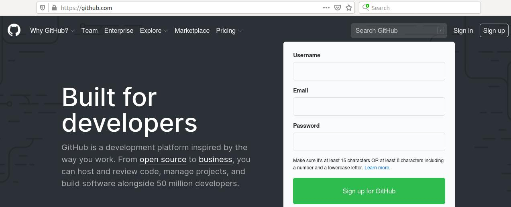


Upon login into your GitHub account you will see the following option to create a new repository

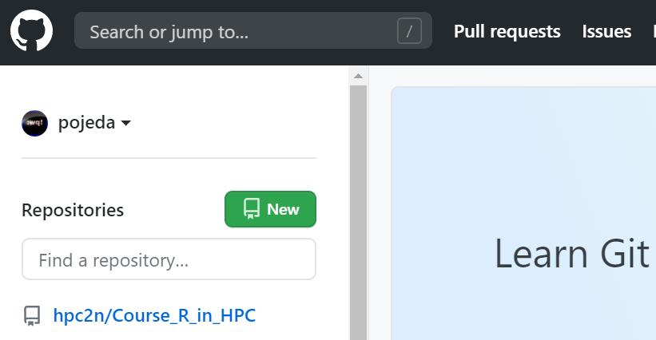


Here, you can choose the type of repository that is appropriate to your needs (public/private), if you want to add *README* and *.gitignore* files and also the type of license for your project,

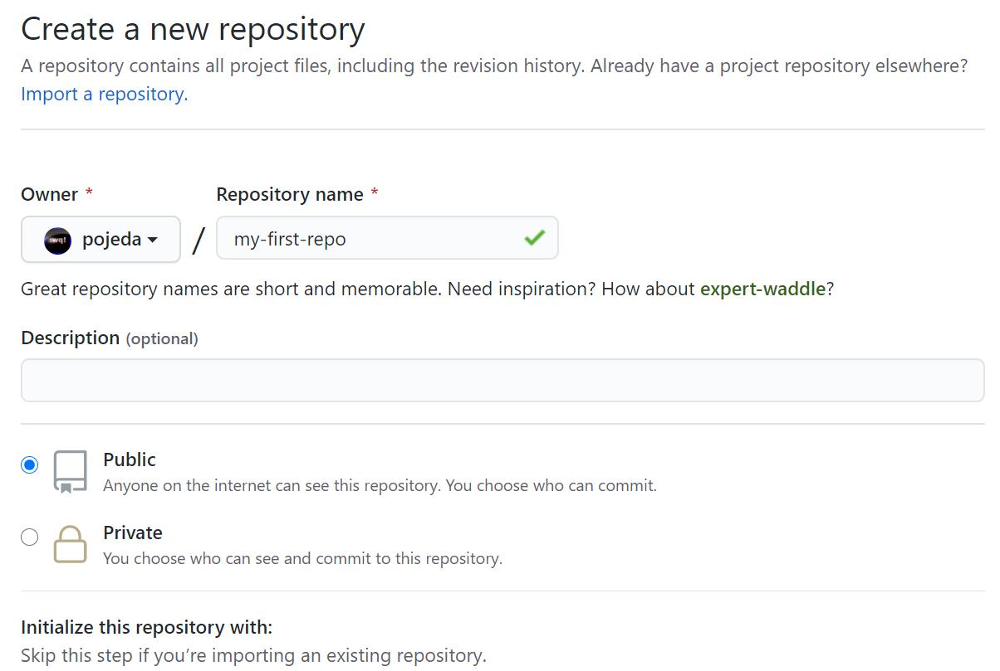


GitHub will suggest some steps that you can take for your brand-new repository:

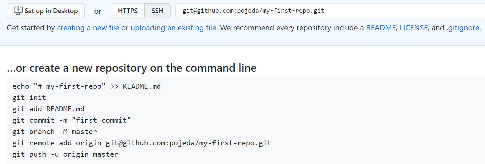


## Network visualization
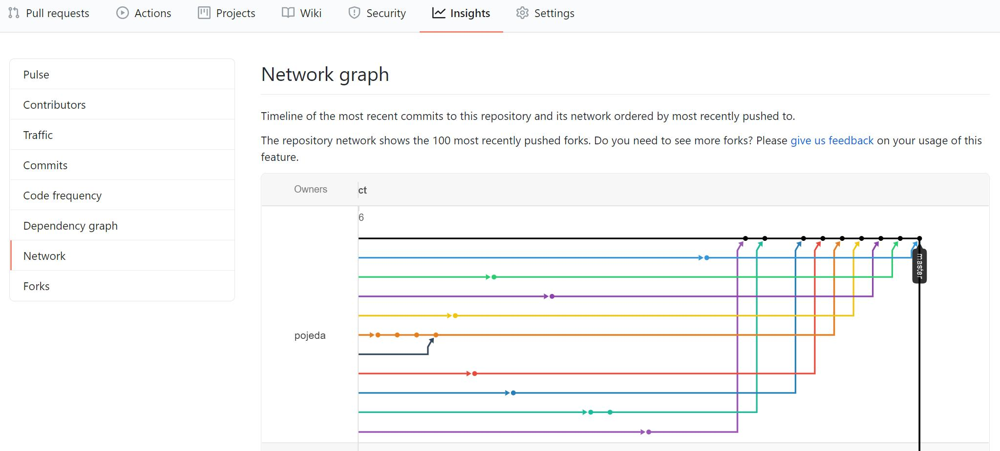


## Working with other's repos
In the following scenario, a developer, Bob, has its repo on GitHub. Another developer, Alice, finds it useful. Alice can clone it but she cannot push changes unless Bob allows it:

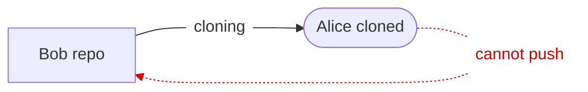


A better approach is to *fork* Bob's repository: 

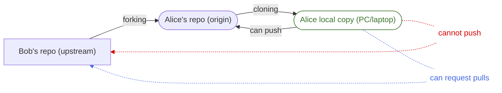
In this way, Alice can push changes to her repository and eventually make Bob aware of them as well.


## Forking a repository

To fork a repository, Alice go to the URL of the target repository and use the option *Fork* in Bob's repository: 

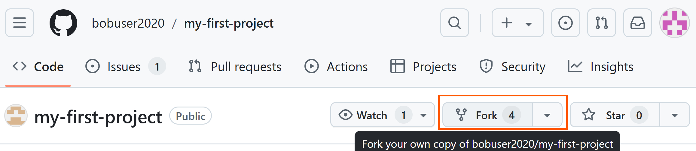


## Forking a repository

Then, Alice will see the forked repository on her user space:


Alice can then add the forked repository where she can *push* push changes:

```java
$ git remote add origin git@github.com:aliceuser2020/my-first-project.git

$ git remote -v
origin	git@github.com:aliceuser2020/my-first-project.git (fetch)
origin	git@github.com:aliceuser2020/my-first-project.git (push)
```

How does she add the upstream remote?


```java
$ git remote add upstream git@github.com:bobuser2020/my-first-project.git

$ git remote -v
origin	git@github.com:aliceuser2020/my-first-project.git (fetch)
origin	git@github.com:aliceuser2020/my-first-project.git (push)
upstream	git@github.com:bobuser2020/my-first-project.git (fetch)
upstream	git@github.com:bobuser2020/my-first-project.git (push)
```


```java
$ git fetch upstream master
$ git graph
* 2e56d0a (HEAD -> main, upstream/main, origin/main, origin/HEAD) text of exercise git diff usage
* 22a7316 Adding yet more lectures
* 0ddb791 Adding some more of the lectures
* 3ff9f8f Adding some of the lectures
```

Alice can used the forked repository as the *origin* where she can put her changes. The *upstream* remote
will help her to be updated with the latest changes from Bob (Github will show messages) but she won't be 
able to commit changes to Bob's repo (without permissions).


## Synchronizing remotes

After doing some changes, Alice push them to her forked repository but she wants Bob become aware of them (1 commit in this case, click on this commit)

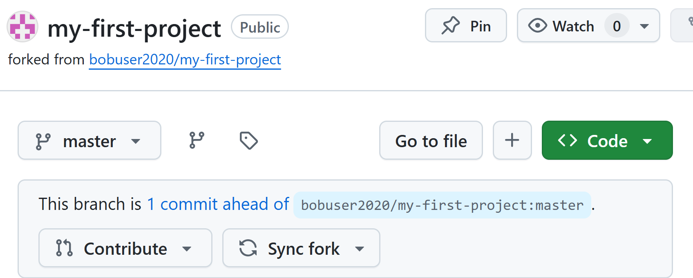


## Pull request

A **pull request** will be suggested: 

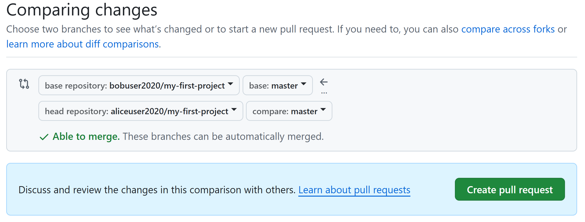


You can then create a the PR:

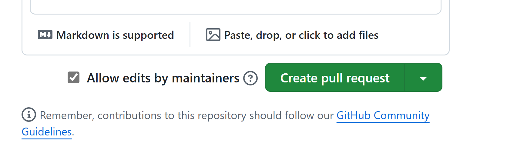


Another way to create PR is with "Pull request" option:


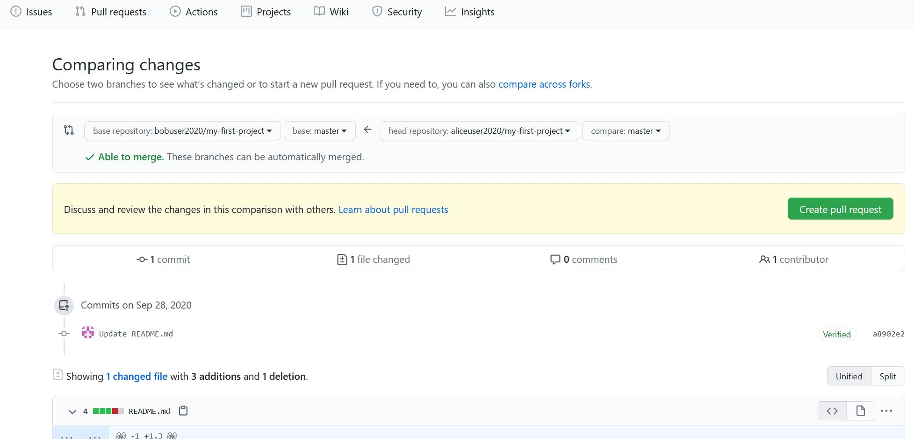

Then, Bob receives an email with the pull request information about Alice modifications. On the GitHub site he sees the request:

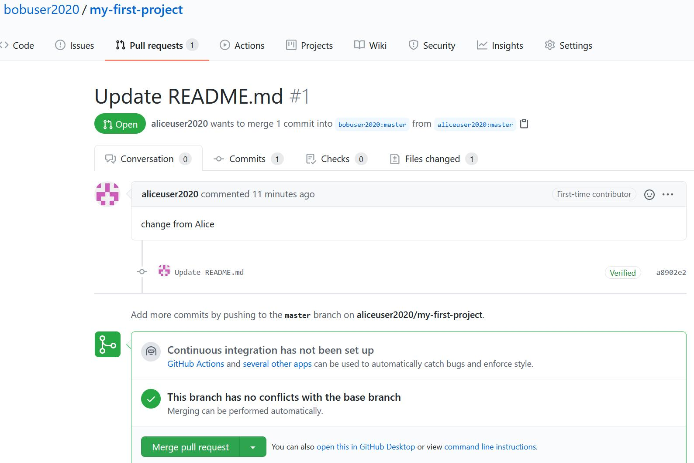


Because Bob find the changes from Alice useful and there are no conflicts he can merge them, 

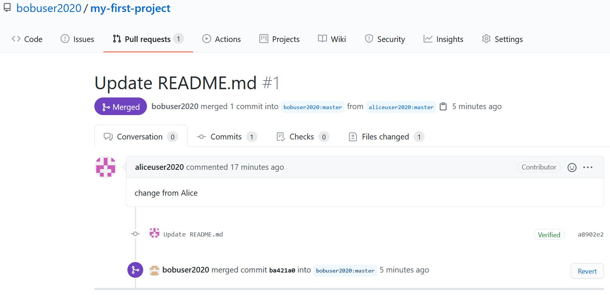


## Issues

If you find some issues in the files/code you can open an "Issue" on GitHub

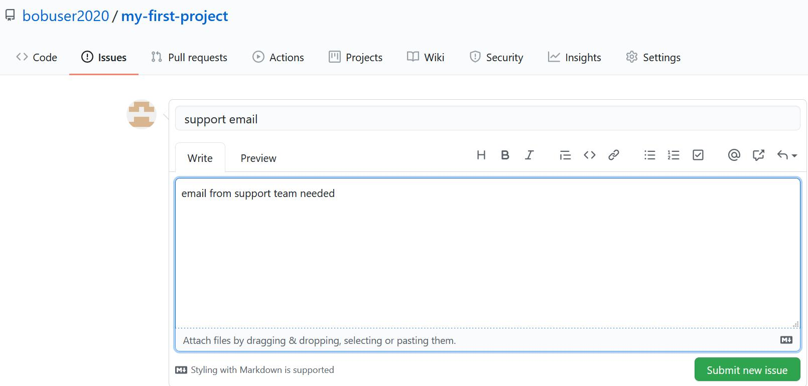


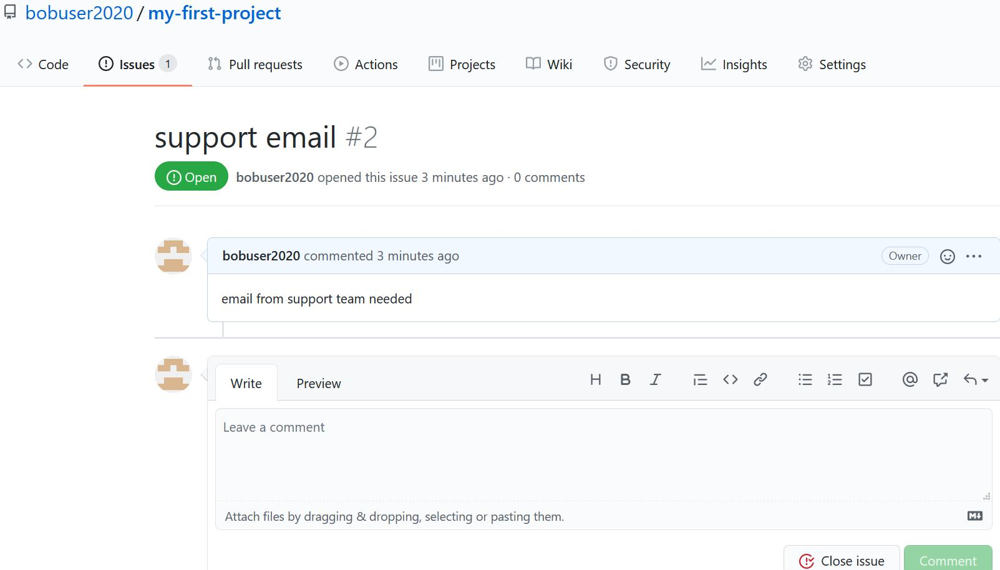

---

You may also assign people to the issues that are more related to that topic. 

In future commits you may refer to this issue by using the issue number, <span style="color:blue">#2</span> in this case. This will allow you to track the evolution of the issue on GitHub.


## Best practices

- Communicate with your colleagues.
- Some commands such as **git rebase** change the history. It wouldn't be a good idea to use them on public branches. 
- Don't accept pull requests right away.


