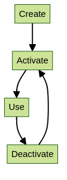

# Virtual environments and Python 

While Python packages can usually be installed through python, with the tool 'python setup.py', we strongly recommend installing in a stand-alone environment. <br> <br>
{: style="width: 100px; float: left;"}

!!! warning

    HPC2N strongly recommends **against** using conda, anaconda, miniconda, etc. on Kebnekaise.

    Read more about this here, including why you should not use conda etc.: <a href="https://docs.hpc2n.umu.se/software/anaconda/" target="_blank">https://docs.hpc2n.umu.se/software/anaconda/</a>

We suggest using Venv or Virtualenv. <br><br>

Whatever environment manager you use, this is the workflow:<br>
- You find and load any relevant modules already installed on the system. <br>
- You create the isolated environment <br>
- You activate the environment <br>
- You work in the isolated environment. Here you install (or update) the environment with the packages you need (only install once) <br>
- You deactivate the environment after use <br>
<br><br style="clear: both;">

!!! NOTE 

    Virtual environments are a great way to make sure you are using the same packages and versions each time you run something in your project; just activate and deactivate the virtual environment in question. You can have as many virtual environments as you want, with different versions and different packages, but only one virtual environment can be active at a time. 

Venv and Virtualenv are almost completely interchangeable. The difference being that virtualenv supports older python versions and has a few more minor unique features, while venv is in the standard library.

!!! NOTE

    Always check first if a package is already site-installed as part of a module. If that is the case, load that first before installing the rest of your packages.

In order to check which packages are available, there are some options:
 
- Type this on the command line: `#!bash module -r spider ".*Python.*"`
    - And this, to get packages with all spellings of Python: `#!bash module -r spider ".*python.*"`
- Other option is to load a Python module and its prerequisites, then do <code>pip list</code>. This is also gives you the version, which can be useful if you are trying to determine if the Python package you want to install is compatible with the Python modules already installed. 

!!! Example "Load Python 3.11.3 and checking for packages" 
    
    ```bash
    b-an01 [~]$ ml GCC/12.3.0 Python/3.11.3
    b-an01 [~]$ pip list
    Package           Version
    ----------------- -------
    flit_core         3.9.0
    packaging         23.1
    pip               23.1.2
    setuptools        67.7.2
    setuptools-scm    7.1.0
    tomli             2.0.1
    typing_extensions 4.6.3
    wheel             0.40.0
    ```

As you can see, there is very little installed with the base Python module, but there are several other Python packages installed as modules. These are some of the more common ones: 

```bash
ASE
Biopython
Flask
Horovod
IPython
JupyterLab
Keras
PyTorch
Python-bundle-PyPI
SciPy-bundle (Bottleneck, deap, mpi4py, mpmath, numexpr, numpy, pandas, scipy, etc.)
TensorFlow
Theano
dask
geopandas
matplotlib
pip
scikit-learn
scikit-image
scipy
sympy
Cython
```

!!! NOTE 

    This is NOT and exhaustive list and they are also not all installed for all versions of Python (send us a mail on support@hpc2n.umu.se if a package is missing for a specific version - we will often install it.)

??? Admonition "Example: Checking which packages are available when Python 3.11.3 and a compatible SciPy-bundle are loaded" 

    ```bash 
    b-an01 [~]$ ml GCC/12.3.0 Python/3.11.3
    b-an01 [~]$ ml SciPy-bundle/2023.07
    b-an01 [~]$ pip list
    Package                           Version
    --------------------------------- -----------
    alabaster                         0.7.13
    appdirs                           1.4.4
    asn1crypto                        1.5.1
    atomicwrites                      1.4.1
    attrs                             23.1.0
    Babel                             2.12.1
    backports.entry-points-selectable 1.2.0
    backports.functools-lru-cache     1.6.5
    beniget                           0.4.1
    bitstring                         4.0.2
    blist                             1.3.6
    Bottleneck                        1.3.7
    CacheControl                      0.12.14
    cachy                             0.3.0
    certifi                           2023.5.7
    cffi                              1.15.1
    chardet                           5.1.0
    charset-normalizer                3.1.0
    cleo                              2.0.1
    click                             8.1.3
    cloudpickle                       2.2.1
    colorama                          0.4.6
    commonmark                        0.9.1
    crashtest                         0.4.1
    cryptography                      41.0.1
    Cython                            0.29.35
    deap                              1.4.0
    decorator                         5.1.1
    distlib                           0.3.6
    distro                            1.8.0
    docopt                            0.6.2
    docutils                          0.20.1
    doit                              0.36.0
    dulwich                           0.21.5
    ecdsa                             0.18.0
    editables                         0.3
    exceptiongroup                    1.1.1
    execnet                           1.9.0
    filelock                          3.12.2
    flit_core                         3.9.0
    fsspec                            2023.6.0
    future                            0.18.3
    gast                              0.5.4
    glob2                             0.7
    html5lib                          1.1
    idna                              3.4
    imagesize                         1.4.1
    importlib-metadata                6.7.0
    importlib-resources               5.12.0
    iniconfig                         2.0.0
    intervaltree                      3.1.0
    intreehooks                       1.0
    ipaddress                         1.0.23
    jaraco.classes                    3.2.3
    jeepney                           0.8.0
    Jinja2                            3.1.2
    joblib                            1.2.0
    jsonschema                        4.17.3
    keyring                           23.13.1
    keyrings.alt                      4.2.0
    liac-arff                         2.5.0
    lockfile                          0.12.2
    markdown-it-py                    3.0.0
    MarkupSafe                        2.1.3
    mdurl                             0.1.2
    mock                              5.0.2
    more-itertools                    9.1.0
    mpmath                            1.3.0
    msgpack                           1.0.5
    netaddr                           0.8.0
    netifaces                         0.11.0
    numexpr                           2.8.4
    numpy                             1.25.1
    packaging                         23.1
    pandas                            2.0.3
    pastel                            0.2.1
    pathlib2                          2.3.7.post1
    pathspec                          0.11.1
    pbr                               5.11.1
    pexpect                           4.8.0
    pip                               23.1.2
    pkginfo                           1.9.6
    platformdirs                      3.8.0
    pluggy                            1.2.0
    ply                               3.11
    pooch                             1.7.0
    psutil                            5.9.5
    ptyprocess                        0.7.0
    py                                1.11.0
    py-expression-eval                0.3.14
    pyasn1                            0.5.0
    pybind11                          2.11.1
    pycparser                         2.21
    pycryptodome                      3.18.0
    pydevtool                         0.3.0
    Pygments                          2.15.1
    pylev                             1.4.0
    PyNaCl                            1.5.0
    pyparsing                         3.1.0
    pyrsistent                        0.19.3
    pytest                            7.4.0
    pytest-xdist                      3.3.1
    python-dateutil                   2.8.2
    pythran                           0.13.1
    pytoml                            0.1.21
    pytz                              2023.3
    rapidfuzz                         2.15.1
    regex                             2023.6.3
    requests                          2.31.0
    requests-toolbelt                 1.0.0
    rich                              13.4.2
    rich-click                        1.6.1
    scandir                           1.10.0
    scipy                             1.11.1
    SecretStorage                     3.3.3
    semantic-version                  2.10.0
    setuptools                        67.7.2
    setuptools-scm                    7.1.0
    shellingham                       1.5.0.post1
    simplegeneric                     0.8.1
    simplejson                        3.19.1
    six                               1.16.0
    snowballstemmer                   2.2.0
    sortedcontainers                  2.4.0
    Sphinx                            7.0.1
    sphinx-bootstrap-theme            0.8.1
    sphinxcontrib-applehelp           1.0.4
    sphinxcontrib-devhelp             1.0.2
    sphinxcontrib-htmlhelp            2.0.1
    sphinxcontrib-jsmath              1.0.1
    sphinxcontrib-qthelp              1.0.3
    sphinxcontrib-serializinghtml     1.1.5
    sphinxcontrib-websupport          1.2.4
    tabulate                          0.9.0
    threadpoolctl                     3.1.0
    toml                              0.10.2
    tomli                             2.0.1
    tomli_w                           1.0.0
    tomlkit                           0.11.8
    typing_extensions                 4.6.3
    tzdata                            2023.3
    ujson                             5.8.0
    urllib3                           1.26.16
    versioneer                        0.29
    virtualenv                        20.23.1
    wcwidth                           0.2.6
    webencodings                      0.5.1
    wheel                             0.40.0
    xlrd                              2.0.1
    zipfile36                         0.1.3
    zipp                              3.15.0
    ```

!!! Hint 

    To make it easier for your colleagues to copy/use the same environment as you, it is a good idea to use <code>pip freeze</code> to save a copy of which python packages you are using/have installed. You can either make a list of all of them (including site-packages), or just the ones you have installed yourself. 

    - Create a file named "requirements.txt" containing ALL the Python packages you have in your virtual environment: <code>pip freeze > requirements.txt</code>. 

    - Create a file named "requirements.txt" containing ONLY the Python packages you have installed yourself in your virtual environment: `#!bash pip freeze --local > requirements.txt`. 


### Venv 

Most newer versions of Python has <code>venv</code> in the standard library. 

This is how you would use <code>venv</code> with HPC2N's Python modules. 

#### Working with venv

- Load the Python module (and prerequisites) containing the version you want to use.
- Create a <code>venv</code> with: `#!bash python -m venv --system-site-packages MYVENV`, where MYVENV is the name you give your virtual environment. 
    - If you are creating the venv in another directory, give the full path in front of the name of the virtual environment. 
- Activate the virtual environment with: <code>source PATH-TO/MYVENV/bin/activate</code>.
- Install Python packages with <code>pip</code>. We recommend using `#!bash pip install --no-cache-dir --no-build-isolation MYPACKAGE` in order to reuse site-installations etc.  
- Deactivate the virtual environment with <code>deactivate</code>

Then, when you want to use the virtual environment again (or install more packages to it), just load the same modules and then activate it. 

!!! Example 

    - In this example, we:
        - load Python 3.11.3 and the compatible SciPy-bundle and matplotlib. 
        - create a virtual environment, named "myvenv"
        - activate the virtual environment (notice that the prompt now changes to include the name of the virtual environment) 
        - install a package (lightgbm) to it
        - check that the newly installed package can be loaded (with <code>pip list</code> or from import inside Python)
        - deactivate the virtual environment 

    ```bash 
    b-an01 [~]$ ml GCC/12.3.0 Python/3.11.3
    b-an01 [~]$ ml SciPy-bundle/2023.07
    b-an01 [~]$ ml matplotlib/3.7.2 

    b-an01 [~]$ python -m venv --system-site-packages myvenv

    b-an01 [~]$ source myvenv/bin/activate
    (myvenv) b-an01 [~]$ 

    (myvenv) b-an01 [~]$ pip install --no-cache-dir --no-build-isolation lightgbm
    Collecting lightgbm
      Downloading lightgbm-4.3.0-py3-none-manylinux_2_28_x86_64.whl (3.1 MB)
         ━━━━━━━━━━━━━━━━━━━━━━━━━━━━━━━━━━━━━━━━ 3.1/3.1 MB 54.7 MB/s eta 0:00:00
    Requirement already satisfied: numpy in /hpc2n/eb/software/SciPy-bundle/2023.07-gfbf-2023a/lib/python3.11/site-packages (from lightgbm) (1.25.1)
    Requirement already satisfied: scipy in /hpc2n/eb/software/SciPy-bundle/2023.07-gfbf-2023a/lib/python3.11/site-packages (from lightgbm) (1.11.1)
    Installing collected packages: lightgbm
    Successfully installed lightgbm-4.3.0

    [notice] A new release of pip available: 22.3.1 -> 24.0
    [notice] To update, run: pip install --upgrade pip
 
    (myvenv) b-an01 [~]$ python
    Python 3.11.3 (main, Apr  2 2024, 14:00:42) [GCC 12.3.0] on linux
    Type "help", "copyright", "credits" or "license" for more information.
    >>> import lightgbm
    >>> exit()
    (myvenv) b-an01 [~]$ 

    (myvenv) b-an01 [~]$ deactivate
    b-an01 [~]$ 
    ```

### Virtualenv

How to use Virtualenv with HPC2N Python modules: 

- Virtualenv is installed with each of the loadable Python modules and is accessible after the Python module is loaded. It is highly recommended to use these versions of Virtualenv instead of installing yourself.

- First load the module containing the Python version that you want to use, see the section on [the module system](../../documentation/modules) if you are unfamiliar with it.

- It is **advisable** to also load any modules that provide any requirements for the python module you are going to install, this includes python-module requirements, like numpy/scipy (from SciPy-bundle) and many others. 

- Using "<code>ml spider python-module-name</code>" will show if there is one installed at all, if there is one but not for the Python version you want to use, ask <a href="mailto:support@hpc2n.umu.se">support@hpc2n.umu.se</a> to install it, specifying which module and for which Python version. 

#### Working with Virtualenv 

1. Now (after loading the Python module) you want to create your first virtual environment. Here I call it 'vpyenv', and put it in your Public, but you can call it anything, of course. 
2. Run the following to initialize the environment: `#!bash virtualenv --system-site-packages $HOME/Public/vpyenv`
3. Installing modules in Virtualenv:
    - In order to install Python modules in the environment, you first need to activate it. Change directory to the environment you created before, and run: <code>source bin/activate</code>
    - You can deactivate it with <code>deactivate</code>
4. It will now look like this (remember I called my environment 'vpyenv', and put it in my Public directory): <code>(vpyenv)t-mn01 [~/Public/vpyenv]$</code>
5. Load any modules that contain pre-installed dependencies for your software.
    - You can also save that set of modules as a collection to make it easy to use the virtual environment later. You do that with <code>ml save mymodulecollection</code>. 
6. You can now install python modules like this (example, <code>spacy</code>): <br>
`#!bash pip install --no-cache-dir --no-build-isolation spacy`
7. The package will be downloaded and installed. 
    - The `#!bash "--no-cache-dir"` option is required to avoid it from reusing earlier installations from the same user in a different environment. 
    - The `#!bash "--no-build-isolation"` is to make sure that it uses the loaded modules from the module system when building any Cython libraries.

### Installing with setup.py

Aside from building and installing, you will usually need to set the correct environment before you can use the python package. There may be specifics to building a certain package (including dependencies or possibly running a configuration script), so you should always check if there is an INSTALL or README file included with the package.

#### General example 

- Download the python module and untar it.
- Load any site modules needed (OpenMPI, Lapack, BLAS...). You should use the gcc-versions if such exist.
- Also load any python-module requirements as per point 3 under "Accessing Virtualenv" above.
- cd into the python package source directory and run: <br>
<code>python setup.py build</code>
- Install the python package. A good choice is to install the python module(s) in <code>/proj/nobackup/YOUR-STORAGE-DIR/python-packages</code>, that way they are easy to keep track of: <br>
`#!bash python setup.py install --prefix=PATH/TO/YOUR/INSTALLDIR`
- Add this line to your <code>~/.bashrc</code> (change as needed - set to where you have installed the module):<br>
<code>export PYTHONPATH=$PYTHONPATH:PATH/TO/YOUR/INSTALLDIR/lib/python3.11/site-packages</code> <br>
**NOTE** that the version of Python will change the location, as you see above. 
- Check the installation. You need to first open a new shell. Then launch python and type: <br>
<code>import PYTHONPACKAGE</code>. 

