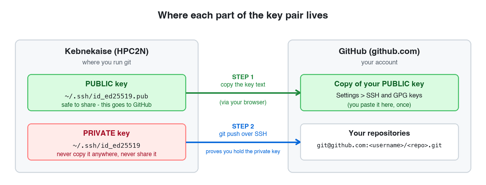
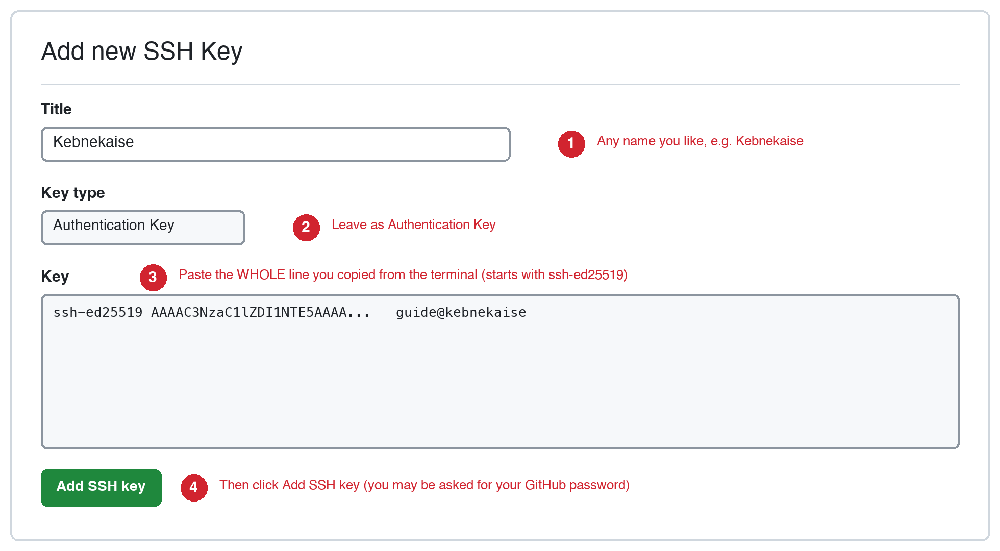
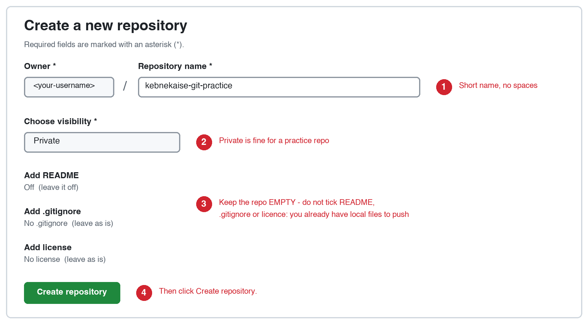

# Pushing to GitHub from Kebnekaise: step-by-step guide

**Course:** 5BI00A Computing for Data-Driven Biology · Umeå University

The exam requires you to **push** your work from Kebnekaise to a repository on GitHub. This page is a short, linear recipe for getting that to work. It replaces nothing in the Git lecture; it just puts the steps that matter for the exam in one place, in the order you need them. Expect it to take about 20 minutes the first time.

!!! warning "The one thing that trips most people up"
    The SSH key must be created **on Kebnekaise**, not on your own computer. When you type `git push` on Kebnekaise, it is Kebnekaise that has to prove who you are to GitHub. A key sitting on your laptop is invisible to Git on Kebnekaise.

## What you need before you start

- A GitHub account (free), with two-factor authentication set up. Sign up at [github.com](https://github.com/).
- Your HPC2N account and a terminal on Kebnekaise (see [Connecting to Kebnekaise](../../02.connect-cluster/connect-cluster.md)). **Every command on this page is typed in the Kebnekaise terminal**, except the two steps marked as done in the browser.
- The commands are shown without the `$` prompt: type or paste only the command itself.

## The idea in one picture

An SSH key is a **pair** of files. The *private* key stays on Kebnekaise and is never shared. The *public* key is a line of text that you give to GitHub once. Afterwards GitHub can check, every time you push, that you hold the matching private key, and no password is needed.

{: style="width: 95%;"}

!!! note
    This key is only for talking to GitHub. It is not what you use to log in to Kebnekaise (that uses Kerberos or your HPC2N password), and adding it to GitHub does not change how you log in.

## Step 1: Tell Git who you are (once)

```
git config --global user.name "Your Name"
git config --global user.email "your-github-email@example.com"
git config --global init.defaultBranch main
```

Use the email address of your GitHub account (or the private `noreply` address shown under *Settings > Emails* on GitHub). Check what you typed:

```
git config --global --list
```

Expected output (with your own name and email):

```
user.name=Your Name
user.email=your-github-email@example.com
init.defaultbranch=main
```

The third line matters. Without it, a new repository on Kebnekaise starts on a branch called `master`, while GitHub expects `main`, and your first push fails (see [Troubleshooting](#troubleshooting)). If you skip the first two lines, Git still lets you commit, but it invents an identity from your username and the login node's name, which is not what you want on your commits.

## Step 2: Create your SSH key on Kebnekaise

First check whether you already made one (for example in the Git lecture):

```
ls -l ~/.ssh/id_ed25519.pub
```

- If this prints `No such file or directory`, continue below.
- If it lists the file, you already have a key. Skip to Step 3.

Create the key:

```
ssh-keygen -t ed25519 -C "your-name@kebnekaise"
```

You will be asked three questions, one after the other:

```
Generating public/private ed25519 key pair.
Enter file in which to save the key (/home/u/username/.ssh/id_ed25519):
Enter passphrase (empty for no passphrase):
Enter same passphrase again:
```

**Press Enter at each of the three prompts** to accept the defaults. The path in the first prompt shows your own home directory; keep the default. The text after `-C` is just a label to help you recognise the key later.

!!! note "About the passphrase"
    Leaving the passphrase empty is the simplest option and is fine for this course: the key lives only in your private home directory on Kebnekaise, `ssh-keygen` makes the private key readable by you alone, it only gives access to your GitHub account, and you can delete it from GitHub whenever you like. If you do set a passphrase, Git will ask for it at every push, and this guide does not cover the extra setup (`ssh-agent`) that avoids that.

When it finishes you will see something like this (your fingerprint and picture will differ):

```
Your identification has been saved in /home/u/username/.ssh/id_ed25519
Your public key has been saved in /home/u/username/.ssh/id_ed25519.pub
The key fingerprint is:
SHA256:DmVQ7MdvmOJCVLtwl3UQ0xynlfxHMpah/79lpJoXq0I your-name@kebnekaise
The key's randomart image is:
+--[ED25519 256]--+
|      .o.   +=+++|
|       .o   .oO*.|
|       ooo o.o.+.|
|      oo+ =  .  o|
|     ..oS+ +  . o|
|      .oo E o .+ |
|     . ..o .  .o+|
|      . . .  oo.o|
|       .   .+o .o|
+----[SHA256]-----+
```

Two files now exist: `id_ed25519` (private, never share) and `id_ed25519.pub` (public).

## Step 3: Show your public key and copy it

```
cat ~/.ssh/id_ed25519.pub
```

This prints a single line that starts with `ssh-ed25519` and ends with the label you chose. Select the **whole line** with the mouse and copy it.

- It must be `id_ed25519.pub` (with `.pub`). Never copy `id_ed25519` without `.pub`; that is the private key.
- It must be one unbroken line. If a line break sneaks in when you paste, GitHub will reject the key.

## Step 4: Add the public key to GitHub (in your browser)

1. Go to [github.com/settings/ssh/new](https://github.com/settings/ssh/new). (Or click your profile picture, then *Settings*, then *SSH and GPG keys*, then *New SSH key*.)
2. Fill in the form as shown below and click **Add SSH key**. GitHub may ask you to confirm your password.

{: style="width: 95%;"}

*Figure redrawn from the GitHub interface (September 2026); GitHub may change the exact appearance.*

## Step 5: Test the connection before doing anything else

Back in the Kebnekaise terminal:

```
ssh -T git@github.com
```

The first time, SSH asks whether you trust GitHub's server:

```
The authenticity of host 'github.com (<IP address>)' can't be established.
ED25519 key fingerprint is SHA256:+DiY3wvvV6TuJJhbpZisF/zLDA0zPMSvHdkr4UvCOqU.
This key is not known by any other names
Are you sure you want to continue connecting (yes/no/[fingerprint])?
```

Check that the fingerprint matches the one above (it is GitHub's published fingerprint, listed in [GitHub's documentation](https://docs.github.com/en/authentication/keeping-your-account-and-data-secure/githubs-ssh-key-fingerprints)), then type `yes` and press Enter. You will only be asked this once.

**Success looks like this** (with your GitHub username):

```
Hi <username>! You've successfully authenticated, but GitHub does not provide shell access.
```

That message is what we want. GitHub does not give you a shell, so the command ends by itself; ignore the fact that it exits with an error code.

**Failure looks like this:**

```
git@github.com: Permission denied (publickey).
```

This means GitHub does not recognise your key. Do not go on; see [Troubleshooting](#troubleshooting) below.

## Step 6: Make a practice repository on Kebnekaise

```
mkdir ~/git-practice
cd ~/git-practice
git init
```

```
Initialized empty Git repository in /home/u/username/git-practice/.git/
```

Create a file, add it, and commit it:

```
echo "Hello from Kebnekaise" > hello.txt
git status
git add hello.txt
git commit -m "Add hello.txt"
```

Two outputs are worth checking. First, `git status` before `git add`:

```
On branch main

No commits yet

Untracked files:
  (use "git add <file>..." to include in what will be committed)
	hello.txt

nothing added to commit but untracked files present (use "git add" to track)
```

```
[main (root-commit) 1ec54ab] Add hello.txt
 1 file changed, 1 insertion(+)
 create mode 100644 hello.txt
```

Second, the result of `git commit` (the code after `root-commit` will be different for you). Confirm you are on `main` and that the commit exists:

```
git branch --show-current
git log --oneline
```

```
main
1ec54ab Add hello.txt
```

## Step 7: Create an empty repository on GitHub (in your browser)

1. Go to [github.com/new](https://github.com/new).
2. Fill in the form as shown and click **Create repository**.

{: style="width: 95%;"}

*Figure redrawn from the GitHub interface (September 2026); GitHub may change the exact appearance.*

Leave the repository **empty**. Do not tick *Add README*, *.gitignore* or *licence*. You already have a repository with a commit on Kebnekaise, and if the GitHub repository also starts with its own first commit, your first push will be rejected.

The address of your new repository (its *SSH URL*) always has this form, so you can type it yourself:

```
git@github.com:<username>/kebnekaise-git-practice.git
```

## Step 8: Connect the two and push

Back in the Kebnekaise terminal, inside `~/git-practice`:

```
git remote add origin git@github.com:<username>/kebnekaise-git-practice.git
git remote -v
git branch -M main
git push -u origin main
```

Replace `<username>` with your GitHub username. **Use the `git@github.com:` address, not one starting with `https://`.** GitHub does not accept your account password for pushes over HTTPS, so an `https://` address will not work here.

`git remote -v` should show your address twice, once for fetch and once for push:

```
origin	git@github.com:<username>/kebnekaise-git-practice.git (fetch)
origin	git@github.com:<username>/kebnekaise-git-practice.git (push)
```

A successful push ends with lines like these (some progress lines, such as `Enumerating objects`, appear above them):

```
To github.com:<username>/kebnekaise-git-practice.git
 * [new branch]      main -> main
Branch 'main' set up to track remote branch 'main' from 'origin'.
```

Now reload your repository page on GitHub. You should see `hello.txt` and your commit message. **That is exactly what the exam needs.**

## Step 9: Do it once more (the everyday loop)

Once `-u` has set things up, a normal round trip is just four commands:

```
echo "second line" >> hello.txt
git add hello.txt
git commit -m "Update hello.txt"
git push
```

```
To github.com:<username>/kebnekaise-git-practice.git
   1ec54ab..b175867  main -> main
```

```
git status
```

```
On branch main
Your branch is up to date with 'origin/main'.

nothing to commit, working tree clean
```

## The exam repository

For the exam, your instructor creates a **private repository for each student** in the course's GitHub organisation, `umu-bioinformatics-msc`, and adds you to it. It is named after your GitHub username:

```
git@github.com:umu-bioinformatics-msc/exam-<your-github-username>.git
```

The name is always `exam-` followed by your GitHub username, and your instructor tells you when the repositories have been created. The SSH key you made in Step 2 works for it, so no new key is needed. Before the exam:

1. **Send your instructor your GitHub username** in good time. The repository cannot be created without it.
2. **Accept the invitation** if GitHub sends you one (check your email and your GitHub notifications). Until you have access, GitHub answers `Repository not found`.
3. **Check that you can push to it, without pushing anything.** Once your instructor tells you the repository has been created, run this from your practice repository (the one from Steps 6 to 8, which has a commit on `main`):

   ```
   cd ~/git-practice
   git push --dry-run git@github.com:umu-bioinformatics-msc/exam-<your-github-username>.git main
   ```

   The word `--dry-run` makes Git do all the checks but send nothing, and because the address is typed in full, nothing is added to your repository's remotes. This is the result you want:

   ```
   To github.com:umu-bioinformatics-msc/exam-<your-github-username>.git
    * [new branch]      main -> main
   ```

   `ERROR: Repository not found.` means access is not in place yet (accept the invitation, then try again) and `Permission denied (publickey)` means the SSH key is the problem (see Step 5). If neither is fixed after a second try, tell your instructor. Run this check before the exam: once the exam starts, the repository may already contain a file from your instructor, and Git then reports the push as rejected even though your access is fine.

!!! warning "Do not push to the exam repository before the exam"
    Only work pushed **during the exam window** counts, and the repository's push history is what is checked. Practise on your own `kebnekaise-git-practice` repository instead.

During the exam, **clone the repository** and work inside the new directory:

```
git clone git@github.com:umu-bioinformatics-msc/exam-<your-github-username>.git
cd exam-<your-github-username>
```

Cloning sets up `origin` for you, so `git push` works without `git remote add`. Do not run `git init` in a new directory and add the exam repository as a remote, as in Step 8: your instructor may already have added a file to the repository (for example one with your assigned protein), and Git rejects a push from a history that does not include it. If the repository is still empty, Git prints `warning: You appear to have cloned an empty repository.` This is normal.

## Checklist: are you ready?

Each of these should give the result shown.

| Command | Expected result |
|---|---|
| `ls ~/.ssh/id_ed25519.pub` | the file is listed |
| `ssh -T git@github.com` | `Hi <username>! You've successfully authenticated...` |
| `git config --global --list` | shows your name, email and `init.defaultbranch=main` |
| `git remote -v` (in your repository) | addresses that start with `git@github.com:` |
| `git branch --show-current` | `main` |
| `git push --dry-run git@github.com:umu-bioinformatics-msc/exam-<username>.git main` (in `~/git-practice`, once the repository exists, before the exam) | `* [new branch]      main -> main` |

## Troubleshooting

Each entry below is a real message you may see, with the cause and the fix.

### `Permission denied (publickey).`

Often followed by `fatal: Could not read from remote repository.` GitHub does not recognise the key that Kebnekaise offered. Work through these in order:

1. Did you finish Step 4? Open [github.com/settings/keys](https://github.com/settings/keys) and check that your key is listed.
2. Does the key on GitHub match the one on Kebnekaise? Run `ssh-keygen -lf ~/.ssh/id_ed25519.pub` on Kebnekaise and compare the `SHA256:` value with the one GitHub shows next to the key.
3. Did you paste the private key by mistake? The line you paste must start with `ssh-ed25519` and come from the file ending in `.pub`.
4. Are you signed in to the right GitHub account in your browser (the one you gave your instructor)?
5. Still stuck? Run `ssh -vT git@github.com` and read the last lines. It shows which key files SSH tried.

### `error: src refspec main does not match any`

Your local branch is not called `main`, or you have not made a commit yet. Check with `git branch --show-current` and `git log --oneline`. If the branch is `master`, rename it and push again:

```
git branch -M main
git push -u origin main
```

If `git log` says there are no commits, run `git add` and `git commit` first (Step 6).

### `fatal: could not read Username for 'https://github.com'`

Your remote address starts with `https://`. Replace it with the SSH address:

```
git remote set-url origin git@github.com:<username>/kebnekaise-git-practice.git
git remote -v
```

### `error: remote origin already exists.`

You have already added a remote called `origin`. To change where it points, use `set-url` instead of `add`:

```
git remote set-url origin git@github.com:<username>/kebnekaise-git-practice.git
```

### `Host key verification failed.`

You answered `no` to the question in Step 5, or the answer could not be read. Run `ssh -T git@github.com` again and type `yes` when asked (after checking the fingerprint).

### `ERROR: Repository not found.`

Either the name or username in the address has a typo, or the repository is private and your account does not have access yet (for the exam repository, accept the invitation). Compare the address with the one on the repository's page on GitHub.

### `Updates were rejected because the remote contains work that you do not have locally.`

The repository on GitHub already has a commit that your local repository does not have. For the exam repository this happens when you created a new local repository with `git init` and added the exam repository as a remote, after your instructor had put a file in it. Your access is fine. Clone the exam repository instead (see "The exam repository" above) and work in the clone.

### `ERROR: Permission to <repository> denied to <your-username>.`

GitHub recognises your SSH key and the repository exists, but your account is not allowed to write to it. This is expected for someone else's public repository. For your own exam repository it means your access is not in place: check that you have accepted the invitation and that the address is exactly `exam-<your-github-username>`, and if it still fails, tell your instructor.

## All commands in one place

For when you have done it once and just need the sequence again. Replace `<username>`.

```
# once per account
git config --global user.name "Your Name"
git config --global user.email "your-github-email@example.com"
git config --global init.defaultBranch main
ssh-keygen -t ed25519 -C "your-name@kebnekaise"      # Enter, Enter, Enter
cat ~/.ssh/id_ed25519.pub                             # copy the line, add at github.com/settings/ssh/new
ssh -T git@github.com                                 # type yes; expect "Hi <username>!"

# per repository
mkdir ~/git-practice && cd ~/git-practice && git init
echo "Hello from Kebnekaise" > hello.txt
git add hello.txt && git commit -m "Add hello.txt"
# create an EMPTY repository at github.com/new, then:
git remote add origin git@github.com:<username>/kebnekaise-git-practice.git
git branch -M main
git push -u origin main
```

For the background on what remotes, `origin` and pushing mean, see [Lecture 7: Working with remotes](../../07.Git/remotes.md).
</content>
